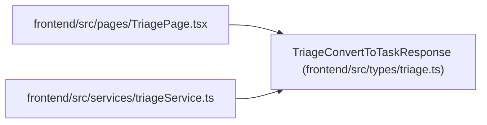

# TriageConvertToTaskResponse

**Location:** `frontend/src/types/triage.ts:155`
**Kind:** Class
**Bases:** —
**Module:** [types_triage](../modules/types_triage.md)

## Description

_Auto-generated from `TriageConvertToTaskResponse` in `frontend/src/types/triage.ts`._

## Attributes

| Name | Type | Default | Description |
|------|------|---------|-------------|
| `triage_item` | `TriageItem` | *required* | — |
| `task` | `Task` | *required* | — |

## Methods

*No public methods. Inherits from base classes.*

## Relationships

<!-- Auto-generated relationship summary. Do not edit by hand. -->

### Summary

| Module | Methods | Attributes |
|---|---:|---|
| [types_triage](../modules/types_triage.md) | 0 | `task`, `triage_item` |

### References

| Reference | Kind | Source | Call sites |
|---|---|---|---:|
| `TriagePage` | import | [TriagePage](../modules/TriagePage.md) | — |
| `triageService` | import | [triageService](../modules/triageService.md) | — |
