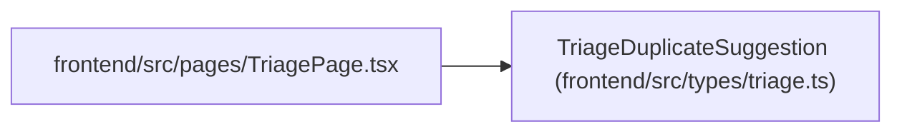

# TriageDuplicateSuggestion

**Location:** `frontend/src/types/triage.ts:69`
**Kind:** Class
**Bases:** —
**Module:** [types_triage](../modules/types_triage.md)

## Description

_Auto-generated from `TriageDuplicateSuggestion` in `frontend/src/types/triage.ts`._

## Attributes

| Name | Type | Default | Description |
|------|------|---------|-------------|
| `target_type` | `'triage_item' \| 'task'` | *required* | — |
| `target_id` | `number` | *required* | — |
| `title` | `string` | *required* | — |
| `description` | `string \| null` | *required* | — |
| `status` | `string \| null` | *required* | — |
| `source` | `string \| null` | *required* | — |
| `source_url` | `string \| null` | *required* | — |
| `external_key` | `string \| null` | *required* | — |
| `labels` | `string[]` | *required* | — |
| `project_id` | `number \| null` | *required* | — |
| `iteration_id` | `number \| null` | *required* | — |
| `score` | `number` | *required* | — |
| `signals` | `string[]` | *required* | — |

## Methods

*No public methods. Inherits from base classes.*

## Relationships

<!-- Auto-generated relationship summary. Do not edit by hand. -->

### Summary

| Module | Methods | Attributes |
|---|---:|---|
| [types_triage](../modules/types_triage.md) | 0 | `description`, `external_key`, `iteration_id`, `labels`, `project_id`, `score`, `signals`, `source`, `source_url`, `status`, `target_id`, `target_type` |

### References

| Reference | Kind | Source | Call sites |
|---|---|---|---:|
| `TriagePage` | import | [TriagePage](../modules/TriagePage.md) | — |
