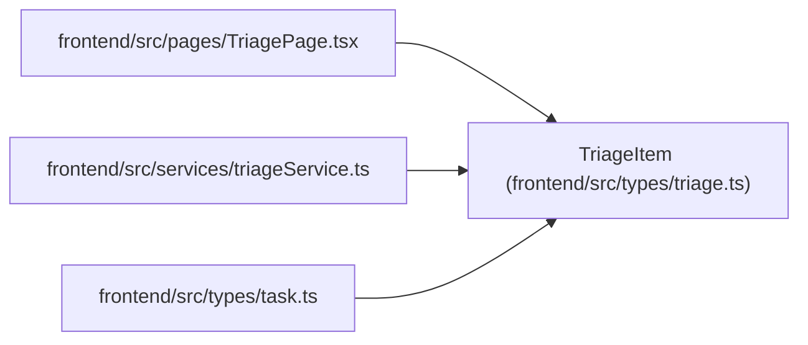

# TriageItem

**Location:** `frontend/src/types/triage.ts:5`
**Kind:** Class
**Bases:** —
**Module:** [types_triage](../modules/types_triage.md)

## Description

_Auto-generated from `TriageItem` in `frontend/src/types/triage.ts`._

## Attributes

| Name | Type | Default | Description |
|------|------|---------|-------------|
| `id` | `number` | *required* | — |
| `title` | `string` | *required* | — |
| `description` | `string \| null` | *required* | — |
| `source` | `string \| null` | *required* | — |
| `source_url` | `string \| null` | *required* | — |
| `external_key` | `string \| null` | *required* | — |
| `status` | `TriageItemStatus` | *required* | — |
| `priority_hint` | `number \| null` | *required* | — |
| `assignee_hint` | `string \| null` | *required* | — |
| `project_hint_id` | `number \| null` | *required* | — |
| `iteration_hint_id` | `number \| null` | *required* | — |
| `labels` | `string[]` | *required* | — |
| `metadata_json` | `Record<string, unknown>` | *required* | — |
| `snoozed_until` | `string \| null` | *required* | — |
| `duplicate_of_id` | `number \| null` | *required* | — |
| `duplicate_task_id` | `number \| null` | *required* | — |
| `converted_task_id` | `number \| null` | *required* | — |
| `request_count` | `number` | *required* | — |
| `created_at` | `string` | *required* | — |
| `updated_at` | `string` | *required* | — |

## Methods

*No public methods. Inherits from base classes.*

## Relationships

<!-- Auto-generated relationship summary. Do not edit by hand. -->

### Summary

| Module | Methods | Attributes |
|---|---:|---|
| [types_triage](../modules/types_triage.md) | 0 | `assignee_hint`, `converted_task_id`, `created_at`, `description`, `duplicate_of_id`, `duplicate_task_id`, `external_key`, `id`, `iteration_hint_id`, `labels`, `metadata_json`, `priority_hint` |

### References

| Reference | Kind | Source | Call sites |
|---|---|---|---:|
| `TriagePage` | import | [TriagePage](../modules/TriagePage.md) | — |
| `triageService` | import | [triageService](../modules/triageService.md) | — |
| `task` | import | [types_task](../modules/types_task.md) | — |
