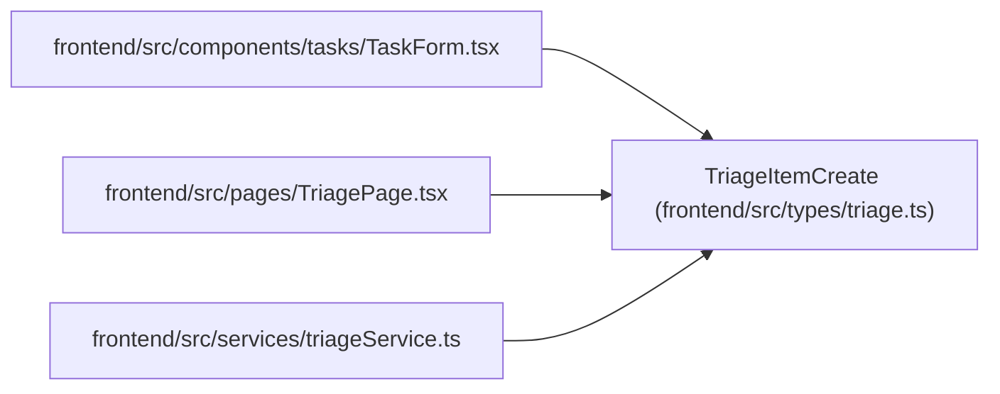

# TriageItemCreate

**Location:** `frontend/src/types/triage.ts:30`
**Kind:** Class
**Bases:** —
**Module:** [types_triage](../modules/types_triage.md)

## Description

_Auto-generated from `TriageItemCreate` in `frontend/src/types/triage.ts`._

## Attributes

| Name | Type | Required | Default | Description |
|------|------|----------|---------|-------------|
| `title` | `string` | Yes | — | — |
| `description` | `string \| null` | No | — | — |
| `source` | `string \| null` | No | — | — |
| `source_url` | `string \| null` | No | — | — |
| `external_key` | `string \| null` | No | — | — |
| `priority_hint` | `number \| null` | No | — | — |
| `assignee_hint` | `string \| null` | No | — | — |
| `project_hint_id` | `number \| null` | No | — | — |
| `iteration_hint_id` | `number \| null` | No | — | — |
| `labels` | `string[]` | No | — | — |
| `metadata_json` | `Record<string, unknown>` | No | — | — |

## Methods

*No public methods. Inherits from base classes.*

## Relationships

<!-- Auto-generated relationship summary. Do not edit by hand. -->

### Summary

| Module | Methods | Attributes |
|---|---:|---|
| [types_triage](../modules/types_triage.md) | 0 | `assignee_hint`, `description`, `external_key`, `iteration_hint_id`, `labels`, `metadata_json`, `priority_hint`, `project_hint_id`, `source`, `source_url`, `title` |

### References

| Reference | Kind | Source | Call sites |
|---|---|---|---:|
| `TaskForm` | import | [TaskForm](../modules/TaskForm.md) | — |
| `TriagePage` | import | [TriagePage](../modules/TriagePage.md) | — |
| `triageService` | import | [triageService](../modules/triageService.md) | — |
