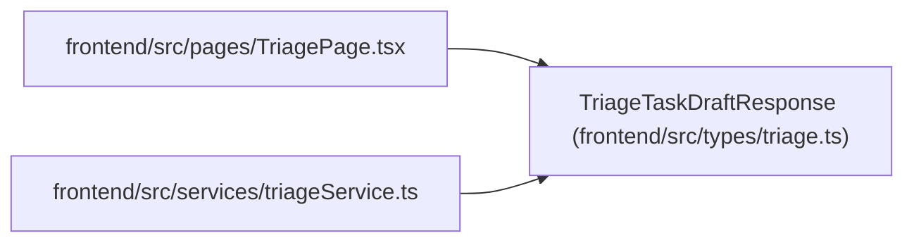

# TriageTaskDraftResponse

**Location:** `frontend/src/types/triage.ts:121`
**Kind:** Class
**Bases:** —
**Module:** [types_triage](../modules/types_triage.md)

## Description

_Auto-generated from `TriageTaskDraftResponse` in `frontend/src/types/triage.ts`._

## Attributes

| Name | Type | Required | Default | Description |
|------|------|----------|---------|-------------|
| `brief` | `TaskBrief` | No | — | — |
| `triage_item_id` | `number` | Yes | — | — |
| `suggested_title` | `string` | Yes | — | — |
| `suggested_description` | `string` | Yes | — | — |
| `suggested_checklist` | `string[]` | Yes | — | — |
| `acceptance_criteria` | `string[]` | Yes | — | — |
| `risks` | `string[]` | Yes | — | — |
| `template_id` | `number \| null` | No | — | — |
| `classification_suggestion_id` | `number \| null` | No | — | — |
| `is_fallback` | `boolean` | Yes | — | — |
| `provider` | `string \| null` | No | — | — |
| `model` | `string \| null` | No | — | — |
| `language` | `'en' \| 'ru'` | No | — | — |
| `finish_reason` | `string \| null` | No | — | — |
| `is_truncated` | `boolean` | No | — | — |
| `grounded_facts` | `Array<{ claim: string; source: string }>` | No | — | — |
| `implementation_notes` | `string[]` | No | — | — |
| `open_questions` | `string[]` | No | — | — |
| `ungrounded_suggestions` | `string[]` | No | — | — |
| `warnings` | `string[]` | No | — | — |
| `rationale` | `string \| null` | No | — | — |

## Methods

*No public methods. Inherits from base classes.*

## Relationships

<!-- Auto-generated relationship summary. Do not edit by hand. -->

### Summary

| Module | Methods | Attributes |
|---|---:|---|
| [types_triage](../modules/types_triage.md) | 0 | `acceptance_criteria`, `brief`, `classification_suggestion_id`, `finish_reason`, `grounded_facts`, `implementation_notes`, `is_fallback`, `is_truncated`, `language`, `model`, `open_questions`, `provider` |

### References

| Reference | Kind | Source | Call sites |
|---|---|---|---:|
| `TriagePage` | import | [TriagePage](../modules/TriagePage.md) | — |
| `triageService` | import | [triageService](../modules/triageService.md) | — |
