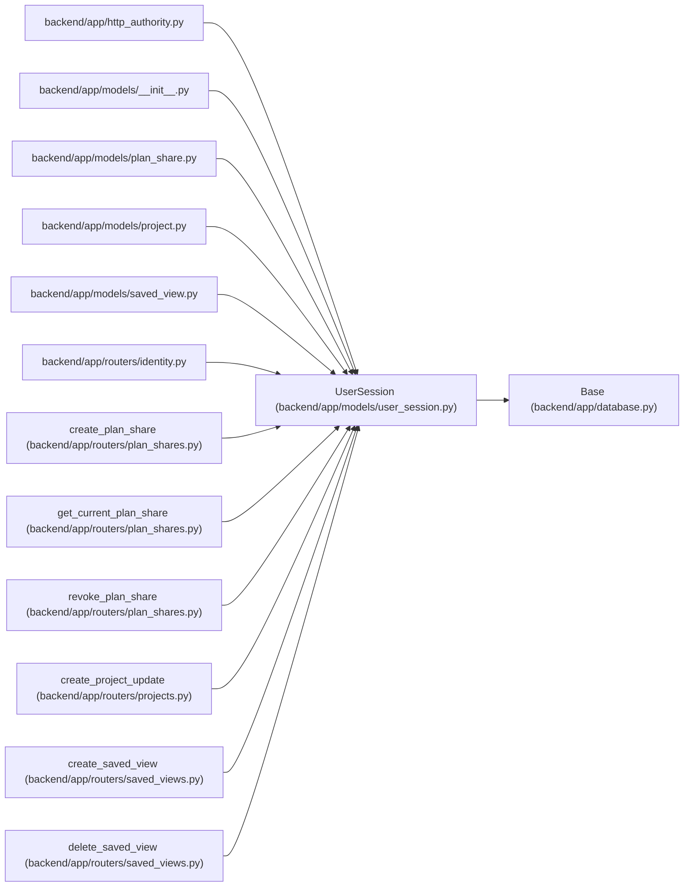

# UserSession

**Location:** `backend/app/models/user_session.py:16`
**Kind:** Class
**Bases:** `Base`
**Module:** [user_session](../modules/user_session.md)

## Description

Opaque browser identity with non-authoritative request audit metadata.

## Attributes

| Name | Type | Default | Description |
|------|------|---------|-------------|
| `id` | `Mapped[int]` | `mapped_column(primary_key=True)` | — |
| `public_id` | `Mapped[str]` | `mapped_column(String(24), unique=True, index=True, default=lambda: secrets.token_hex(6))` | — |
| `principal_id` | `Mapped[int \| None]` | `mapped_column(ForeignKey('principals.id', ondelete='RESTRICT'), index=True)` | — |
| `csrf_token` | `Mapped[str \| None]` | `mapped_column(String(128))` | — |
| `authenticated_at` | `Mapped[datetime \| None]` | `mapped_column(UTCDateTime())` | — |
| `principal` | `Mapped['Principal \| None']` | `relationship('Principal', lazy='selectin')` | — |
| `session_token_hash` | `Mapped[str \| None]` | `mapped_column(String(64), unique=True, index=True, nullable=True)` | — |
| `ip_address` | `Mapped[str]` | `mapped_column(String, index=True)` | — |
| `user_agent` | `Mapped[str \| None]` | `mapped_column(String, nullable=True)` | — |
| `created_at` | `Mapped[datetime]` | `mapped_column(UTCDateTime(), default=utc_now)` | — |
| `last_seen_at` | `Mapped[datetime]` | `mapped_column(UTCDateTime(), default=utc_now, onupdate=utc_now)` | — |
| `expires_at` | `Mapped[datetime \| None]` | `mapped_column(UTCDateTime(), nullable=True)` | — |
| `revoked_at` | `Mapped[datetime \| None]` | `mapped_column(UTCDateTime(), nullable=True)` | — |
| `saved_views` | `Mapped[list['SavedView']]` | `relationship('SavedView', back_populates='created_by_session')` | — |
| `project_updates` | `Mapped[list['ProjectUpdateEntry']]` | `relationship('ProjectUpdateEntry', back_populates='created_by_session')` | — |
| `plan_shares` | `Mapped[list['PlanShare']]` | `relationship('PlanShare', back_populates='created_by_session')` | — |

## Methods

| Method | Signature | Decorators | Description |
|--------|-----------|------------|-------------|
| `__repr__` | `() -> str` | — | — |
| `display_name` | `() -> str` | `@property` | Return a privacy-safe stable label without exposing IP or token data. |
| `authenticated` | `() -> bool` | `@property` | — |

## Relationships

<!-- Auto-generated relationship summary. Do not edit by hand. -->

### Summary

| Module | Methods | Attributes |
|---|---:|---|
| [user_session](../modules/user_session.md) | 3 | `authenticated_at`, `created_at`, `csrf_token`, `expires_at`, `id`, `ip_address`, `last_seen_at`, `plan_shares`, `principal`, `principal_id`, `project_updates`, `public_id` |

### Structure

| Kind | Entity | Module |
|---|---|---|
| Base | `Base` | [app_database](../modules/app_database.md) |

### References

| Reference | Kind | Source | Call sites |
|---|---|---|---:|
| `http_authority` | import | [http_authority](../modules/http_authority.md) | — |
| `__init__` | import | [models___init__](../modules/models___init__.md) | — |
| `plan_share` | import | [models_plan_share](../modules/models_plan_share.md) | — |
| `project` | import | [models_project](../modules/models_project.md) | — |
| `saved_view` | import | [models_saved_view](../modules/models_saved_view.md) | — |
| `identity` | import | [routers_identity](../modules/routers_identity.md) | — |
| `create_plan_share` | type_reference | [plan_shares](../modules/plan_shares.md) | — |
| `get_current_plan_share` | type_reference | [plan_shares](../modules/plan_shares.md) | — |
| `revoke_plan_share` | type_reference | [plan_shares](../modules/plan_shares.md) | — |
| `create_project_update` | type_reference | [projects](../modules/projects.md) | — |
| `create_saved_view` | type_reference | [saved_views](../modules/saved_views.md) | — |
| `delete_saved_view` | type_reference | [saved_views](../modules/saved_views.md) | — |

> References: showing 12 of 43 logical references; 31 omitted by the 12-row generated summary limit.
