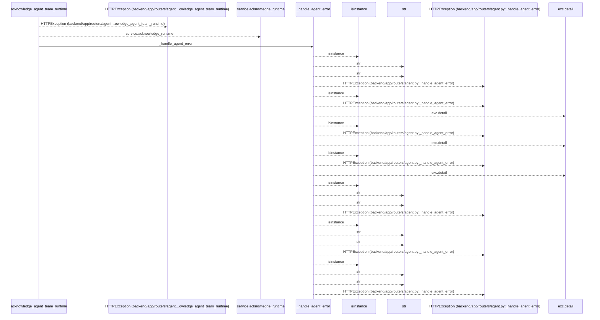
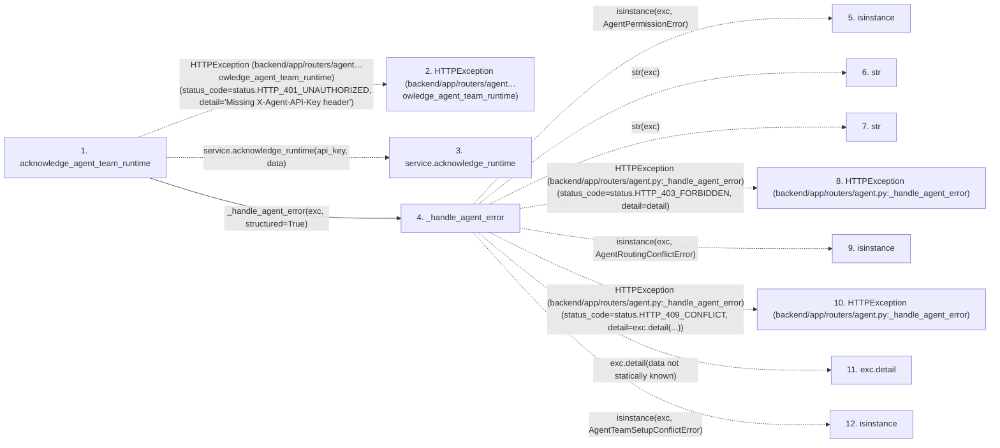

# acknowledge_agent_team_runtime

**Entry point:** `acknowledge_agent_team_runtime` (`http`)
**Source:** [routers_agent](../modules/routers_agent.md)
**Modules touched:** [routers_agent](../modules/routers_agent.md)

## Call sequence

<!-- Auto-generated from static call edges. Dashed arrows are external or unresolved calls. Reviewed runtime conditions and side effects belong in Behavior. -->

## Data flow

<!-- Auto-generated static analysis. Treat values and boundaries as best-effort hints, not runtime proof. -->

### Step data

| Step | Inputs | Reads | Writes | Returns |
|---|---|---|---|---|
| `acknowledge_agent_team_runtime` | `data: AgentTeamRuntimeAcknowledgement`, `response: Response`, `service: Annotated[AgentTeamSetupService, Depends(get_agent_team_setup_service)]`, `api_key: Annotated[Optional[str], Header(alias='X-Agent-API-Key')]` | `status` | `response.headers[...]`, `response.headers[...]` | `result` |
| `HTTPException (backend/app/routers/agent…owledge_agent_team_runtime)` | - | - | - | - |
| `service.acknowledge_runtime` | - | - | - | - |
| `_handle_agent_error` | `exc: Exception`, `structured: bool` | `AgentPermissionError`, `status`, `AgentRoutingConflictError`, `status`, `AgentTeamSetupConflictError`, `status`, `TaskVersionConflictError`, `status` | - | - |
| `isinstance` | - | - | - | - |
| `str` | - | - | - | - |
| `str` | - | - | - | - |
| `HTTPException (backend/app/routers/agent.py:_handle_agent_error)` | - | - | - | - |
| `isinstance` | - | - | - | - |
| `HTTPException (backend/app/routers/agent.py:_handle_agent_error)` | - | - | - | - |
| `exc.detail` | - | - | - | - |
| `isinstance` | - | - | - | - |

### Call data

| From | To | Line | Call |
|---|---|---:|---|
| acknowledge_agent_team_runtime | HTTPException (backend/app/routers/agent…owledge_agent_team_runtime) | 528 | `HTTPException(status_code=status.HTTP_401_UNAUTHORIZED, detail='Missing X-Agent-API-Key header')` |
| acknowledge_agent_team_runtime | service.acknowledge_runtime | 533 | `service.acknowledge_runtime(api_key, data)` |
| acknowledge_agent_team_runtime | _handle_agent_error | 535 | `_handle_agent_error(exc, structured=True)` |
| _handle_agent_error | isinstance | 252 | `isinstance(exc, AgentPermissionError)` |
| _handle_agent_error | str | 254 | `str(exc)` |
| _handle_agent_error | str | 256 | `str(exc)` |
| _handle_agent_error | HTTPException (backend/app/routers/agent.py:_handle_agent_error) | 258 | `HTTPException(status_code=status.HTTP_403_FORBIDDEN, detail=detail)` |
| _handle_agent_error | isinstance | 259 | `isinstance(exc, AgentRoutingConflictError)` |
| _handle_agent_error | HTTPException (backend/app/routers/agent.py:_handle_agent_error) | 260 | `HTTPException(status_code=status.HTTP_409_CONFLICT, detail=exc.detail(...))` |
| _handle_agent_error | exc.detail | 260 | `exc.detail(data not statically known)` |
| _handle_agent_error | isinstance | 261 | `isinstance(exc, AgentTeamSetupConflictError)` |

### Boundary effects

*No boundary effects detected.*

### Static analysis gaps

| Kind | Step | Target | Line |
|---|---|---|---:|
| external_call | `acknowledge_agent_team_runtime` | `HTTPException` | 528 |
| unresolved_call | `acknowledge_agent_team_runtime` | `service.acknowledge_runtime` | 533 |
| external_call | `_handle_agent_error` | `isinstance` | 252 |
| external_call | `_handle_agent_error` | `HTTPException` | 258 |
| external_call | `_handle_agent_error` | `isinstance` | 259 |
| external_call | `_handle_agent_error` | `HTTPException` | 260 |
| unresolved_call | `_handle_agent_error` | `exc.detail` | 260 |
| external_call | `_handle_agent_error` | `isinstance` | 261 |
| step_limit | `acknowledge_agent_team_runtime` | `first 12 steps` | 0 |

## Behavior

This flow starts at `acknowledge_agent_team_runtime` and is classified as `http`. The generated call and data-flow sections are bounded static projections; runtime conditions and side effects require source-level confirmation.
