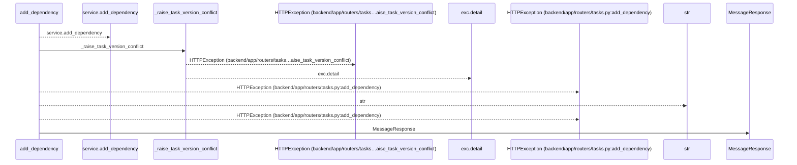
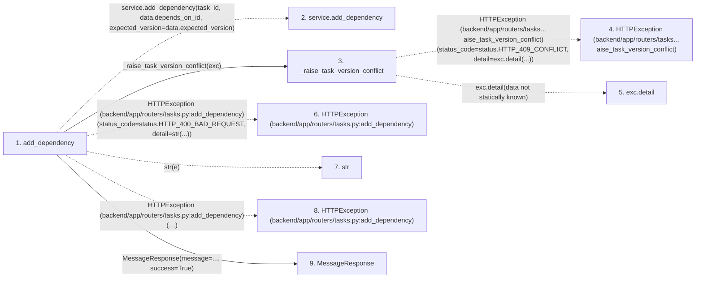

# add_dependency

**Entry point:** `add_dependency` (`http`)
**Source:** [tasks](../modules/tasks.md)
**Modules touched:** [schemas_common](../modules/schemas_common.md), [tasks](../modules/tasks.md)

## Call sequence

<!-- Auto-generated from static call edges. Dashed arrows are external or unresolved calls. Reviewed runtime conditions and side effects belong in Behavior. -->

## Data flow

<!-- Auto-generated static analysis. Treat values and boundaries as best-effort hints, not runtime proof. -->

### Step data

| Step | Inputs | Reads | Writes | Returns |
|---|---|---|---|---|
| `add_dependency` | `task_id: int`, `data: TaskDependencyCreate`, `service: Annotated[TaskService, Depends(get_task_service)]` | `TaskVersionConflictError`, `status`, `status` | - | `MessageResponse(...)` |
| `service.add_dependency` | - | - | - | - |
| `_raise_task_version_conflict` | `exc: TaskVersionConflictError` | `status` | - | - |
| `HTTPException (backend/app/routers/tasks…aise_task_version_conflict)` | - | - | - | - |
| `exc.detail` | - | - | - | - |
| `HTTPException (backend/app/routers/tasks.py:add_dependency)` | - | - | - | - |
| `str` | - | - | - | - |
| `HTTPException (backend/app/routers/tasks.py:add_dependency)` | - | - | - | - |
| `MessageResponse` | - | - | - | - |

### Call data

| From | To | Line | Call |
|---|---|---:|---|
| add_dependency | service.add_dependency | 620 | `service.add_dependency(task_id, data.depends_on_id, expected_version=data.expected_version)` |
| add_dependency | _raise_task_version_conflict | 622 | `_raise_task_version_conflict(exc)` |
| _raise_task_version_conflict | HTTPException (backend/app/routers/tasks…aise_task_version_conflict) | 59 | `HTTPException(status_code=status.HTTP_409_CONFLICT, detail=exc.detail(...))` |
| _raise_task_version_conflict | exc.detail | 61 | `exc.detail(data not statically known)` |
| add_dependency | HTTPException (backend/app/routers/tasks.py:add_dependency) | 624 | `HTTPException(status_code=status.HTTP_400_BAD_REQUEST, detail=str(...))` |
| add_dependency | str | 626 | `str(e)` |
| add_dependency | HTTPException (backend/app/routers/tasks.py:add_dependency) | 629 | `HTTPException(status_code=status.HTTP_400_BAD_REQUEST, detail='Could not add dependency. Check that both tasks exist and are different.')` |
| add_dependency | MessageResponse | 633 | `MessageResponse(message=..., success=True)` |

### Boundary effects

*No boundary effects detected.*

### Static analysis gaps

| Kind | Step | Target | Line |
|---|---|---|---:|
| unresolved_call | `add_dependency` | `service.add_dependency` | 620 |
| external_call | `_raise_task_version_conflict` | `HTTPException` | 59 |
| unresolved_call | `_raise_task_version_conflict` | `exc.detail` | 61 |
| external_call | `add_dependency` | `HTTPException` | 624 |
| external_call | `add_dependency` | `HTTPException` | 629 |

## Behavior

This flow starts at `add_dependency` and is classified as `http`. The generated call and data-flow sections are bounded static projections; runtime conditions and side effects require source-level confirmation.

Actual dependency changes invalidate current progress and acceptance through general updates and individual add/remove commands. Immutable evidence history remains available, a command reserves one task version, and no-op dependency requests retain their current version. Locked graph relationships are loaded explicitly before applying a dependency update.
