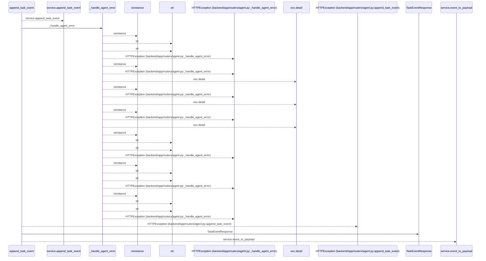
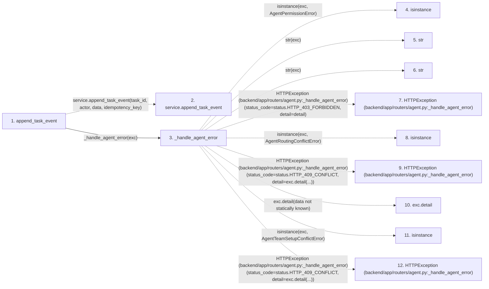

# append_task_event

**Entry point:** `append_task_event` (`http`)
**Source:** [routers_agent](../modules/routers_agent.md)
**Modules touched:** [routers_agent](../modules/routers_agent.md), [schemas_agent](../modules/schemas_agent.md)

## Call sequence

<!-- Auto-generated from static call edges. Dashed arrows are external or unresolved calls. Reviewed runtime conditions and side effects belong in Behavior. -->

## Data flow

<!-- Auto-generated static analysis. Treat values and boundaries as best-effort hints, not runtime proof. -->

### Step data

| Step | Inputs | Reads | Writes | Returns |
|---|---|---|---|---|
| `append_task_event` | `task_id: int`, `data: TaskEventCreate`, `actor: Annotated[AgentActor, Depends(get_agent_actor)]`, `service: Annotated[AgentService, Depends(get_agent_service)]`, `idempotency_key: Annotated[Optional[str], Header(alias='Idempotency-Key')]` | `status` | - | `TaskEventResponse(...)` |
| `service.append_task_event` | - | - | - | - |
| `_handle_agent_error` | `exc: Exception`, `structured: bool` | `AgentPermissionError`, `status`, `AgentRoutingConflictError`, `status`, `AgentTeamSetupConflictError`, `status`, `TaskVersionConflictError`, `status` | - | - |
| `isinstance` | - | - | - | - |
| `str` | - | - | - | - |
| `str` | - | - | - | - |
| `HTTPException (backend/app/routers/agent.py:_handle_agent_error)` | - | - | - | - |
| `isinstance` | - | - | - | - |
| `HTTPException (backend/app/routers/agent.py:_handle_agent_error)` | - | - | - | - |
| `exc.detail` | - | - | - | - |
| `isinstance` | - | - | - | - |
| `HTTPException (backend/app/routers/agent.py:_handle_agent_error)` | - | - | - | - |

### Call data

| From | To | Line | Call |
|---|---|---:|---|
| append_task_event | service.append_task_event | 1139 | `service.append_task_event(task_id, actor, data, idempotency_key)` |
| append_task_event | _handle_agent_error | 1141 | `_handle_agent_error(exc)` |
| _handle_agent_error | isinstance | 244 | `isinstance(exc, AgentPermissionError)` |
| _handle_agent_error | str | 246 | `str(exc)` |
| _handle_agent_error | str | 248 | `str(exc)` |
| _handle_agent_error | HTTPException (backend/app/routers/agent.py:_handle_agent_error) | 250 | `HTTPException(status_code=status.HTTP_403_FORBIDDEN, detail=detail)` |
| _handle_agent_error | isinstance | 251 | `isinstance(exc, AgentRoutingConflictError)` |
| _handle_agent_error | HTTPException (backend/app/routers/agent.py:_handle_agent_error) | 252 | `HTTPException(status_code=status.HTTP_409_CONFLICT, detail=exc.detail(...))` |
| _handle_agent_error | exc.detail | 252 | `exc.detail(data not statically known)` |
| _handle_agent_error | isinstance | 253 | `isinstance(exc, AgentTeamSetupConflictError)` |
| _handle_agent_error | HTTPException (backend/app/routers/agent.py:_handle_agent_error) | 254 | `HTTPException(status_code=status.HTTP_409_CONFLICT, detail=exc.detail(...))` |

### Boundary effects

*No boundary effects detected.*

### Static analysis gaps

| Kind | Step | Target | Line |
|---|---|---|---:|
| unresolved_call | `append_task_event` | `service.append_task_event` | 1139 |
| external_call | `_handle_agent_error` | `isinstance` | 244 |
| external_call | `_handle_agent_error` | `HTTPException` | 250 |
| external_call | `_handle_agent_error` | `isinstance` | 251 |
| external_call | `_handle_agent_error` | `HTTPException` | 252 |
| unresolved_call | `_handle_agent_error` | `exc.detail` | 252 |
| external_call | `_handle_agent_error` | `isinstance` | 253 |
| external_call | `_handle_agent_error` | `HTTPException` | 254 |
| step_limit | `append_task_event` | `first 12 steps` | 0 |

## Behavior

This flow starts at `append_task_event` and is classified as `http`. The generated call and data-flow sections are bounded static projections; runtime conditions and side effects require source-level confirmation.
