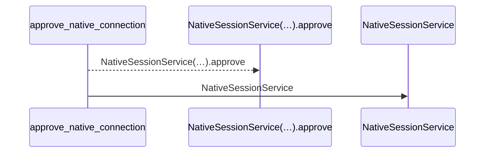
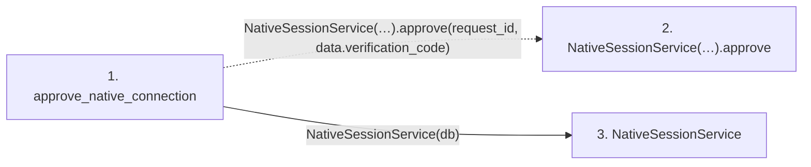

# approve_native_connection

**Entry point:** `approve_native_connection` (`http`)
**Source:** [routers_identity](../modules/routers_identity.md)
**Modules touched:** [native_session_service](../modules/native_session_service.md), [routers_identity](../modules/routers_identity.md)

## Call sequence

<!-- Auto-generated from static call edges. Dashed arrows are external or unresolved calls. Reviewed runtime conditions and side effects belong in Behavior. -->

## Data flow

<!-- Auto-generated static analysis. Treat values and boundaries as best-effort hints, not runtime proof. -->

### Step data

| Step | Inputs | Reads | Writes | Returns |
|---|---|---|---|---|
| `approve_native_connection` | `request_id: str`, `data: NativeConnectionApproval`, `response: Response`, `db: Database` | - | `response.headers[...]` | `...` |
| `NativeSessionService(…).approve` | - | - | - | - |
| `NativeSessionService` | - | - | - | - |

### Call data

| From | To | Line | Call |
|---|---|---:|---|
| approve_native_connection | NativeSessionService(…).approve | 101 | `NativeSessionService(db).approve(request_id, data.verification_code)` |
| approve_native_connection | NativeSessionService | 101 | `NativeSessionService(db)` |

### Boundary effects

*No boundary effects detected.*

### Static analysis gaps

| Kind | Step | Target | Line |
|---|---|---|---:|
| unresolved_call | `approve_native_connection` | `NativeSessionService(db).approve` | 101 |

## Behavior

Requires a human session and the matching displayed code. Normal HTTP cookie mutations retain CSRF and Origin checks. A conditional update binds the request to the approving session; another session cannot replace that approval.
