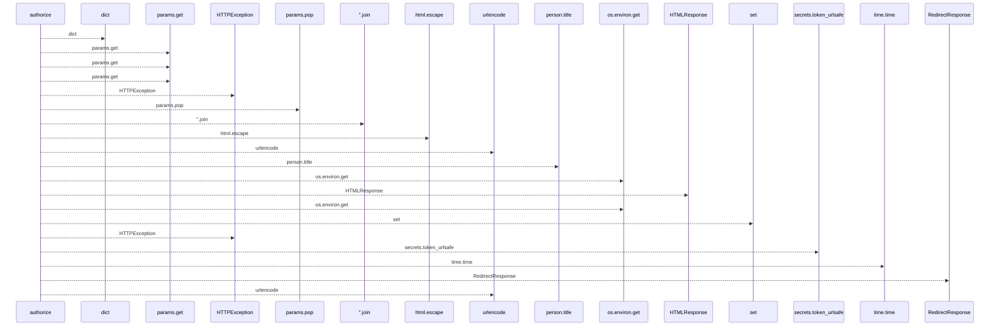
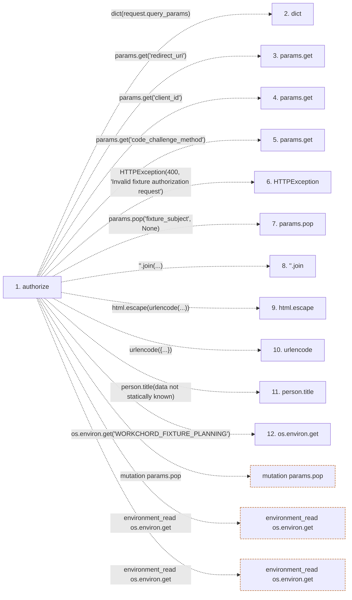

# authorize

**Entry point:** `authorize` (`http`)
**Source:** [serve_disposable_oidc](../modules/serve_disposable_oidc.md)
**Modules touched:** [serve_disposable_oidc](../modules/serve_disposable_oidc.md)

## Call sequence

<!-- Auto-generated from static call edges. Dashed arrows are external or unresolved calls. Reviewed runtime conditions and side effects belong in Behavior. -->

## Data flow

<!-- Auto-generated static analysis. Treat values and boundaries as best-effort hints, not runtime proof. -->

### Step data

| Step | Inputs | Reads | Writes | Returns |
|---|---|---|---|---|
| `authorize` | `request: Request` | `redirect_uri`, `redirect_uri` | `grants[...]` | `HTMLResponse(...)`, `RedirectResponse(...)` |
| `dict` | - | - | - | - |
| `params.get` | - | - | - | - |
| `params.get` | - | - | - | - |
| `params.get` | - | - | - | - |
| `HTTPException` | - | - | - | - |
| `params.pop` | - | - | - | - |
| `''.join` | - | - | - | - |
| `html.escape` | - | - | - | - |
| `urlencode` | - | - | - | - |
| `person.title` | - | - | - | - |
| `os.environ.get` | - | - | - | - |

### Call data

| From | To | Line | Call |
|---|---|---:|---|
| authorize | dict | 48 | `dict(request.query_params)` |
| authorize | params.get | 49 | `params.get('redirect_uri')` |
| authorize | params.get | 49 | `params.get('client_id')` |
| authorize | params.get | 49 | `params.get('code_challenge_method')` |
| authorize | HTTPException | 50 | `HTTPException(400, 'Invalid fixture authorization request')` |
| authorize | params.pop | 51 | `params.pop('fixture_subject', None)` |
| authorize | ''.join | 53 | `''.join(...)` |
| authorize | html.escape | 53 | `html.escape(urlencode(...))` |
| authorize | urlencode | 53 | `urlencode({...})` |
| authorize | person.title | 53 | `person.title(data not statically known)` |
| authorize | os.environ.get | 53 | `os.environ.get('WORKCHORD_FIXTURE_PLANNING')` |

### Boundary effects

| Kind | Target | Step | Line |
|---|---|---|---:|
| mutation | `params.pop` | `authorize` | 51 |
| environment_read | `os.environ.get` | `authorize` | 53 |
| environment_read | `os.environ.get` | `authorize` | 55 |

### Static analysis gaps

| Kind | Step | Target | Line |
|---|---|---|---:|
| unresolved_call | `authorize` | `params.get` | 49 |
| external_call | `authorize` | `HTTPException` | 50 |
| step_limit | `authorize` | `first 12 steps` | 0 |

## Behavior

This flow starts at `authorize` and is classified as `http`. The generated call and data-flow sections are bounded static projections; runtime conditions and side effects require source-level confirmation.
