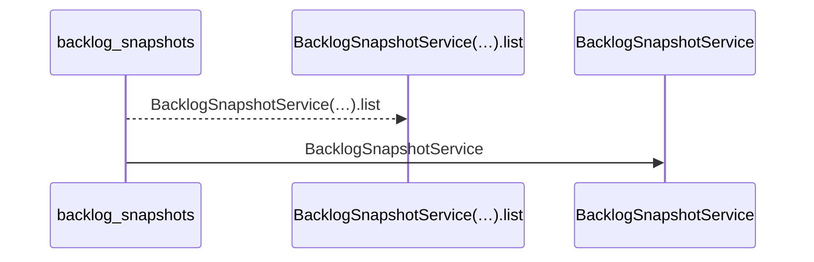
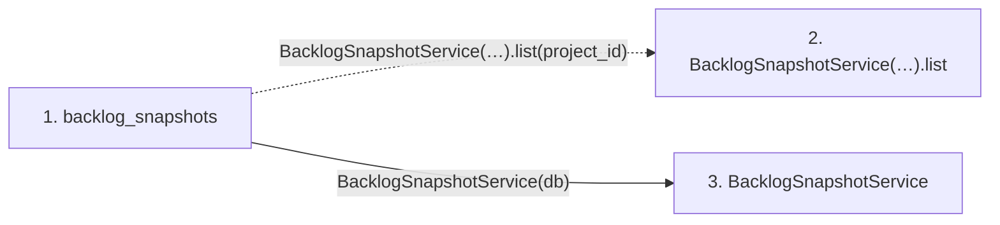

# backlog_snapshots

**Entry point:** `backlog_snapshots` (`http`)
**Source:** [routers_task_domain](../modules/routers_task_domain.md)
**Modules touched:** [backlog_snapshot_service](../modules/backlog_snapshot_service.md), [routers_task_domain](../modules/routers_task_domain.md)

## Call sequence

<!-- Auto-generated from static call edges. Dashed arrows are external or unresolved calls. Reviewed runtime conditions and side effects belong in Behavior. -->

## Data flow

<!-- Auto-generated static analysis. Treat values and boundaries as best-effort hints, not runtime proof. -->

### Step data

| Step | Inputs | Reads | Writes | Returns |
|---|---|---|---|---|
| `backlog_snapshots` | `project_id: int`, `db: DB` | - | - | `...` |
| `BacklogSnapshotService(…).list` | - | - | - | - |
| `BacklogSnapshotService` | - | - | - | - |

### Call data

| From | To | Line | Call |
|---|---|---:|---|
| backlog_snapshots | BacklogSnapshotService(…).list | 201 | `BacklogSnapshotService(db).list(project_id)` |
| backlog_snapshots | BacklogSnapshotService | 201 | `BacklogSnapshotService(db)` |

### Boundary effects

*No boundary effects detected.*

### Static analysis gaps

*No static analysis gaps detected.*

## Behavior

This flow starts at `backlog_snapshots` and is classified as `http`. The generated call and data-flow sections are bounded static projections; runtime conditions and side effects require source-level confirmation.
