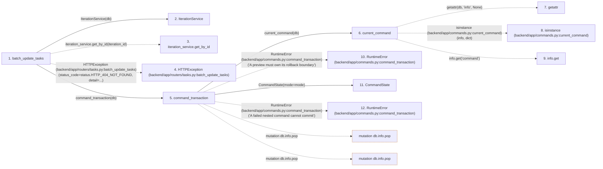

# batch_update_tasks

**Entry point:** `batch_update_tasks` (`http`)
**Source:** [tasks](../modules/tasks.md)
**Modules touched:** [authority](../modules/authority.md), [commands](../modules/commands.md), [iteration_service](../modules/iteration_service.md), [schemas_task](../modules/schemas_task.md), [tasks](../modules/tasks.md)

## Call sequence

```mermaid
sequenceDiagram
    participant p0 as batch_update_tasks
    participant p1 as IterationService
    participant p2 as iteration_service.get_by_id
    participant p3 as HTTPException (backend/app/routers/tasks.py:batch_update_tasks)
    participant p4 as command_transaction
    participant p5 as current_command
    participant p6 as getattr
    participant p7 as isinstance (backend/app/commands.py:current_command)
    participant p8 as info.get
    participant p9 as RuntimeError (backend/app/commands.py:command_transaction)
    participant p10 as CommandState
    participant p11 as db.rollback
    participant p12 as db.commit
    participant p13 as db.flush
    participant p14 as db.info.pop
    participant p15 as lock_iterations
    participant p16 as RuntimeError (backend/app/commands.py:lock_iterations)
    participant p17 as sorted
    participant p18 as set
    participant p19 as AggregateVersionConflict
    participant p20 as db.scalar
    participant p21 as select(…).where(…).with_for_update
    participant p22 as select(…).where (backend/app/commands.py:lock_iterations)
    participant p23 as select
    participant p24 as ValueError (backend/app/commands.py:lock_iterations)
    participant p25 as db.info.get (backend/app/commands.py:lock_iterations)
    participant p26 as internal_authority
    p0->>p1: IterationService
    p0-->>p2: iteration_service.get_by_id
    p0-->>p3: HTTPException (backend/app/routers/tasks.py:batch_update_tasks)
    p0->>p4: command_transaction
    p4->>p5: current_command
    p5-->>p6: getattr
    p5-->>p7: isinstance (backend/app/commands.py:current_command)
    p5-->>p8: info.get
    p4-->>p9: RuntimeError (backend/app/commands.py:command_transaction)
    p4->>p10: CommandState
    p4-->>p9: RuntimeError (backend/app/commands.py:command_transaction)
    p4-->>p11: db.rollback
    p4-->>p12: db.commit
    p4-->>p13: db.flush
    p4-->>p11: db.rollback
    p4-->>p14: db.info.pop
    p4-->>p14: db.info.pop
    p0->>p15: lock_iterations
    p15->>p5: current_command
    p15-->>p16: RuntimeError (backend/app/commands.py:lock_iterations)
    p15-->>p17: sorted
    p15-->>p18: set
    p15->>p19: AggregateVersionConflict
    p15-->>p20: db.scalar
    p15-->>p21: select(…).where(…).with_for_update
    p15-->>p22: select(…).where (backend/app/commands.py:lock_iterations)
    p15-->>p23: select
    p15-->>p24: ValueError (backend/app/commands.py:lock_iterations)
    p15-->>p25: db.info.get (backend/app/commands.py:lock_iterations)
    p15->>p26: internal_authority
```

<!-- Auto-generated from static call edges. Dashed arrows are external or unresolved calls. Reviewed runtime conditions and side effects belong in Behavior. -->

> Call sequence diagram shows 30 of 86 interactions; 56 omitted to keep the visualization within the 30-interaction and generated-diagram limits.

## Data flow

<!-- Auto-generated static analysis. Treat values and boundaries as best-effort hints, not runtime proof. -->

### Step data

| Step | Inputs | Reads | Writes | Returns |
|---|---|---|---|---|
| `batch_update_tasks` | `iteration_id: int`, `data: TaskBatchUpdateRequest`, `service: Annotated[TaskService, Depends(get_task_service)]`, `scheduler_service: Annotated[SchedulerService, Depends(get_scheduler_service)]`, `db: Annotated[AsyncSession, Depends(get_db, scope='function')]` | `status`, `TaskVersionConflictError`, `status` | - | `TaskBatchUpdateResponse(...)` |
| `IterationService` | - | - | - | - |
| `iteration_service.get_by_id` | - | - | - | - |
| `HTTPException (backend/app/routers/tasks.py:batch_update_tasks)` | - | - | - | - |
| `command_transaction` | `db: AsyncSession`, `mode`, `commit` | - | `previous.failed`, `db.info[...]` | `none` |
| `current_command` | `db` | - | - | `...` |
| `getattr` | - | - | - | - |
| `isinstance (backend/app/commands.py:current_command)` | - | - | - | - |
| `info.get` | - | - | - | - |
| `RuntimeError (backend/app/commands.py:command_transaction)` | - | - | - | - |
| `CommandState` | - | - | - | - |
| `RuntimeError (backend/app/commands.py:command_transaction)` | - | - | - | - |

### Call data

| From | To | Line | Call |
|---|---|---:|---|
| batch_update_tasks | IterationService | 238 | `IterationService(db)` |
| batch_update_tasks | iteration_service.get_by_id | 239 | `iteration_service.get_by_id(iteration_id)` |
| batch_update_tasks | HTTPException (backend/app/routers/tasks.py:batch_update_tasks) | 241 | `HTTPException(status_code=status.HTTP_404_NOT_FOUND, detail=...)` |
| batch_update_tasks | command_transaction | 247 | `command_transaction(db)` |
| command_transaction | current_command | 52 | `current_command(db)` |
| current_command | getattr | 38 | `getattr(db, 'info', None)` |
| current_command | isinstance (backend/app/commands.py:current_command) | 39 | `isinstance(info, dict)` |
| current_command | info.get | 39 | `info.get('command')` |
| command_transaction | RuntimeError (backend/app/commands.py:command_transaction) | 55 | `RuntimeError('A preview must own its rollback boundary')` |
| command_transaction | CommandState | 62 | `CommandState(mode=mode)` |
| command_transaction | RuntimeError (backend/app/commands.py:command_transaction) | 67 | `RuntimeError('A failed nested command cannot commit')` |

### Boundary effects

| Kind | Target | Step | Line |
|---|---|---|---:|
| mutation | `db.info.pop` | `command_transaction` | 78 |
| mutation | `db.info.pop` | `command_transaction` | 80 |

### Static analysis gaps

| Kind | Step | Target | Line |
|---|---|---|---:|
| unresolved_call | `batch_update_tasks` | `iteration_service.get_by_id` | 239 |
| external_call | `batch_update_tasks` | `HTTPException` | 241 |
| external_call | `current_command` | `getattr` | 38 |
| external_call | `current_command` | `isinstance` | 39 |
| unresolved_call | `current_command` | `info.get` | 39 |
| external_call | `command_transaction` | `RuntimeError` | 55 |
| external_call | `command_transaction` | `RuntimeError` | 67 |
| step_limit | `batch_update_tasks` | `first 12 steps` | 0 |

## Behavior

This flow starts at `batch_update_tasks` and is classified as `http`. The generated call and data-flow sections are bounded static projections; runtime conditions and side effects require source-level confirmation.

Validates the observed aggregate and task revisions, applies all selected changes and scheduling, and commits once before returning. A conflict or failed item rolls back the whole logical edit.
