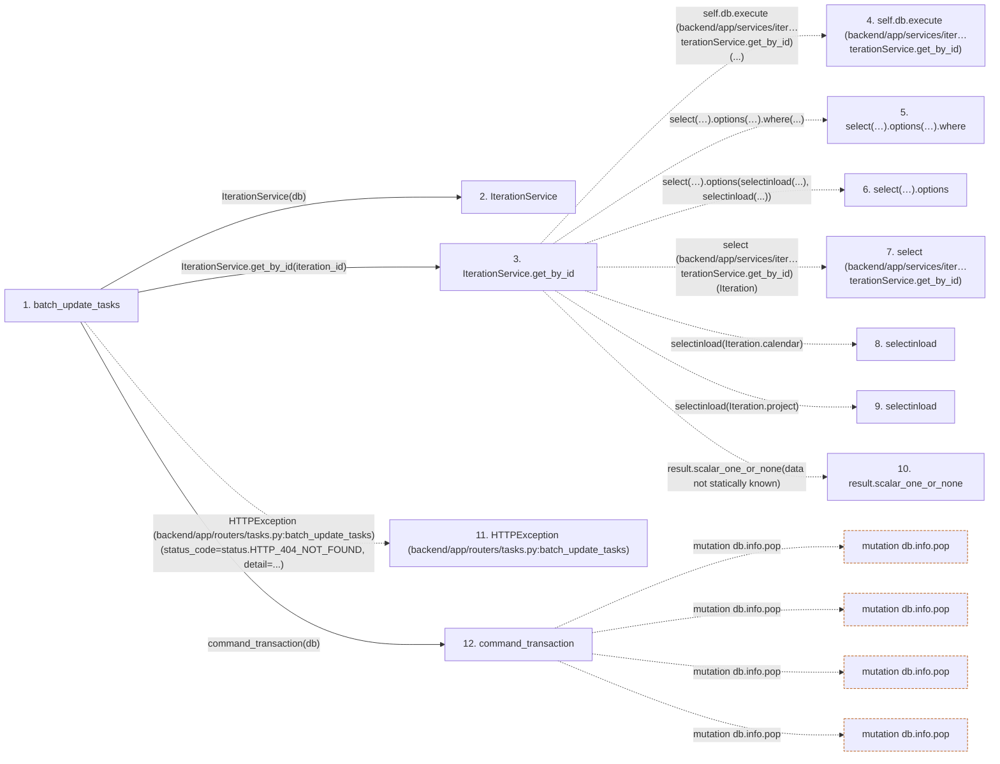

# batch_update_tasks

**Entry point:** `batch_update_tasks` (`http`)
**Source:** [tasks](../modules/tasks.md)
**Modules touched:** [authority](../modules/authority.md), [commands](../modules/commands.md), [config](../modules/config.md), [delivery_dependency_service](../modules/delivery_dependency_service.md), and 9 more

**Complete modules touched:**

- [authority](../modules/authority.md)
- [commands](../modules/commands.md)
- [config](../modules/config.md)
- [delivery_dependency_service](../modules/delivery_dependency_service.md)
- [discussion_service](../modules/discussion_service.md)
- [identity_service](../modules/identity_service.md)
- [iteration_service](../modules/iteration_service.md)
- [models_outbound_webhook](../modules/models_outbound_webhook.md)
- [mutation_versions](../modules/mutation_versions.md)
- [schemas_task](../modules/schemas_task.md)
- [task_brief_service](../modules/task_brief_service.md)
- [task_service](../modules/task_service.md)
- [tasks](../modules/tasks.md)

## Call sequence

> Static overview in presentation order, not runtime execution order. Arrows retain captured callers; representative internal continuations and boundary examples precede repeated helper detail.

<!-- Auto-generated from static call edges. Dashed arrows are external or unresolved calls. Reviewed runtime conditions and side effects belong in Behavior. -->

```mermaid
sequenceDiagram
    participant p0 as batch_update_tasks
    participant p1 as command_transaction
    participant p2 as apply_batch_update_items
    participant p3 as IterationService
    participant p4 as IterationService.get_by_id
    participant p5 as lock_iterations
    participant p6 as DeliveryDependencyService.reconcile
    participant p7 as DeliveryDependencyService
    participant p8 as _raise_task_version_conflict
    participant p9 as TaskBatchUpdateResponse
    participant p10 as DiscussionService.enqueue
    participant p11 as DeliveryDependencyService.validate_cycles
    participant p12 as DiscussionService.recipient_authorized
    participant p13 as TaskService.reserve_task_version
    participant p14 as clear_execution_evidence
    participant p15 as DeliveryDependencyService.graph
    participant p16 as IdentityService.context
    participant p17 as lock_planning
    participant p18 as require_mutation_revision
    participant p19 as current_command
    participant p20 as CommandState
    participant p21 as TaskUpdate
    participant p22 as DiscussionService
    participant p23 as TaskBatchUpdateResponseItem
    participant p24 as internal_authority
    participant p25 as PlanningConflict
    participant p26 as OutboundWebhookEvent
    participant p27 as OutboundWebhookDelivery
    participant p28 as TaskService
    participant p29 as HTTPException (backend/app/routers/tasks.py:batch_update_tasks)
    participant p30 as scheduler_service.schedule_iteration
    p0->>p1: command_transaction
    p0->>p2: apply_batch_update_items
    p0->>p3: IterationService
    p0->>p4: IterationService.get_by_id
    p0->>p5: lock_iterations
    p0->>p6: DeliveryDependencyService.reconcile
    p0->>p7: DeliveryDependencyService
    p0->>p8: _raise_task_version_conflict
    p0->>p9: TaskBatchUpdateResponse
    p1->>p10: DiscussionService.enqueue
    p6->>p11: DeliveryDependencyService.validate_cycles
    p10->>p12: DiscussionService.recipient_authorized
    p6->>p13: TaskService.reserve_task_version
    p6->>p14: clear_execution_evidence
    p11->>p15: DeliveryDependencyService.graph
    p12->>p16: IdentityService.context
    p5->>p17: lock_planning
    p5->>p18: require_mutation_revision
    p1->>p19: current_command
    p1->>p20: CommandState
    p2->>p21: TaskUpdate
    p1->>p22: DiscussionService
    p2->>p23: TaskBatchUpdateResponseItem
    p10->>p24: internal_authority
    p6->>p25: PlanningConflict
    p10->>p26: OutboundWebhookEvent
    p10->>p27: OutboundWebhookDelivery
    p6->>p28: TaskService
    p0-->>p29: HTTPException (backend/app/routers/tasks.py:batch_update_tasks)(status_code=status.HTTP_404_NOT_FOUND, detail=...)
    p0-->>p30: scheduler_service.schedule_iteration(iteration_id, expected_planning_revision=data.expected_planning_revision)
```

> Call sequence diagram shows 30 of 278 interactions; 248 omitted to keep the visualization within the 30-interaction and generated-diagram limits, with uncertain identities omitted rather than inferred.

> Captured boundary calls: external 1 of 70 (69 omitted); unresolved 1 of 148 (147 omitted). These counts cover the captured static trace.

Omitted captured detail, grouped by actual caller occurrence and target module:

| Caller | Parent step | Target module | Kind | Omitted interactions |
| --- | --- | --- | --- | --- |
| `backend/app/services/iteration_service.py:IterationService.get_by_id` | 3 | - | unresolved | 4 |
| `backend/app/services/iteration_service.py:IterationService.get_by_id` | 3 | - | external | 3 |
| `backend/app/commands.py:current_command` | 13 | - | external | 2 |
| `backend/app/commands.py:current_command` | 13 | - | unresolved | 1 |
| `backend/app/commands.py:command_transaction` | 12 | - | external | 4 |
| `backend/app/commands.py:command_transaction` | 12 | - | unresolved | 12 |
| `backend/app/commands.py:command_transaction` | 12 | [backend/app/services/delivery_dependency_service.py](../modules/delivery_dependency_service.md) | internal | 2 |
| `backend/app/services/delivery_dependency_service.py:DeliveryDependencyService.reconcile` | 24 | - | unresolved | 23 |
> Omission summary shows 8 of 54 groups; 46 further groups are not expanded here. Counts above include all omitted interactions.
> Detailed flow queries retain their own coverage and limits; omitted paths may execute at runtime.

> Trace truncated at the depth limit; deeper calls are omitted.

## Data flow

<!-- Auto-generated static analysis. Treat values and boundaries as best-effort hints, not runtime proof. -->

### Analysis coverage

**Effect analysis partially available.** Flow assembly and source effect analysis are separate; empty observations do not prove an empty handler body.

Source steps: 61; effect analysis evaluated: 36, partial: 0, unavailable: 25. Counts include steps omitted from the displayed trace.

Collector observations for 36 source steps with known totals: observed: 181, emitted: 181, omitted: 0. Unavailable totals are excluded.

- Callable record unavailable for one or more source steps; those steps have no represented callable body.
- Effect collector totals unavailable; observed counts cover captured records only.

| Step | Callable record | Effect analysis | Collector totals | Observed | Emitted | Omitted |
|---|---|---|---|---:|---:|---:|
| `batch_update_tasks` | `available` | `evaluated` | `available` | `9` | `9` | `0` |
| `IterationService` | `unavailable` | `unavailable` | `unavailable` | — | — | — |
| `IterationService.get_by_id` | `available` | `evaluated` | `available` | `3` | `3` | `0` |
| `self.db.execute (backend/app/services/iter…terationService.get_by_id)` | `not_applicable` | `not_applicable` | `not_applicable` | — | — | — |
| `select(…).options(…).where` | `not_applicable` | `not_applicable` | `not_applicable` | — | — | — |
| `select(…).options` | `not_applicable` | `not_applicable` | `not_applicable` | — | — | — |
| `select (backend/app/services/iter…terationService.get_by_id)` | `not_applicable` | `not_applicable` | `not_applicable` | — | — | — |
| `selectinload` | `not_applicable` | `not_applicable` | `not_applicable` | — | — | — |
| `selectinload` | `not_applicable` | `not_applicable` | `not_applicable` | — | — | — |
| `result.scalar_one_or_none` | `not_applicable` | `not_applicable` | `not_applicable` | — | — | — |
| `HTTPException (backend/app/routers/tasks.py:batch_update_tasks)` | `not_applicable` | `not_applicable` | `not_applicable` | — | — | — |
| `command_transaction` | `available` | `evaluated` | `available` | `10` | `10` | `0` |

```mermaid
flowchart LR
    s1["1. batch_update_tasks"]
    s2["2. IterationService"]
    s3["3. IterationService.get_by_id"]
    s4["4. self.db.execute (backend/app/services/iter…terationService.get_by_id)"]
    s5["5. select(…).options(…).where"]
    s6["6. select(…).options"]
    s7["7. select (backend/app/services/iter…terationService.get_by_id)"]
    s8["8. selectinload"]
    s9["9. selectinload"]
    s10["10. result.scalar_one_or_none"]
    s11["11. HTTPException (backend/app/routers/tasks.py:batch_update_tasks)"]
    s12["12. command_transaction"]
    s1 -->|"IterationService(db)"| s2
    s1 -->|"IterationService.get_by_id(iteration_id)"| s3
    s3 -. "self.db.execute (backend/app/services/iter…terationService.get_by_id)(...)" .-> s4
    s3 -. "select(…).options(…).where(...)" .-> s5
    s3 -. "select(…).options(selectinload(...), selectinload(...))" .-> s6
    s3 -. "select (backend/app/services/iter…terationService.get_by_id)(Iteration)" .-> s7
    s3 -. "selectinload(Iteration.calendar)" .-> s8
    s3 -. "selectinload(Iteration.project)" .-> s9
    s3 -. "result.scalar_one_or_none(data not statically known)" .-> s10
    s1 -. "HTTPException (backend/app/routers/tasks.py:batch_update_tasks)(status_code=status.HTTP_404_NOT_FOUND, detail=...)" .-> s11
    s1 -->|"command_transaction(db)"| s12
    b0["mutation db.info.pop"]
    s12 -. "mutation db.info.pop" .-> b0
    b1["mutation db.info.pop"]
    s12 -. "mutation db.info.pop" .-> b1
    b2["mutation db.info.pop"]
    s12 -. "mutation db.info.pop" .-> b2
    b3["mutation db.info.pop"]
    s12 -. "mutation db.info.pop" .-> b3
    click s1 "../modules/tasks.md"
    click s2 "../modules/iteration_service.md"
    click s3 "../modules/iteration_service.md"
    click s12 "../modules/commands.md"
    classDef boundary stroke:#b45309,stroke-dasharray: 4 2
    class b0 boundary
    class b1 boundary
    class b2 boundary
    class b3 boundary
```

### Step data

| Step | Inputs | Reads | Writes | Returns |
|---|---|---|---|---|
| `batch_update_tasks` | `iteration_id: int`, `data: TaskBatchUpdateRequest`, `service: Annotated[TaskService, Depends(get_task_service)]`, `scheduler_service: Annotated[SchedulerService, Depends(get_scheduler_service)]`, `db: Annotated[AsyncSession, Depends(get_db, scope='function')]` | `status`, `TaskVersionConflictError`, `status` | - | `TaskBatchUpdateResponse(...)` |
| `IterationService` | - | - | - | - |
| `IterationService.get_by_id` | `iteration_id: int` | `Iteration` | - | `result.scalar_one_or_none(...)` |
| `self.db.execute (backend/app/services/iter…terationService.get_by_id)` | - | - | - | - |
| `select(…).options(…).where` | - | - | - | - |
| `select(…).options` | - | - | - | - |
| `select (backend/app/services/iter…terationService.get_by_id)` | - | - | - | - |
| `selectinload` | - | - | - | - |
| `selectinload` | - | - | - | - |
| `result.scalar_one_or_none` | - | - | - | - |
| `HTTPException (backend/app/routers/tasks.py:batch_update_tasks)` | - | - | - | - |
| `command_transaction` | `db: AsyncSession`, `mode`, `commit` | - | `previous.failed`, `db.info[...]` | `none` |

### Call data

| From | To | Line | Call |
|---|---|---:|---|
| batch_update_tasks | IterationService | 243 | `IterationService(db)` |
| batch_update_tasks | IterationService.get_by_id | 244 | `iteration_service.get_by_id(iteration_id)` |
| IterationService.get_by_id | self.db.execute (backend/app/services/iter…terationService.get_by_id) | 323 | `self.db.execute(...)` |
| IterationService.get_by_id | select(…).options(…).where | 324 | `select(Iteration).options(selectinload(Iteration.calendar), selectinload(Iteration.project)).where(...)` |
| IterationService.get_by_id | select(…).options | 324 | `select(Iteration).options(selectinload(...), selectinload(...))` |
| IterationService.get_by_id | select (backend/app/services/iter…terationService.get_by_id) | 324 | `select(Iteration)` |
| IterationService.get_by_id | selectinload | 326 | `selectinload(Iteration.calendar)` |
| IterationService.get_by_id | selectinload | 327 | `selectinload(Iteration.project)` |
| IterationService.get_by_id | result.scalar_one_or_none | 331 | `result.scalar_one_or_none(data not statically known)` |
| batch_update_tasks | HTTPException (backend/app/routers/tasks.py:batch_update_tasks) | 246 | `HTTPException(status_code=status.HTTP_404_NOT_FOUND, detail=...)` |
| batch_update_tasks | command_transaction | 252 | `command_transaction(db)` |

### Boundary effects

| Kind | Target | Step | Line |
|---|---|---|---:|
| mutation | `db.info.pop` | `command_transaction` | 107 |
| mutation | `db.info.pop` | `command_transaction` | 120 |
| mutation | `db.info.pop` | `command_transaction` | 121 |
| mutation | `db.info.pop` | `command_transaction` | 123 |

### Static analysis gaps

| Kind | Step | Target | Line |
|---|---|---|---:|
| unresolved_call | `IterationService.get_by_id` | `self.db.execute` | 323 |
| unresolved_call | `IterationService.get_by_id` | `select(Iteration).options(selectinload(Iteration.calendar), selectinload(Iteration.project)).where` | 324 |
| unresolved_call | `IterationService.get_by_id` | `select(Iteration).options` | 324 |
| external_call | `IterationService.get_by_id` | `select` | 324 |
| external_call | `IterationService.get_by_id` | `selectinload` | 326 |
| external_call | `IterationService.get_by_id` | `selectinload` | 327 |
| unresolved_call | `IterationService.get_by_id` | `result.scalar_one_or_none` | 331 |
| external_call | `batch_update_tasks` | `HTTPException` | 246 |
| step_limit | `batch_update_tasks` | `first 12 steps` | 0 |
| truncated_flow | `batch_update_tasks` | `depth limit` | 0 |

## Behavior

This flow starts at `batch_update_tasks` and is classified as `http`. The generated call and data-flow sections are bounded static projections; runtime conditions and side effects require source-level confirmation.

Validates the observed aggregate and task revisions, applies all selected changes and scheduling, and commits once before returning. A conflict or failed item rolls back the whole logical edit.
