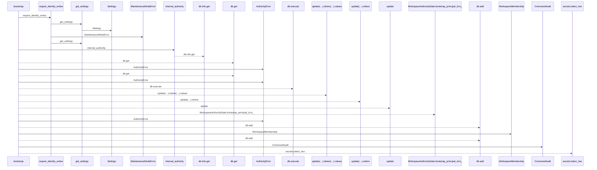
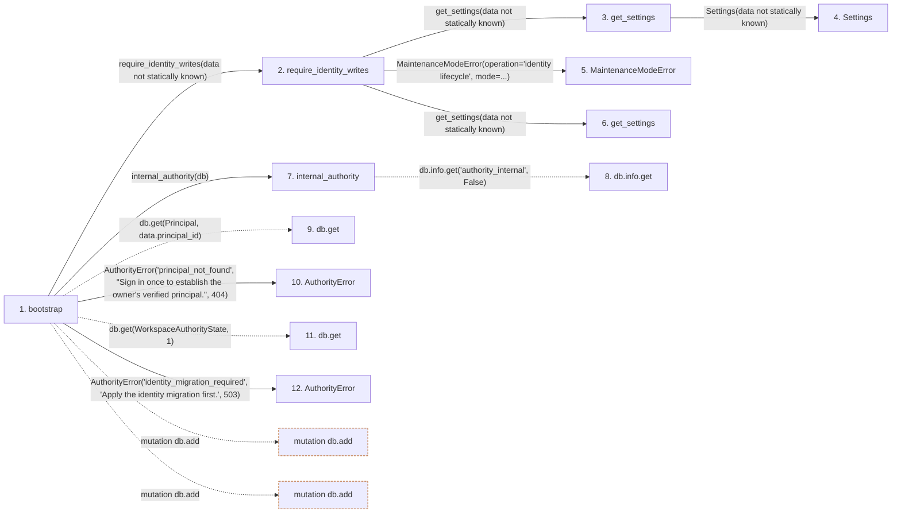

# bootstrap

**Entry point:** `bootstrap` (`http`)
**Source:** [routers_identity](../modules/routers_identity.md)
**Modules touched:** [authority](../modules/authority.md), [config](../modules/config.md), [identity_service](../modules/identity_service.md), [maintenance](../modules/maintenance.md), and 2 more

**Complete modules touched:**

- [authority](../modules/authority.md)
- [config](../modules/config.md)
- [identity_service](../modules/identity_service.md)
- [maintenance](../modules/maintenance.md)
- [models_identity](../modules/models_identity.md)
- [routers_identity](../modules/routers_identity.md)

## Call sequence

<!-- Auto-generated from static call edges. Dashed arrows are external or unresolved calls. Reviewed runtime conditions and side effects belong in Behavior. -->

## Data flow

<!-- Auto-generated static analysis. Treat values and boundaries as best-effort hints, not runtime proof. -->

### Step data

| Step | Inputs | Reads | Writes | Returns |
|---|---|---|---|---|
| `bootstrap` | `data: BootstrapOwner`, `db: Database`, `_operator: Annotated[None, Depends(require_admin_api_key)]` | `Principal`, `WorkspaceAuthorityState` | - | `{...}`, `{...}` |
| `require_identity_writes` | - | - | - | - |
| `get_settings` | - | - | - | `Settings(...)` |
| `Settings` | - | - | - | - |
| `MaintenanceModeError` | - | - | - | - |
| `get_settings` | - | - | - | `Settings(...)` |
| `internal_authority` | `db` | - | `db.info[...]`, `db.info[...]` | - |
| `db.info.get` | - | - | - | - |
| `db.get` | - | - | - | - |
| `AuthorityError` | - | - | - | - |
| `db.get` | - | - | - | - |
| `AuthorityError` | - | - | - | - |

### Call data

| From | To | Line | Call |
|---|---|---:|---|
| bootstrap | require_identity_writes | 178 | `require_identity_writes(data not statically known)` |
| require_identity_writes | get_settings | 31 | `get_settings(data not statically known)` |
| get_settings | Settings | 480 | `Settings(data not statically known)` |
| require_identity_writes | MaintenanceModeError | 32 | `MaintenanceModeError(operation='identity lifecycle', mode=...)` |
| require_identity_writes | get_settings | 32 | `get_settings(data not statically known)` |
| bootstrap | internal_authority | 179 | `internal_authority(db)` |
| internal_authority | db.info.get | 87 | `db.info.get('authority_internal', False)` |
| bootstrap | db.get | 180 | `db.get(Principal, data.principal_id)` |
| bootstrap | AuthorityError | 182 | `AuthorityError('principal_not_found', "Sign in once to establish the owner's verified principal.", 404)` |
| bootstrap | db.get | 183 | `db.get(WorkspaceAuthorityState, 1)` |
| bootstrap | AuthorityError | 185 | `AuthorityError('identity_migration_required', 'Apply the identity migration first.', 503)` |

### Boundary effects

| Kind | Target | Step | Line |
|---|---|---|---:|
| mutation | `db.add` | `bootstrap` | 192 |
| mutation | `db.add` | `bootstrap` | 193 |

### Static analysis gaps

| Kind | Step | Target | Line |
|---|---|---|---:|
| unresolved_call | `internal_authority` | `db.info.get` | 87 |
| unresolved_call | `bootstrap` | `db.get` | 180 |
| unresolved_call | `bootstrap` | `db.get` | 183 |
| step_limit | `bootstrap` | `first 12 steps` | 0 |

## Behavior

This flow starts at `bootstrap` and is classified as `http`. The generated call and data-flow sections are bounded static projections; runtime conditions and side effects require source-level confirmation.

Uses the configured operator credential to assign the first verified owner through a singleton compare-and-set. Repeating bootstrap cannot replace an established owner.
