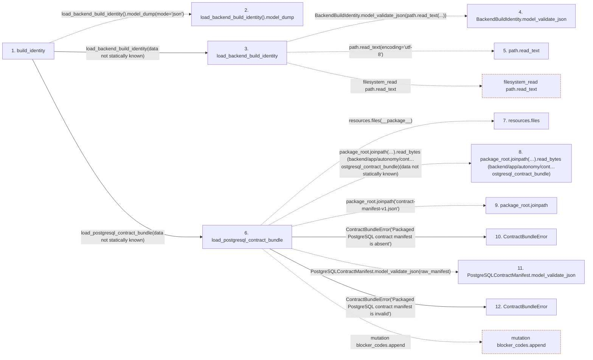

# build_identity

**Entry point:** `build_identity` (`http`)
**Source:** [app_main](../modules/app_main.md)
**Modules touched:** [app_main](../modules/app_main.md), [autonomy_canonical](../modules/autonomy_canonical.md), [build_identity](../modules/build_identity.md), [loader](../modules/loader.md)

## Call sequence

```mermaid
sequenceDiagram
    participant p0 as build_identity
    participant p1 as load_backend_build_identity().model_dump
    participant p2 as load_backend_build_identity
    participant p3 as BackendBuildIdentity.model_validate_json
    participant p4 as path.read_text
    participant p5 as load_postgresql_contract_bundle
    participant p6 as resources.files
    participant p7 as package_root.joinpath(…).read_bytes (backend/app/autonomy/cont…ostgresql_contract_bundle)
    participant p8 as package_root.joinpath
    participant p9 as ContractBundleError
    participant p10 as PostgreSQLContractManifest.model_validate_json
    participant p11 as canonical_json_bytes
    participant p12 as json.dumps(…).encode
    participant p13 as json.dumps
    participant p14 as _json_value
    participant p15 as isinstance (backend/app/autonomy/canonical.py:_json_value)
    participant p16 as value.model_dump
    participant p17 as value.isoformat
    participant p18 as str
    participant p19 as value.items
    participant p20 as package_root.joinpath(…).read_bytes (backend/app/autonomy/cont…gresql_contract_bundle, 1)
    p0-->>p1: load_backend_build_identity().model_dump
    p0->>p2: load_backend_build_identity
    p2-->>p3: BackendBuildIdentity.model_validate_json
    p2-->>p4: path.read_text
    p0->>p5: load_postgresql_contract_bundle
    p5-->>p6: resources.files
    p5-->>p7: package_root.joinpath(…).read_bytes (backend/app/autonomy/cont…ostgresql_contract_bundle)
    p5-->>p8: package_root.joinpath
    p5->>p9: ContractBundleError
    p5-->>p10: PostgreSQLContractManifest.model_validate_json
    p5->>p9: ContractBundleError
    p5->>p11: canonical_json_bytes
    p11-->>p12: json.dumps(…).encode
    p11-->>p13: json.dumps
    p11->>p14: _json_value
    p14-->>p15: isinstance (backend/app/autonomy/canonical.py:_json_value)
    p14-->>p16: value.model_dump
    p14-->>p15: isinstance (backend/app/autonomy/canonical.py:_json_value)
    p14-->>p15: isinstance (backend/app/autonomy/canonical.py:_json_value)
    p14-->>p17: value.isoformat
    p14-->>p15: isinstance (backend/app/autonomy/canonical.py:_json_value)
    p14-->>p18: str
    p14->>p14: _json_value
    p14-->>p19: value.items
    p14-->>p15: isinstance (backend/app/autonomy/canonical.py:_json_value)
    p14-->>p15: isinstance (backend/app/autonomy/canonical.py:_json_value)
    p14->>p14: _json_value
    p5-->>p20: package_root.joinpath(…).read_bytes (backend/app/autonomy/cont…gresql_contract_bundle, 1)
    p5-->>p8: package_root.joinpath
    p5->>p9: ContractBundleError
```

<!-- Auto-generated from static call edges. Dashed arrows are external or unresolved calls. Reviewed runtime conditions and side effects belong in Behavior. -->

> Call sequence diagram shows 30 of 124 interactions; 94 omitted to keep the visualization within the 30-interaction and generated-diagram limits.

## Data flow

<!-- Auto-generated static analysis. Treat values and boundaries as best-effort hints, not runtime proof. -->

### Step data

| Step | Inputs | Reads | Writes | Returns |
|---|---|---|---|---|
| `build_identity` | - | - | - | `{...}` |
| `load_backend_build_identity().model_dump` | - | - | - | - |
| `load_backend_build_identity` | `path: Path` | - | - | `BackendBuildIdentity.model_validate_json(...)` |
| `BackendBuildIdentity.model_validate_json` | - | - | - | - |
| `path.read_text` | - | - | - | - |
| `load_postgresql_contract_bundle` | `archive: ImmutableContractArchive \| None`, `require_archive: bool` | - | `members[...]` | `PostgreSQLContractBundle(...)` |
| `resources.files` | - | - | - | - |
| `package_root.joinpath(…).read_bytes (backend/app/autonomy/cont…ostgresql_contract_bundle)` | - | - | - | - |
| `package_root.joinpath` | - | - | - | - |
| `ContractBundleError` | - | - | - | - |
| `PostgreSQLContractManifest.model_validate_json` | - | - | - | - |
| `ContractBundleError` | - | - | - | - |

### Call data

| From | To | Line | Call |
|---|---|---:|---|
| build_identity | load_backend_build_identity().model_dump | 276 | `load_backend_build_identity().model_dump(mode='json')` |
| build_identity | load_backend_build_identity | 276 | `load_backend_build_identity(data not statically known)` |
| load_backend_build_identity | BackendBuildIdentity.model_validate_json | 44 | `BackendBuildIdentity.model_validate_json(path.read_text(...))` |
| load_backend_build_identity | path.read_text | 44 | `path.read_text(encoding='utf-8')` |
| build_identity | load_postgresql_contract_bundle | 278 | `load_postgresql_contract_bundle(data not statically known)` |
| load_postgresql_contract_bundle | resources.files | 179 | `resources.files(__package__)` |
| load_postgresql_contract_bundle | package_root.joinpath(…).read_bytes (backend/app/autonomy/cont…ostgresql_contract_bundle) | 181 | `package_root.joinpath('contract-manifest-v1.json').read_bytes(data not statically known)` |
| load_postgresql_contract_bundle | package_root.joinpath | 181 | `package_root.joinpath('contract-manifest-v1.json')` |
| load_postgresql_contract_bundle | ContractBundleError | 183 | `ContractBundleError('Packaged PostgreSQL contract manifest is absent')` |
| load_postgresql_contract_bundle | PostgreSQLContractManifest.model_validate_json | 185 | `PostgreSQLContractManifest.model_validate_json(raw_manifest)` |
| load_postgresql_contract_bundle | ContractBundleError | 187 | `ContractBundleError('Packaged PostgreSQL contract manifest is invalid')` |

### Boundary effects

| Kind | Target | Step | Line |
|---|---|---|---:|
| filesystem_read | `path.read_text` | `load_backend_build_identity` | 44 |
| mutation | `blocker_codes.append` | `load_postgresql_contract_bundle` | 211 |

### Static analysis gaps

| Kind | Step | Target | Line |
|---|---|---|---:|
| unresolved_call | `build_identity` | `load_backend_build_identity().model_dump` | 276 |
| external_call | `load_postgresql_contract_bundle` | `resources.files` | 179 |
| unresolved_call | `load_postgresql_contract_bundle` | `package_root.joinpath('contract-manifest-v1.json').read_bytes` | 181 |
| unresolved_call | `load_postgresql_contract_bundle` | `package_root.joinpath` | 181 |
| unresolved_call | `load_postgresql_contract_bundle` | `PostgreSQLContractManifest.model_validate_json` | 185 |
| step_limit | `build_identity` | `first 12 steps` | 0 |

## Behavior

This flow starts at `build_identity` and is classified as `http`. The generated call and data-flow sections are bounded static projections; runtime conditions and side effects require source-level confirmation.
