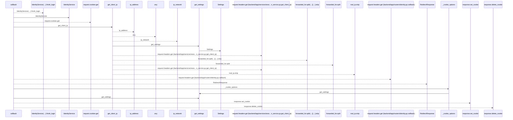
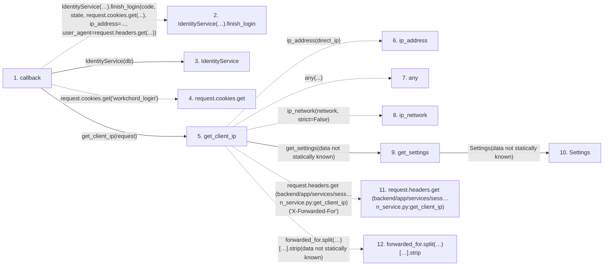

# callback

**Entry point:** `callback` (`http`)
**Source:** [routers_identity](../modules/routers_identity.md)
**Modules touched:** [config](../modules/config.md), [identity_service](../modules/identity_service.md), [routers_identity](../modules/routers_identity.md), [session_service](../modules/session_service.md)

## Call sequence

<!-- Auto-generated from static call edges. Dashed arrows are external or unresolved calls. Reviewed runtime conditions and side effects belong in Behavior. -->

## Data flow

<!-- Auto-generated static analysis. Treat values and boundaries as best-effort hints, not runtime proof. -->

### Step data

| Step | Inputs | Reads | Writes | Returns |
|---|---|---|---|---|
| `callback` | `request: Request`, `db: Database`, `code: str`, `state: str` | - | `options[...]` | `response` |
| `IdentityService(…).finish_login` | - | - | - | - |
| `IdentityService` | - | - | - | - |
| `request.cookies.get` | - | - | - | - |
| `get_client_ip` | `request: Request` | - | - | `...`, `real_ip.strip(...)`, `direct_ip` |
| `ip_address` | - | - | - | - |
| `any` | - | - | - | - |
| `ip_network` | - | - | - | - |
| `get_settings` | - | - | - | `Settings(...)` |
| `Settings` | - | - | - | - |
| `request.headers.get (backend/app/services/sess…n_service.py:get_client_ip)` | - | - | - | - |
| `forwarded_for.split(…)[…].strip` | - | - | - | - |

### Call data

| From | To | Line | Call |
|---|---|---:|---|
| callback | IdentityService(…).finish_login | 166 | `IdentityService(db).finish_login(code, state, request.cookies.get(...), ip_address=..., user_agent=request.headers.get(...))` |
| callback | IdentityService | 166 | `IdentityService(db)` |
| callback | request.cookies.get | 166 | `request.cookies.get('workchord_login')` |
| callback | get_client_ip | 167 | `get_client_ip(request)` |
| get_client_ip | ip_address | 52 | `ip_address(direct_ip)` |
| get_client_ip | any | 53 | `any(...)` |
| get_client_ip | ip_network | 54 | `ip_network(network, strict=False)` |
| get_client_ip | get_settings | 55 | `get_settings(data not statically known)` |
| get_settings | Settings | 481 | `Settings(data not statically known)` |
| get_client_ip | request.headers.get (backend/app/services/sess…n_service.py:get_client_ip) | 60 | `request.headers.get('X-Forwarded-For')` |
| get_client_ip | forwarded_for.split(…)[…].strip | 62 | `forwarded_for.split(',')[0].strip(data not statically known)` |

### Boundary effects

*No boundary effects detected.*

### Static analysis gaps

| Kind | Step | Target | Line |
|---|---|---|---:|
| unresolved_call | `callback` | `IdentityService(db).finish_login` | 166 |
| unresolved_call | `callback` | `request.cookies.get` | 166 |
| external_call | `get_client_ip` | `ip_address` | 52 |
| external_call | `get_client_ip` | `any` | 53 |
| external_call | `get_client_ip` | `ip_network` | 54 |
| unresolved_call | `get_client_ip` | `request.headers.get` | 60 |
| unresolved_call | `get_client_ip` | `forwarded_for.split(',')[0].strip` | 62 |
| step_limit | `callback` | `first 12 steps` | 0 |

## Behavior

This flow starts at `callback` and is classified as `http`. The generated call and data-flow sections are bounded static projections; runtime conditions and side effects require source-level confirmation.

Validates the provider response before issuing an opaque human session. Issuer/subject mapping determines the principal; matching IP, display name or profile ID does not establish identity.
