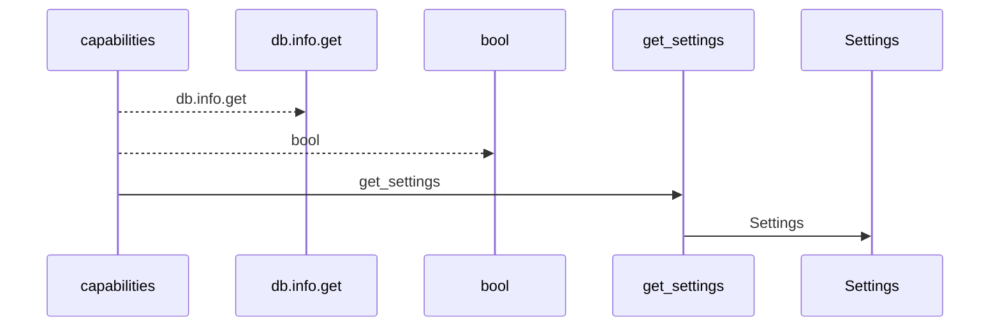
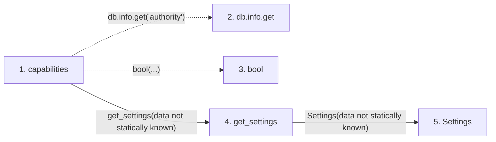

# capabilities

**Entry point:** `capabilities` (`http`)
**Source:** [time_entries](../modules/time_entries.md)
**Modules touched:** [config](../modules/config.md), [time_entries](../modules/time_entries.md)

## Call sequence

<!-- Auto-generated from static call edges. Dashed arrows are external or unresolved calls. Reviewed runtime conditions and side effects belong in Behavior. -->

## Data flow

<!-- Auto-generated static analysis. Treat values and boundaries as best-effort hints, not runtime proof. -->

### Step data

| Step | Inputs | Reads | Writes | Returns |
|---|---|---|---|---|
| `capabilities` | `db: DB` | - | - | `{...}` |
| `db.info.get` | - | - | - | - |
| `bool` | - | - | - | - |
| `get_settings` | - | - | - | `Settings(...)` |
| `Settings` | - | - | - | - |

### Call data

| From | To | Line | Call |
|---|---|---:|---|
| capabilities | db.info.get | 21 | `db.info.get('authority')` |
| capabilities | bool | 22 | `bool(...)` |
| capabilities | get_settings | 23 | `get_settings(data not statically known)` |
| get_settings | Settings | 481 | `Settings(data not statically known)` |

### Boundary effects

*No boundary effects detected.*

### Static analysis gaps

| Kind | Step | Target | Line |
|---|---|---|---:|
| unresolved_call | `capabilities` | `db.info.get` | 21 |

## Behavior

This flow starts at `capabilities` and is classified as `http`. The generated call and data-flow sections are bounded static projections; runtime conditions and side effects require source-level confirmation.
