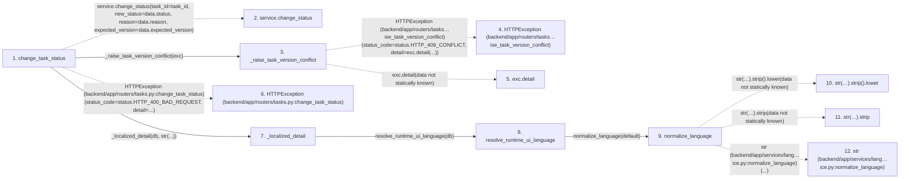

# change_task_status

**Entry point:** `change_task_status` (`http`)
**Source:** [tasks](../modules/tasks.md)
**Modules touched:** [config](../modules/config.md), [iteration_service](../modules/iteration_service.md), [language_service](../modules/language_service.md), [schemas_task](../modules/schemas_task.md), and 2 more

**Complete modules touched:**

- [config](../modules/config.md)
- [iteration_service](../modules/iteration_service.md)
- [language_service](../modules/language_service.md)
- [schemas_task](../modules/schemas_task.md)
- [system_settings_service](../modules/system_settings_service.md)
- [tasks](../modules/tasks.md)

## Call sequence

```mermaid
sequenceDiagram
    participant p0 as change_task_status
    participant p1 as service.change_status
    participant p2 as _raise_task_version_conflict
    participant p3 as HTTPException (backend/app/routers/tasks…ise_task_version_conflict)
    participant p4 as exc.detail
    participant p5 as HTTPException (backend/app/routers/tasks.py:change_task_status)
    participant p6 as _localized_detail
    participant p7 as resolve_runtime_ui_language
    participant p8 as normalize_language
    participant p9 as str(…).strip().lower
    participant p10 as str(…).strip
    participant p11 as str (backend/app/services/lang…ice.py:normalize_language)
    participant p12 as RuntimeSettingsService(…).get_app_settings
    participant p13 as RuntimeSettingsService
    participant p14 as getattr
    participant p15 as logger.warning
    participant p16 as get_settings
    participant p17 as Settings
    participant p18 as backend_error_message
    participant p19 as message.lower
    participant p20 as re.fullmatch
    participant p21 as match.groups
    participant p22 as label.strip().lower().replace
    participant p23 as label.strip().lower
    participant p24 as label.strip
    participant p25 as entity_not_found_message
    p0-->>p1: service.change_status
    p0->>p2: _raise_task_version_conflict
    p2-->>p3: HTTPException (backend/app/routers/tasks…ise_task_version_conflict)
    p2-->>p4: exc.detail
    p0-->>p5: HTTPException (backend/app/routers/tasks.py:change_task_status)
    p0->>p6: _localized_detail
    p6->>p7: resolve_runtime_ui_language
    p7->>p8: normalize_language
    p8-->>p9: str(…).strip().lower
    p8-->>p10: str(…).strip
    p8-->>p11: str (backend/app/services/lang…ice.py:normalize_language)
    p7-->>p12: RuntimeSettingsService(…).get_app_settings
    p7->>p13: RuntimeSettingsService
    p7->>p8: normalize_language
    p7-->>p14: getattr
    p7-->>p15: logger.warning
    p7->>p8: normalize_language
    p7-->>p14: getattr
    p7->>p16: get_settings
    p16->>p17: Settings
    p7-->>p15: logger.warning
    p6->>p18: backend_error_message
    p18->>p8: normalize_language
    p18-->>p19: message.lower
    p18-->>p20: re.fullmatch
    p18-->>p21: match.groups
    p18-->>p22: label.strip().lower().replace
    p18-->>p23: label.strip().lower
    p18-->>p24: label.strip
    p18->>p25: entity_not_found_message
```

<!-- Auto-generated from static call edges. Dashed arrows are external or unresolved calls. Reviewed runtime conditions and side effects belong in Behavior. -->

> Call sequence diagram shows 30 of 132 interactions; 102 omitted to keep the visualization within the 30-interaction and generated-diagram limits.

## Data flow

<!-- Auto-generated static analysis. Treat values and boundaries as best-effort hints, not runtime proof. -->

### Step data

| Step | Inputs | Reads | Writes | Returns |
|---|---|---|---|---|
| `change_task_status` | `task_id: int`, `data: TaskStatusChange`, `service: Annotated[TaskService, Depends(get_task_service)]`, `db: Annotated[AsyncSession, Depends(get_db, scope='function')]` | `TaskVersionConflictError`, `status`, `status`, `status` | - | `TaskStatusChangeResponse(...)` |
| `service.change_status` | - | - | - | - |
| `_raise_task_version_conflict` | `exc: TaskVersionConflictError` | `status` | - | - |
| `HTTPException (backend/app/routers/tasks…ise_task_version_conflict)` | - | - | - | - |
| `exc.detail` | - | - | - | - |
| `HTTPException (backend/app/routers/tasks.py:change_task_status)` | - | - | - | - |
| `_localized_detail` | `db: AsyncSession`, `message: str` | - | - | `backend_error_message(...)` |
| `resolve_runtime_ui_language` | `db: Any`, `default: LanguageCode \| None` | - | - | `normalize_language(...)`, `normalize_language(...)`, `fallback` |
| `normalize_language` | `value: Any`, `default: LanguageCode` | - | - | `normalized`, `default` |
| `str(…).strip().lower` | - | - | - | - |
| `str(…).strip` | - | - | - | - |
| `str (backend/app/services/lang…ice.py:normalize_language)` | - | - | - | - |

### Call data

| From | To | Line | Call |
|---|---|---:|---|
| change_task_status | service.change_status | 893 | `service.change_status(task_id=task_id, new_status=data.status, reason=data.reason, expected_version=data.expected_version)` |
| change_task_status | _raise_task_version_conflict | 900 | `_raise_task_version_conflict(exc)` |
| _raise_task_version_conflict | HTTPException (backend/app/routers/tasks…ise_task_version_conflict) | 56 | `HTTPException(status_code=status.HTTP_409_CONFLICT, detail=exc.detail(...))` |
| _raise_task_version_conflict | exc.detail | 58 | `exc.detail(data not statically known)` |
| change_task_status | HTTPException (backend/app/routers/tasks.py:change_task_status) | 902 | `HTTPException(status_code=status.HTTP_400_BAD_REQUEST, detail=...)` |
| change_task_status | _localized_detail | 904 | `_localized_detail(db, str(...))` |
| _localized_detail | resolve_runtime_ui_language | 63 | `resolve_runtime_ui_language(db)` |
| resolve_runtime_ui_language | normalize_language | 406 | `normalize_language(default)` |
| normalize_language | str(…).strip().lower | 35 | `str(value or '').strip().lower(data not statically known)` |
| normalize_language | str(…).strip | 35 | `str(value or '').strip(data not statically known)` |
| normalize_language | str (backend/app/services/lang…ice.py:normalize_language) | 35 | `str(...)` |

### Boundary effects

*No boundary effects detected.*

### Static analysis gaps

| Kind | Step | Target | Line |
|---|---|---|---:|
| unresolved_call | `change_task_status` | `service.change_status` | 893 |
| external_call | `_raise_task_version_conflict` | `HTTPException` | 56 |
| unresolved_call | `_raise_task_version_conflict` | `exc.detail` | 58 |
| external_call | `change_task_status` | `HTTPException` | 902 |
| unresolved_call | `normalize_language` | `str(value or '').strip().lower` | 35 |
| unresolved_call | `normalize_language` | `str(value or '').strip` | 35 |
| step_limit | `change_task_status` | `first 12 steps` | 0 |

## Behavior

This flow starts at `change_task_status` and is classified as `http`. The generated call and data-flow sections are bounded static projections; runtime conditions and side effects require source-level confirmation.
