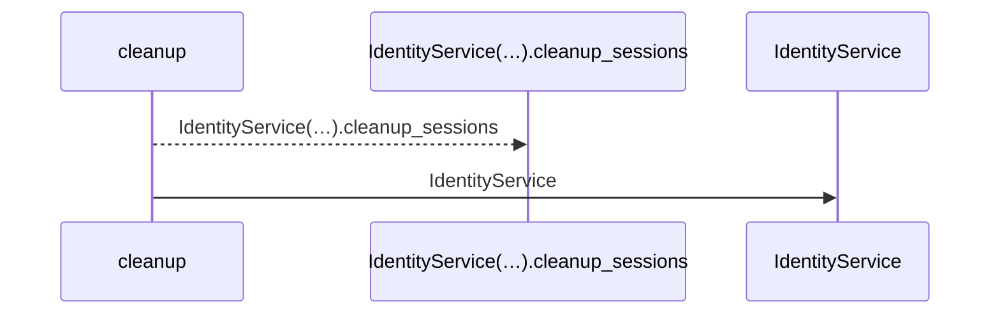
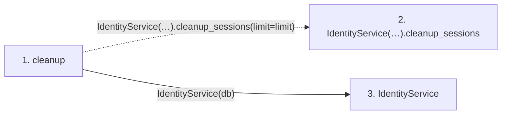

# cleanup

**Entry point:** `cleanup` (`http`)
**Source:** [routers_identity](../modules/routers_identity.md)
**Modules touched:** [identity_service](../modules/identity_service.md), [routers_identity](../modules/routers_identity.md)

## Call sequence

<!-- Auto-generated from static call edges. Dashed arrows are external or unresolved calls. Reviewed runtime conditions and side effects belong in Behavior. -->

## Data flow

<!-- Auto-generated static analysis. Treat values and boundaries as best-effort hints, not runtime proof. -->

### Step data

| Step | Inputs | Reads | Writes | Returns |
|---|---|---|---|---|
| `cleanup` | `db: Database`, `limit: int` | - | - | `...` |
| `IdentityService(…).cleanup_sessions` | - | - | - | - |
| `IdentityService` | - | - | - | - |

### Call data

| From | To | Line | Call |
|---|---|---:|---|
| cleanup | IdentityService(…).cleanup_sessions | 340 | `IdentityService(db).cleanup_sessions(limit=limit)` |
| cleanup | IdentityService | 340 | `IdentityService(db)` |

### Boundary effects

*No boundary effects detected.*

### Static analysis gaps

| Kind | Step | Target | Line |
|---|---|---|---:|
| unresolved_call | `cleanup` | `IdentityService(db).cleanup_sessions` | 340 |

## Behavior

This flow starts at `cleanup` and is classified as `http`. The generated call and data-flow sections are bounded static projections; runtime conditions and side effects require source-level confirmation.
