# convert_planning_triage_item_to_task

**Entry point:** `convert_planning_triage_item_to_task` (`http`)
**Source:** [routers_agent_planning](../modules/routers_agent_planning.md)
**Modules touched:** [agent_service](../modules/agent_service.md), [commands](../modules/commands.md), [mcp_agent_tools](../modules/mcp_agent_tools.md), [models_agent](../modules/models_agent.md), and 5 more

**Complete modules touched:**

- [agent_service](../modules/agent_service.md)
- [commands](../modules/commands.md)
- [mcp_agent_tools](../modules/mcp_agent_tools.md)
- [models_agent](../modules/models_agent.md)
- [routers_agent_planning](../modules/routers_agent_planning.md)
- [schemas_agent_planning](../modules/schemas_agent_planning.md)
- [schemas_triage](../modules/schemas_triage.md)
- [task_service](../modules/task_service.md)
- [triage_service](../modules/triage_service.md)

## Call sequence

```mermaid
sequenceDiagram
    participant p0 as convert_planning_triage_item_to_task
    participant p1 as require_scope
    participant p2 as actor_has_scope
    participant p3 as actor_scopes
    participant p4 as json.loads (backend/app/services/agent_service.py:actor_scopes)
    participant p5 as isinstance (backend/app/services/agent_service.py:actor_scopes)
    participant p6 as AgentPermissionError
    participant p7 as convert_triage_to_task
    participant p8 as _triage_command_context
    participant p9 as validate_idempotency_key
    participant p10 as ValueError
    participant p11 as value.strip
    participant p12 as len
    participant p13 as any
    participant p14 as ord
    participant p15 as AgentPlanningCommandContext
    participant p16 as TriageConvertToTaskRequest
    participant p17 as _triage_audited_request
    participant p18 as data.model_dump (backend/app/mcp_agent_too….py:convert_triage_to_task)
    participant p19 as _triage_command_replay
    participant p20 as db.execute
    participant p21 as select(…).where
    participant p22 as select
    participant p23 as result.scalar_one_or_none
    participant p24 as _triage_command_request_hash
    participant p25 as json.dumps (backend/app/mcp_agent_too…riage_command_request_hash)
    participant p26 as hashlib.sha256(…).hexdigest
    participant p27 as hashlib.sha256
    participant p28 as canonical.encode
    p0->>p1: require_scope
    p1->>p2: actor_has_scope
    p2->>p3: actor_scopes
    p3-->>p4: json.loads (backend/app/services/agent_service.py:actor_scopes)
    p3-->>p5: isinstance (backend/app/services/agent_service.py:actor_scopes)
    p1->>p6: AgentPermissionError
    p0->>p7: convert_triage_to_task
    p7->>p8: _triage_command_context
    p8->>p9: validate_idempotency_key
    p9-->>p10: ValueError
    p9-->>p11: value.strip
    p9-->>p12: len
    p9-->>p13: any
    p9-->>p14: ord
    p9-->>p14: ord
    p9-->>p10: ValueError
    p8->>p15: AgentPlanningCommandContext
    p7->>p16: TriageConvertToTaskRequest
    p7->>p17: _triage_audited_request
    p7-->>p18: data.model_dump (backend/app/mcp_agent_too….py:convert_triage_to_task)
    p7->>p19: _triage_command_replay
    p19-->>p20: db.execute
    p19-->>p21: select(…).where
    p19-->>p22: select
    p19-->>p23: result.scalar_one_or_none
    p19->>p24: _triage_command_request_hash
    p24-->>p25: json.dumps (backend/app/mcp_agent_too…riage_command_request_hash)
    p24-->>p26: hashlib.sha256(…).hexdigest
    p24-->>p27: hashlib.sha256
    p24-->>p28: canonical.encode
```

<!-- Auto-generated from static call edges. Dashed arrows are external or unresolved calls. Reviewed runtime conditions and side effects belong in Behavior. -->

> Call sequence diagram shows 30 of 94 interactions; 64 omitted to keep the visualization within the 30-interaction and generated-diagram limits.

## Data flow

```mermaid
flowchart LR
    s1["1. convert_planning_triage_item_to_task"]
    s2["2. require_scope"]
    s3["3. actor_has_scope"]
    s4["4. actor_scopes"]
    s5["5. json.loads (backend/app/services/agent_service.py:actor_scopes)"]
    s6["6. isinstance (backend/app/services/agent_service.py:actor_scopes)"]
    s7["7. AgentPermissionError"]
    s8["8. convert_triage_to_task"]
    s9["9. _triage_command_context"]
    s10["10. validate_idempotency_key"]
    s11["11. ValueError"]
    s12["12. value.strip"]
    s1 -->|"require_scope(actor, 'planning:write')"| s2
    s2 -->|"actor_has_scope(actor, scope)"| s3
    s3 -->|"actor_scopes(actor)"| s4
    s4 -. "json.loads (backend/app/services/agent_service.py:actor_scopes)(actor.scopes)" .-> s5
    s4 -. "isinstance (backend/app/services/agent_service.py:actor_scopes)(scopes, list)" .-> s6
    s2 -->|"AgentPermissionError(...)"| s7
    s1 -->|"convert_triage_to_task(…)"| s8
    s8 -->|"_triage_command_context(idempotency_key=idempotency_key, rationale=rationale, correlation_id=correlation_id)"| s9
    s9 -->|"validate_idempotency_key(idempotency_key, required=True)"| s10
    s10 -. "ValueError('Idempotency-Key is required')" .-> s11
    s10 -. "value.strip(data not statically known)" .-> s12
    click s1 "../modules/routers_agent_planning.md"
    click s2 "../modules/agent_service.md"
    click s3 "../modules/agent_service.md"
    click s4 "../modules/agent_service.md"
    click s7 "../modules/agent_service.md"
    click s8 "../modules/mcp_agent_tools.md"
    click s9 "../modules/mcp_agent_tools.md"
    click s10 "../modules/agent_service.md"
```

<!-- Auto-generated static analysis. Treat values and boundaries as best-effort hints, not runtime proof. -->

### Step data

| Step | Inputs | Reads | Writes | Returns |
|---|---|---|---|---|
| `convert_planning_triage_item_to_task` | `triage_item_id: int`, `data: TriageConvertToTaskRequest`, `actor: Annotated[AgentActor, Depends(get_agent_actor)]`, `db: Annotated[AsyncSession, Depends(get_db, scope='function')]`, `command: Annotated[AgentPlanningCommandContext, Depends(get_agent_planning_command_context)]` | - | - | `_require_triage_result(...)` |
| `require_scope` | `actor: AgentActor`, `scope: str` | - | - | - |
| `actor_has_scope` | `actor: AgentActor`, `scope: str` | - | - | `...` |
| `actor_scopes` | `actor: AgentActor` | `json` | - | `...` |
| `json.loads (backend/app/services/agent_service.py:actor_scopes)` | - | - | - | - |
| `isinstance (backend/app/services/agent_service.py:actor_scopes)` | - | - | - | - |
| `AgentPermissionError` | - | - | - | - |
| `convert_triage_to_task` | `db: AsyncSession`, `actor: AgentActor`, `triage_item_id: int`, `payload: dict[str, Any]`, `idempotency_key: str`, `rationale: str`, `correlation_id: str` | `TriageConflictError` | - | `replay`, `None`, `replay`, `None`, `...`, `replay` |
| `_triage_command_context` | `idempotency_key: str`, `rationale: str`, `correlation_id: str` | - | - | `AgentPlanningCommandContext(...)` |
| `validate_idempotency_key` | `value: Optional[str]`, `required: bool` | - | - | `None`, `value` |
| `ValueError` | - | - | - | - |
| `value.strip` | - | - | - | - |

### Call data

| From | To | Line | Call |
|---|---|---:|---|
| convert_planning_triage_item_to_task | require_scope | 799 | `require_scope(actor, 'planning:write')` |
| require_scope | actor_has_scope | 86 | `actor_has_scope(actor, scope)` |
| actor_has_scope | actor_scopes | 80 | `actor_scopes(actor)` |
| actor_scopes | json.loads (backend/app/services/agent_service.py:actor_scopes) | 72 | `json.loads(actor.scopes)` |
| actor_scopes | isinstance (backend/app/services/agent_service.py:actor_scopes) | 75 | `isinstance(scopes, list)` |
| require_scope | AgentPermissionError | 87 | `AgentPermissionError(...)` |
| convert_planning_triage_item_to_task | convert_triage_to_task | 800 | `mcp_agent_tools.convert_triage_to_task(db, actor, triage_item_id, data.model_dump(...), idempotency_key=command.idempotency_key, rationale=command.rationale, correlation_id=command.correlation_id)` |
| convert_triage_to_task | _triage_command_context | 2523 | `_triage_command_context(idempotency_key=idempotency_key, rationale=rationale, correlation_id=correlation_id)` |
| _triage_command_context | validate_idempotency_key | 216 | `validate_idempotency_key(idempotency_key, required=True)` |
| validate_idempotency_key | ValueError | 96 | `ValueError('Idempotency-Key is required')` |
| validate_idempotency_key | value.strip | 100 | `value.strip(data not statically known)` |

### Boundary effects

*No boundary effects detected.*

### Static analysis gaps

| Kind | Step | Target | Line |
|---|---|---|---:|
| external_call | `actor_scopes` | `json.loads` | 72 |
| external_call | `actor_scopes` | `isinstance` | 75 |
| external_call | `validate_idempotency_key` | `ValueError` | 96 |
| unresolved_call | `validate_idempotency_key` | `value.strip` | 100 |
| step_limit | `convert_planning_triage_item_to_task` | `first 12 steps` | 0 |

## Behavior

This flow starts at `convert_planning_triage_item_to_task` and is classified as `http`. The generated call and data-flow sections are bounded static projections; runtime conditions and side effects require source-level confirmation.
