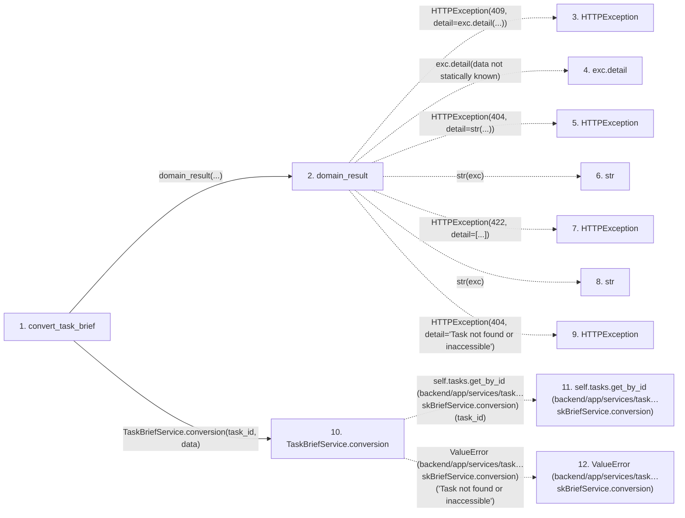

# convert_task_brief

**Entry point:** `convert_task_brief` (`http`)
**Source:** [routers_task_domain](../modules/routers_task_domain.md)
**Modules touched:** [authority](../modules/authority.md), [commands](../modules/commands.md), [config](../modules/config.md), [delivery_dependency_service](../modules/delivery_dependency_service.md), and 9 more

**Complete modules touched:**

- [authority](../modules/authority.md)
- [commands](../modules/commands.md)
- [config](../modules/config.md)
- [delivery_dependency_service](../modules/delivery_dependency_service.md)
- [discussion_service](../modules/discussion_service.md)
- [identity_service](../modules/identity_service.md)
- [models_outbound_webhook](../modules/models_outbound_webhook.md)
- [models_task_brief](../modules/models_task_brief.md)
- [mutation_versions](../modules/mutation_versions.md)
- [routers_task_domain](../modules/routers_task_domain.md)
- [snapshot_service](../modules/snapshot_service.md)
- [task_brief_service](../modules/task_brief_service.md)
- [task_service](../modules/task_service.md)

## Call sequence

> Static overview in presentation order, not runtime execution order. Arrows retain captured callers; representative internal continuations and boundary examples precede repeated helper detail.

<!-- Auto-generated from static call edges. Dashed arrows are external or unresolved calls. Reviewed runtime conditions and side effects belong in Behavior. -->

```mermaid
sequenceDiagram
    participant p0 as convert_task_brief
    participant p1 as TaskBriefService.conversion
    participant p2 as domain_result
    participant p3 as TaskBriefService
    participant p4 as command_transaction
    participant p5 as TaskBriefService._locked
    participant p6 as TaskBriefService.apply_brief
    participant p7 as require_project
    participant p8 as DeliveryDependencyService.reconcile
    participant p9 as DiscussionService.enqueue
    participant p10 as DeliveryDependencyService.validate_cycles
    participant p11 as DiscussionService.recipient_authorized
    participant p12 as TaskService.reserve_task_version
    participant p13 as clear_execution_evidence
    participant p14 as DeliveryDependencyService.graph
    participant p15 as lock_iterations
    participant p16 as IdentityService.context
    participant p17 as import_legacy_brief
    participant p18 as current_command
    participant p19 as CommandState
    participant p20 as SnapshotService
    participant p21 as DeliveryDependencyService
    participant p22 as DiscussionService
    participant p23 as render_brief
    participant p24 as clear_acceptance
    participant p25 as TaskBriefRevision
    participant p26 as get_settings
    participant p27 as internal_authority
    participant p28 as AuthorityError
    participant p29 as HTTPException
    participant p30 as self.tasks.get_by_id (backend/app/services/task…skBriefService.conversion)
    p0->>p1: TaskBriefService.conversion
    p0->>p2: domain_result
    p0->>p3: TaskBriefService
    p1->>p4: command_transaction
    p1->>p5: TaskBriefService._locked
    p1->>p6: TaskBriefService.apply_brief
    p6->>p7: require_project
    p4->>p8: DeliveryDependencyService.reconcile
    p4->>p9: DiscussionService.enqueue
    p8->>p10: DeliveryDependencyService.validate_cycles
    p9->>p11: DiscussionService.recipient_authorized
    p8->>p12: TaskService.reserve_task_version
    p8->>p13: clear_execution_evidence
    p10->>p14: DeliveryDependencyService.graph
    p12->>p15: lock_iterations
    p11->>p16: IdentityService.context
    p1->>p17: import_legacy_brief
    p4->>p18: current_command
    p4->>p19: CommandState
    p5->>p20: SnapshotService
    p4->>p21: DeliveryDependencyService
    p4->>p22: DiscussionService
    p6->>p23: render_brief
    p6->>p24: clear_acceptance
    p6->>p25: TaskBriefRevision
    p7->>p26: get_settings
    p9->>p27: internal_authority
    p7->>p28: AuthorityError
    p2-->>p29: HTTPException(409, detail=exc.detail(...))
    p1-->>p30: self.tasks.get_by_id (backend/app/services/task…skBriefService.conversion)(task_id)
```

> Call sequence diagram shows 30 of 308 interactions; 278 omitted to keep the visualization within the 30-interaction and generated-diagram limits, with uncertain identities omitted rather than inferred.

> Captured boundary calls: external 1 of 80 (79 omitted); unresolved 1 of 168 (167 omitted). These counts cover the captured static trace.

Omitted captured detail, grouped by actual caller occurrence and target module:

| Caller | Parent step | Target module | Kind | Omitted interactions |
| --- | --- | --- | --- | --- |
| `backend/app/routers/task_domain.py:domain_result` | 2 | - | unresolved | 1 |
| `backend/app/routers/task_domain.py:domain_result` | 2 | - | external | 5 |
| `backend/app/services/task_brief_service.py:TaskBriefService.conversion` | 10 | - | external | 1 |
| `backend/app/services/task_brief_service.py:TaskBriefService.conversion` | 10 | - | unresolved | 2 |
| `backend/app/services/task_brief_service.py:import_legacy_brief` | 14 | - | external | 10 |
| `backend/app/services/task_brief_service.py:import_legacy_brief` | 14 | - | unresolved | 23 |
| `backend/app/commands.py:current_command` | 49 | - | external | 2 |
| `backend/app/commands.py:current_command` | 49 | - | unresolved | 1 |
> Omission summary shows 8 of 57 groups; 49 further groups are not expanded here. Counts above include all omitted interactions.
> Detailed flow queries retain their own coverage and limits; omitted paths may execute at runtime.

> Trace truncated at the depth limit; deeper calls are omitted.

## Data flow

<!-- Auto-generated static analysis. Treat values and boundaries as best-effort hints, not runtime proof. -->

### Analysis coverage

**Effect analysis partially available.** Flow assembly and source effect analysis are separate; empty observations do not prove an empty handler body.

Source steps: 61; effect analysis evaluated: 38, partial: 1, unavailable: 22. Counts include steps omitted from the displayed trace.

Collector observations for 39 source steps with known totals: observed: 216, emitted: 215, omitted: 1. Unavailable totals are excluded.

- Callable record unavailable for one or more source steps; those steps have no represented callable body.
- Effect collector omitted observations before flow assembly; displayed effects are partial.
- Effect collector totals unavailable; observed counts cover captured records only.

| Step | Callable record | Effect analysis | Collector totals | Observed | Emitted | Omitted |
|---|---|---|---|---:|---:|---:|
| `convert_task_brief` | `available` | `evaluated` | `available` | `4` | `4` | `0` |
| `domain_result` | `available` | `evaluated` | `available` | `3` | `3` | `0` |
| `HTTPException` | `not_applicable` | `not_applicable` | `not_applicable` | — | — | — |
| `exc.detail` | `not_applicable` | `not_applicable` | `not_applicable` | — | — | — |
| `HTTPException` | `not_applicable` | `not_applicable` | `not_applicable` | — | — | — |
| `str` | `not_applicable` | `not_applicable` | `not_applicable` | — | — | — |
| `HTTPException` | `not_applicable` | `not_applicable` | `not_applicable` | — | — | — |
| `str` | `not_applicable` | `not_applicable` | `not_applicable` | — | — | — |
| `HTTPException` | `not_applicable` | `not_applicable` | `not_applicable` | — | — | — |
| `TaskBriefService.conversion` | `available` | `evaluated` | `available` | `6` | `6` | `0` |
| `self.tasks.get_by_id (backend/app/services/task…skBriefService.conversion)` | `not_applicable` | `not_applicable` | `not_applicable` | — | — | — |
| `ValueError (backend/app/services/task…skBriefService.conversion)` | `not_applicable` | `not_applicable` | `not_applicable` | — | — | — |

```mermaid
flowchart LR
    s1["1. convert_task_brief"]
    s2["2. domain_result"]
    s3["3. HTTPException"]
    s4["4. exc.detail"]
    s5["5. HTTPException"]
    s6["6. str"]
    s7["7. HTTPException"]
    s8["8. str"]
    s9["9. HTTPException"]
    s10["10. TaskBriefService.conversion"]
    s11["11. self.tasks.get_by_id (backend/app/services/task…skBriefService.conversion)"]
    s12["12. ValueError (backend/app/services/task…skBriefService.conversion)"]
    s1 -->|"domain_result(...)"| s2
    s2 -. "HTTPException(409, detail=exc.detail(...))" .-> s3
    s2 -. "exc.detail(data not statically known)" .-> s4
    s2 -. "HTTPException(404, detail=str(...))" .-> s5
    s2 -. "str(exc)" .-> s6
    s2 -. "HTTPException(422, detail=[...])" .-> s7
    s2 -. "str(exc)" .-> s8
    s2 -. "HTTPException(404, detail='Task not found or inaccessible')" .-> s9
    s1 -->|"TaskBriefService.conversion(task_id, data)"| s10
    s10 -. "self.tasks.get_by_id (backend/app/services/task…skBriefService.conversion)(task_id)" .-> s11
    s10 -. "ValueError (backend/app/services/task…skBriefService.conversion)('Task not found or inaccessible')" .-> s12
    click s1 "../modules/routers_task_domain.md"
    click s2 "../modules/routers_task_domain.md"
    click s10 "../modules/task_brief_service.md"
```

### Step data

| Step | Inputs | Reads | Writes | Returns |
|---|---|---|---|---|
| `convert_task_brief` | `task_id: int`, `data: BriefConvert`, `db: DB` | - | - | `...` |
| `domain_result` | `awaitable` | `TaskVersionConflictError` | - | `result` |
| `HTTPException` | - | - | - | - |
| `exc.detail` | - | - | - | - |
| `HTTPException` | - | - | - | - |
| `str` | - | - | - | - |
| `HTTPException` | - | - | - | - |
| `str` | - | - | - | - |
| `HTTPException` | - | - | - | - |
| `TaskBriefService.conversion` | `task_id`, `data` | `self.db` | `task.brief_migration_notes` | `{...}`, `{...}` |
| `self.tasks.get_by_id (backend/app/services/task…skBriefService.conversion)` | - | - | - | - |
| `ValueError (backend/app/services/task…skBriefService.conversion)` | - | - | - | - |

### Call data

| From | To | Line | Call |
|---|---|---:|---|
| convert_task_brief | domain_result | 230 | `domain_result(...)` |
| domain_result | HTTPException | 51 | `HTTPException(409, detail=exc.detail(...))` |
| domain_result | exc.detail | 51 | `exc.detail(data not statically known)` |
| domain_result | HTTPException | 53 | `HTTPException(404, detail=str(...))` |
| domain_result | str | 53 | `str(exc)` |
| domain_result | HTTPException | 55 | `HTTPException(422, detail=[...])` |
| domain_result | str | 55 | `str(exc)` |
| domain_result | HTTPException | 57 | `HTTPException(404, detail='Task not found or inaccessible')` |
| convert_task_brief | TaskBriefService.conversion | 230 | `TaskBriefService(db).conversion(task_id, data)` |
| TaskBriefService.conversion | self.tasks.get_by_id (backend/app/services/task…skBriefService.conversion) | 211 | `self.tasks.get_by_id(task_id)` |
| TaskBriefService.conversion | ValueError (backend/app/services/task…skBriefService.conversion) | 213 | `ValueError('Task not found or inaccessible')` |

### Boundary effects

*No boundary-effect observations were captured in this static trace.*

### Static analysis gaps

| Kind | Step | Target | Line |
|---|---|---|---:|
| external_call | `domain_result` | `HTTPException` | 51 |
| unresolved_call | `domain_result` | `exc.detail` | 51 |
| external_call | `domain_result` | `HTTPException` | 53 |
| external_call | `domain_result` | `HTTPException` | 55 |
| external_call | `domain_result` | `HTTPException` | 57 |
| unresolved_call | `TaskBriefService.conversion` | `self.tasks.get_by_id` | 211 |
| external_call | `TaskBriefService.conversion` | `ValueError` | 213 |
| step_limit | `convert_task_brief` | `first 12 steps` | 0 |
| truncated_flow | `convert_task_brief` | `depth limit` | 0 |

## Behavior

This flow starts at `convert_task_brief` and is classified as `http`. The generated call and data-flow sections are bounded static projections; runtime conditions and side effects require source-level confirmation.
