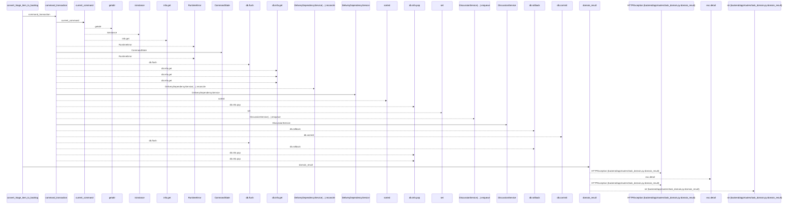
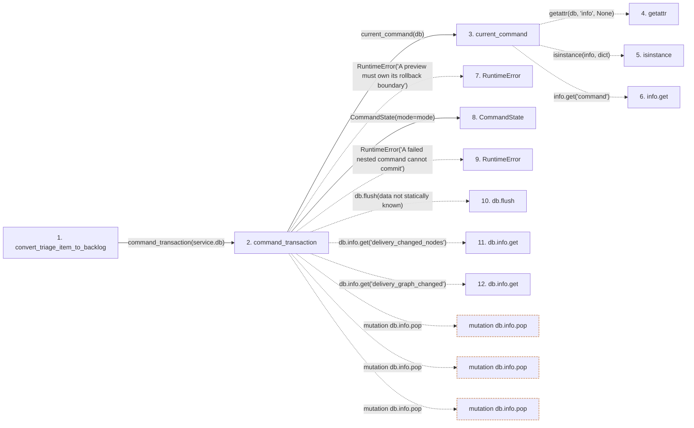

# convert_triage_item_to_backlog

**Entry point:** `convert_triage_item_to_backlog` (`http`)
**Source:** [routers_triage](../modules/routers_triage.md)
**Modules touched:** [commands](../modules/commands.md), [delivery_dependency_service](../modules/delivery_dependency_service.md), [discussion_service](../modules/discussion_service.md), and 3 more

**Complete modules touched:**

- [commands](../modules/commands.md)
- [delivery_dependency_service](../modules/delivery_dependency_service.md)
- [discussion_service](../modules/discussion_service.md)
- [routers_task_domain](../modules/routers_task_domain.md)
- [routers_triage](../modules/routers_triage.md)
- [schemas_triage](../modules/schemas_triage.md)

## Call sequence

<!-- Auto-generated from static call edges. Dashed arrows are external or unresolved calls. Reviewed runtime conditions and side effects belong in Behavior. -->

> Call sequence diagram shows 30 of 37 interactions; 7 omitted to keep the visualization within the 30-interaction and generated-diagram limits.

## Data flow

<!-- Auto-generated static analysis. Treat values and boundaries as best-effort hints, not runtime proof. -->

### Step data

| Step | Inputs | Reads | Writes | Returns |
|---|---|---|---|---|
| `convert_triage_item_to_backlog` | `triage_item_id: int`, `data: TriageConvertToBacklogRequest`, `service: Annotated[TriageService, Depends(get_triage_service)]` | `TriageConflictError` | - | `TriageConvertToTaskResponse(...)` |
| `command_transaction` | `db: AsyncSession`, `mode`, `commit` | - | `previous.failed`, `db.info[...]` | `none` |
| `current_command` | `db` | - | - | `...` |
| `getattr` | - | - | - | - |
| `isinstance` | - | - | - | - |
| `info.get` | - | - | - | - |
| `RuntimeError` | - | - | - | - |
| `CommandState` | - | - | - | - |
| `RuntimeError` | - | - | - | - |
| `db.flush` | - | - | - | - |
| `db.info.get` | - | - | - | - |
| `db.info.get` | - | - | - | - |

### Call data

| From | To | Line | Call |
|---|---|---:|---|
| convert_triage_item_to_backlog | command_transaction | 387 | `command_transaction(service.db)` |
| command_transaction | current_command | 85 | `current_command(db)` |
| current_command | getattr | 71 | `getattr(db, 'info', None)` |
| current_command | isinstance | 72 | `isinstance(info, dict)` |
| current_command | info.get | 72 | `info.get('command')` |
| command_transaction | RuntimeError | 88 | `RuntimeError('A preview must own its rollback boundary')` |
| command_transaction | CommandState | 95 | `CommandState(mode=mode)` |
| command_transaction | RuntimeError | 100 | `RuntimeError('A failed nested command cannot commit')` |
| command_transaction | db.flush | 101 | `db.flush(data not statically known)` |
| command_transaction | db.info.get | 102 | `db.info.get('delivery_changed_nodes')` |
| command_transaction | db.info.get | 102 | `db.info.get('delivery_graph_changed')` |

### Boundary effects

| Kind | Target | Step | Line |
|---|---|---|---:|
| mutation | `db.info.pop` | `command_transaction` | 105 |
| mutation | `db.info.pop` | `command_transaction` | 118 |
| mutation | `db.info.pop` | `command_transaction` | 120 |

### Static analysis gaps

| Kind | Step | Target | Line |
|---|---|---|---:|
| external_call | `current_command` | `getattr` | 71 |
| external_call | `current_command` | `isinstance` | 72 |
| unresolved_call | `current_command` | `info.get` | 72 |
| external_call | `command_transaction` | `RuntimeError` | 88 |
| external_call | `command_transaction` | `RuntimeError` | 100 |
| unresolved_call | `command_transaction` | `db.flush` | 101 |
| unresolved_call | `command_transaction` | `db.info.get` | 102 |
| step_limit | `convert_triage_item_to_backlog` | `first 12 steps` | 0 |

## Behavior

This flow starts at `convert_triage_item_to_backlog` and is classified as `http`. The generated call and data-flow sections are bounded static projections; runtime conditions and side effects require source-level confirmation.
