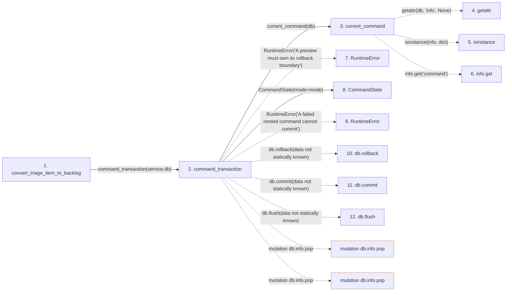

# convert_triage_item_to_backlog

**Entry point:** `convert_triage_item_to_backlog` (`http`)
**Source:** [routers_triage](../modules/routers_triage.md)
**Modules touched:** [commands](../modules/commands.md), [routers_task_domain](../modules/routers_task_domain.md), [routers_triage](../modules/routers_triage.md), [schemas_triage](../modules/schemas_triage.md)

## Call sequence

```mermaid
sequenceDiagram
    participant p0 as convert_triage_item_to_backlog
    participant p1 as command_transaction
    participant p2 as current_command
    participant p3 as getattr
    participant p4 as isinstance
    participant p5 as info.get
    participant p6 as RuntimeError
    participant p7 as CommandState
    participant p8 as db.rollback
    participant p9 as db.commit
    participant p10 as db.flush
    participant p11 as db.info.pop
    participant p12 as domain_result
    participant p13 as HTTPException (backend/app/routers/task_domain.py:domain_result)
    participant p14 as exc.detail
    participant p15 as str (backend/app/routers/task_domain.py:domain_result)
    participant p16 as service.convert_to_task
    participant p17 as TriageConvertToTaskResponse
    participant p18 as TriageItemResponse.model_validate
    participant p19 as service.task_service.task_to_response
    participant p20 as HTTPException (backend/app/routers/triag…ert_triage_item_to_backlog)
    participant p21 as str (backend/app/routers/triag…ert_triage_item_to_backlog)
    p0->>p1: command_transaction
    p1->>p2: current_command
    p2-->>p3: getattr
    p2-->>p4: isinstance
    p2-->>p5: info.get
    p1-->>p6: RuntimeError
    p1->>p7: CommandState
    p1-->>p6: RuntimeError
    p1-->>p8: db.rollback
    p1-->>p9: db.commit
    p1-->>p10: db.flush
    p1-->>p8: db.rollback
    p1-->>p11: db.info.pop
    p1-->>p11: db.info.pop
    p0->>p12: domain_result
    p12-->>p13: HTTPException (backend/app/routers/task_domain.py:domain_result)
    p12-->>p14: exc.detail
    p12-->>p13: HTTPException (backend/app/routers/task_domain.py:domain_result)
    p12-->>p15: str (backend/app/routers/task_domain.py:domain_result)
    p12-->>p13: HTTPException (backend/app/routers/task_domain.py:domain_result)
    p0-->>p16: service.convert_to_task
    p0->>p17: TriageConvertToTaskResponse
    p0-->>p18: TriageItemResponse.model_validate
    p0-->>p19: service.task_service.task_to_response
    p0-->>p20: HTTPException (backend/app/routers/triag…ert_triage_item_to_backlog)
    p0-->>p21: str (backend/app/routers/triag…ert_triage_item_to_backlog)
```

<!-- Auto-generated from static call edges. Dashed arrows are external or unresolved calls. Reviewed runtime conditions and side effects belong in Behavior. -->

## Data flow

<!-- Auto-generated static analysis. Treat values and boundaries as best-effort hints, not runtime proof. -->

### Step data

| Step | Inputs | Reads | Writes | Returns |
|---|---|---|---|---|
| `convert_triage_item_to_backlog` | `triage_item_id: int`, `data: TriageConvertToBacklogRequest`, `service: Annotated[TriageService, Depends(get_triage_service)]` | `TriageConflictError` | - | `TriageConvertToTaskResponse(...)` |
| `command_transaction` | `db: AsyncSession`, `mode`, `commit` | - | `previous.failed`, `db.info[...]` | `none` |
| `current_command` | `db` | - | - | `...` |
| `getattr` | - | - | - | - |
| `isinstance` | - | - | - | - |
| `info.get` | - | - | - | - |
| `RuntimeError` | - | - | - | - |
| `CommandState` | - | - | - | - |
| `RuntimeError` | - | - | - | - |
| `db.rollback` | - | - | - | - |
| `db.commit` | - | - | - | - |
| `db.flush` | - | - | - | - |

### Call data

| From | To | Line | Call |
|---|---|---:|---|
| convert_triage_item_to_backlog | command_transaction | 387 | `command_transaction(service.db)` |
| command_transaction | current_command | 53 | `current_command(db)` |
| current_command | getattr | 39 | `getattr(db, 'info', None)` |
| current_command | isinstance | 40 | `isinstance(info, dict)` |
| current_command | info.get | 40 | `info.get('command')` |
| command_transaction | RuntimeError | 56 | `RuntimeError('A preview must own its rollback boundary')` |
| command_transaction | CommandState | 63 | `CommandState(mode=mode)` |
| command_transaction | RuntimeError | 68 | `RuntimeError('A failed nested command cannot commit')` |
| command_transaction | db.rollback | 70 | `db.rollback(data not statically known)` |
| command_transaction | db.commit | 72 | `db.commit(data not statically known)` |
| command_transaction | db.flush | 74 | `db.flush(data not statically known)` |

### Boundary effects

| Kind | Target | Step | Line |
|---|---|---|---:|
| mutation | `db.info.pop` | `command_transaction` | 79 |
| mutation | `db.info.pop` | `command_transaction` | 81 |

### Static analysis gaps

| Kind | Step | Target | Line |
|---|---|---|---:|
| external_call | `current_command` | `getattr` | 39 |
| external_call | `current_command` | `isinstance` | 40 |
| unresolved_call | `current_command` | `info.get` | 40 |
| external_call | `command_transaction` | `RuntimeError` | 56 |
| external_call | `command_transaction` | `RuntimeError` | 68 |
| unresolved_call | `command_transaction` | `db.rollback` | 70 |
| unresolved_call | `command_transaction` | `db.commit` | 72 |
| unresolved_call | `command_transaction` | `db.flush` | 74 |
| step_limit | `convert_triage_item_to_backlog` | `first 12 steps` | 0 |

## Behavior

This flow starts at `convert_triage_item_to_backlog` and is classified as `http`. The generated call and data-flow sections are bounded static projections; runtime conditions and side effects require source-level confirmation.
