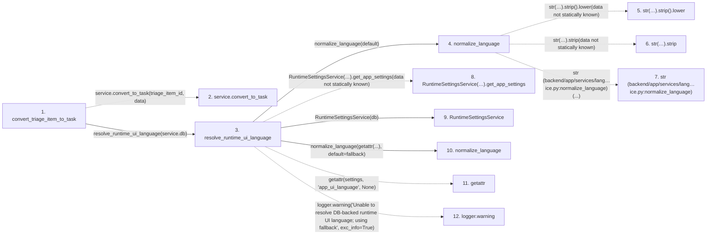

# convert_triage_item_to_task

**Entry point:** `convert_triage_item_to_task` (`http`)
**Source:** [routers_triage](../modules/routers_triage.md)
**Modules touched:** [config](../modules/config.md), [language_service](../modules/language_service.md), [routers_triage](../modules/routers_triage.md), [schemas_triage](../modules/schemas_triage.md), and 1 more

**Complete modules touched:**

- [config](../modules/config.md)
- [language_service](../modules/language_service.md)
- [routers_triage](../modules/routers_triage.md)
- [schemas_triage](../modules/schemas_triage.md)
- [system_settings_service](../modules/system_settings_service.md)

## Call sequence

```mermaid
sequenceDiagram
    participant p0 as convert_triage_item_to_task
    participant p1 as service.convert_to_task
    participant p2 as resolve_runtime_ui_language
    participant p3 as normalize_language
    participant p4 as str(…).strip().lower
    participant p5 as str(…).strip
    participant p6 as str (backend/app/services/lang…ice.py:normalize_language)
    participant p7 as RuntimeSettingsService(…).get_app_settings
    participant p8 as RuntimeSettingsService
    participant p9 as getattr
    participant p10 as logger.warning
    participant p11 as get_settings
    participant p12 as Settings
    participant p13 as HTTPException (backend/app/routers/triag…nvert_triage_item_to_task)
    participant p14 as backend_error_message
    participant p15 as message.lower
    participant p16 as re.fullmatch
    participant p17 as match.groups
    participant p18 as label.strip().lower().replace
    participant p19 as label.strip().lower
    participant p20 as label.strip
    participant p21 as entity_not_found_message
    participant p22 as _RESOURCE_LABELS.get (backend/app/services/lang…:entity_not_found_message)
    participant p23 as localized
    p0-->>p1: service.convert_to_task
    p0->>p2: resolve_runtime_ui_language
    p2->>p3: normalize_language
    p3-->>p4: str(…).strip().lower
    p3-->>p5: str(…).strip
    p3-->>p6: str (backend/app/services/lang…ice.py:normalize_language)
    p2-->>p7: RuntimeSettingsService(…).get_app_settings
    p2->>p8: RuntimeSettingsService
    p2->>p3: normalize_language
    p2-->>p9: getattr
    p2-->>p10: logger.warning
    p2->>p3: normalize_language
    p2-->>p9: getattr
    p2->>p11: get_settings
    p11->>p12: Settings
    p2-->>p10: logger.warning
    p0-->>p13: HTTPException (backend/app/routers/triag…nvert_triage_item_to_task)
    p0->>p14: backend_error_message
    p14->>p3: normalize_language
    p14-->>p15: message.lower
    p14-->>p16: re.fullmatch
    p14-->>p17: match.groups
    p14-->>p18: label.strip().lower().replace
    p14-->>p19: label.strip().lower
    p14-->>p20: label.strip
    p14->>p21: entity_not_found_message
    p21-->>p22: _RESOURCE_LABELS.get (backend/app/services/lang…:entity_not_found_message)
    p21->>p23: localized
    p23->>p3: normalize_language
    p14-->>p16: re.fullmatch
```

<!-- Auto-generated from static call edges. Dashed arrows are external or unresolved calls. Reviewed runtime conditions and side effects belong in Behavior. -->

> Call sequence diagram shows 30 of 126 interactions; 96 omitted to keep the visualization within the 30-interaction and generated-diagram limits.

## Data flow

<!-- Auto-generated static analysis. Treat values and boundaries as best-effort hints, not runtime proof. -->

### Step data

| Step | Inputs | Reads | Writes | Returns |
|---|---|---|---|---|
| `convert_triage_item_to_task` | `triage_item_id: int`, `data: TriageConvertToTaskRequest`, `service: Annotated[TriageService, Depends(get_triage_service)]` | `TriageConflictError`, `status`, `status` | - | `TriageConvertToTaskResponse(...)` |
| `service.convert_to_task` | - | - | - | - |
| `resolve_runtime_ui_language` | `db: Any`, `default: LanguageCode \| None` | - | - | `normalize_language(...)`, `normalize_language(...)`, `fallback` |
| `normalize_language` | `value: Any`, `default: LanguageCode` | - | - | `normalized`, `default` |
| `str(…).strip().lower` | - | - | - | - |
| `str(…).strip` | - | - | - | - |
| `str (backend/app/services/lang…ice.py:normalize_language)` | - | - | - | - |
| `RuntimeSettingsService(…).get_app_settings` | - | - | - | - |
| `RuntimeSettingsService` | - | - | - | - |
| `normalize_language` | `value: Any`, `default: LanguageCode` | - | - | `normalized`, `default` |
| `getattr` | - | - | - | - |
| `logger.warning` | - | - | - | - |

### Call data

| From | To | Line | Call |
|---|---|---:|---|
| convert_triage_item_to_task | service.convert_to_task | 357 | `service.convert_to_task(triage_item_id, data)` |
| convert_triage_item_to_task | resolve_runtime_ui_language | 359 | `resolve_runtime_ui_language(service.db)` |
| resolve_runtime_ui_language | normalize_language | 406 | `normalize_language(default)` |
| normalize_language | str(…).strip().lower | 35 | `str(value or '').strip().lower(data not statically known)` |
| normalize_language | str(…).strip | 35 | `str(value or '').strip(data not statically known)` |
| normalize_language | str (backend/app/services/lang…ice.py:normalize_language) | 35 | `str(...)` |
| resolve_runtime_ui_language | RuntimeSettingsService(…).get_app_settings | 411 | `RuntimeSettingsService(db).get_app_settings(data not statically known)` |
| resolve_runtime_ui_language | RuntimeSettingsService | 411 | `RuntimeSettingsService(db)` |
| resolve_runtime_ui_language | normalize_language | 412 | `normalize_language(getattr(...), default=fallback)` |
| resolve_runtime_ui_language | getattr | 412 | `getattr(settings, 'app_ui_language', None)` |
| resolve_runtime_ui_language | logger.warning | 415 | `logger.warning('Unable to resolve DB-backed runtime UI language; using fallback', exc_info=True)` |

### Boundary effects

*No boundary effects detected.*

### Static analysis gaps

| Kind | Step | Target | Line |
|---|---|---|---:|
| unresolved_call | `convert_triage_item_to_task` | `service.convert_to_task` | 357 |
| unresolved_call | `normalize_language` | `str(value or '').strip().lower` | 35 |
| unresolved_call | `normalize_language` | `str(value or '').strip` | 35 |
| unresolved_call | `resolve_runtime_ui_language` | `RuntimeSettingsService(db).get_app_settings` | 411 |
| external_call | `resolve_runtime_ui_language` | `getattr` | 412 |
| unresolved_call | `resolve_runtime_ui_language` | `logger.warning` | 415 |
| step_limit | `convert_triage_item_to_task` | `first 12 steps` | 0 |

## Behavior

This flow starts at `convert_triage_item_to_task` and is classified as `http`. The generated call and data-flow sections are bounded static projections; runtime conditions and side effects require source-level confirmation.
