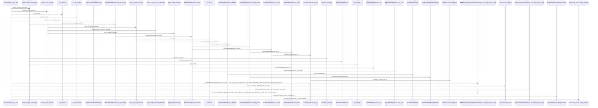
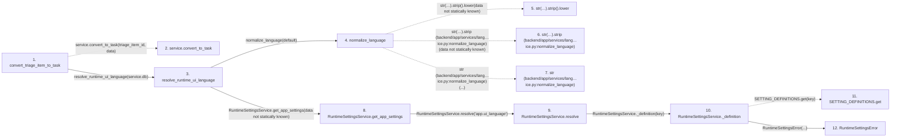

# convert_triage_item_to_task

**Entry point:** `convert_triage_item_to_task` (`http`)
**Source:** [routers_triage](../modules/routers_triage.md)
**Modules touched:** [config](../modules/config.md), [language_service](../modules/language_service.md), [routers_triage](../modules/routers_triage.md), [schemas_triage](../modules/schemas_triage.md), and 2 more

**Complete modules touched:**

- [config](../modules/config.md)
- [language_service](../modules/language_service.md)
- [routers_triage](../modules/routers_triage.md)
- [schemas_triage](../modules/schemas_triage.md)
- [system_settings_service](../modules/system_settings_service.md)
- [url_policy](../modules/url_policy.md)

## Call sequence

> Static overview in presentation order, not runtime execution order. Arrows retain captured callers; representative internal continuations and boundary examples precede repeated helper detail.

<!-- Auto-generated from static call edges. Dashed arrows are external or unresolved calls. Reviewed runtime conditions and side effects belong in Behavior. -->

```mermaid
sequenceDiagram
    participant p0 as convert_triage_item_to_task
    participant p1 as resolve_runtime_ui_language
    participant p2 as backend_error_message
    participant p3 as _bad_request
    participant p4 as _not_found_detail
    participant p5 as TriageConvertToTaskResponse
    participant p6 as RuntimeSettingsService.get_app_settings
    participant p7 as entity_not_found_message
    participant p8 as scoped_entity_not_found_message
    participant p9 as entity_deleted_message
    participant p10 as RuntimeSettingsService.resolve
    participant p11 as localized
    participant p12 as RuntimeSettingsService._definition
    participant p13 as RuntimeSettingsService._decrypt_secret
    participant p14 as RuntimeSettingsService._coerce
    participant p15 as RuntimeSettingsService._fernet
    participant p16 as normalize_provider_api_url
    participant p17 as normalize_language
    participant p18 as RuntimeSettingsService
    participant p19 as get_settings
    participant p20 as RuntimeSettingsService._row
    participant p21 as RuntimeSettingsService._env_value
    participant p22 as RuntimeSettingsError
    participant p23 as RuntimeSettingsEncryptionError
    participant p24 as normalize_external_http_url
    participant p25 as HTTPException (backend/app/routers/triag…nvert_triage_item_to_task)
    participant p26 as service.convert_to_task
    participant p27 as str (backend/app/routers/triag…nvert_triage_item_to_task)
    participant p28 as TriageItemResponse.model_validate
    participant p29 as service.task_service.task_to_response
    p0->>p1: resolve_runtime_ui_language
    p0->>p2: backend_error_message
    p0->>p3: _bad_request
    p0->>p4: _not_found_detail
    p0->>p5: TriageConvertToTaskResponse
    p1->>p6: RuntimeSettingsService.get_app_settings
    p2->>p7: entity_not_found_message
    p2->>p8: scoped_entity_not_found_message
    p2->>p9: entity_deleted_message
    p6->>p10: RuntimeSettingsService.resolve
    p7->>p11: localized
    p10->>p12: RuntimeSettingsService._definition
    p10->>p13: RuntimeSettingsService._decrypt_secret
    p10->>p14: RuntimeSettingsService._coerce
    p13->>p15: RuntimeSettingsService._fernet
    p14->>p16: normalize_provider_api_url
    p1->>p17: normalize_language
    p1->>p18: RuntimeSettingsService
    p1->>p19: get_settings
    p10->>p20: RuntimeSettingsService._row
    p10->>p21: RuntimeSettingsService._env_value
    p12->>p22: RuntimeSettingsError
    p13->>p23: RuntimeSettingsEncryptionError
    p16->>p24: normalize_external_http_url
    p0-->>p25: HTTPException (backend/app/routers/triag…nvert_triage_item_to_task)(status_code=status.HTTP_409_CONFLICT, detail=backend_error_message(...))
    p0-->>p26: service.convert_to_task(triage_item_id, data)
    p0-->>p27: str (backend/app/routers/triag…nvert_triage_item_to_task)(e)
    p0-->>p25: HTTPException (backend/app/routers/triag…nvert_triage_item_to_task)(status_code=status.HTTP_404_NOT_FOUND, detail=...)
    p0-->>p28: TriageItemResponse.model_validate(item)
    p0-->>p29: service.task_service.task_to_response(task)
```

> Call sequence diagram shows 30 of 177 interactions; 147 omitted to keep the visualization within the 30-interaction and generated-diagram limits, with uncertain identities omitted rather than inferred.

> Captured boundary calls: external 3 of 51 (48 omitted); unresolved 3 of 72 (69 omitted). These counts cover the captured static trace.

Omitted captured detail, grouped by actual caller occurrence and target module:

| Caller | Parent step | Target module | Kind | Omitted interactions |
| --- | --- | --- | --- | --- |
| `backend/app/services/language_service.py:normalize_language` | 4 | - | unresolved | 2 |
| `backend/app/services/language_service.py:normalize_language` | 4 | - | external | 1 |
| `backend/app/services/system_settings_service.py:RuntimeSettingsService._definition` | 10 | - | unresolved | 1 |
| `backend/app/services/system_settings_service.py:RuntimeSettingsService._row` | 13 | - | unresolved | 3 |
| `backend/app/services/system_settings_service.py:RuntimeSettingsService._row` | 13 | - | external | 1 |
| `backend/app/services/system_settings_service.py:RuntimeSettingsService._decrypt_secret` | 18 | - | unresolved | 3 |
| `backend/app/services/system_settings_service.py:RuntimeSettingsService._fernet` | 21 | - | external | 2 |
| `backend/app/services/system_settings_service.py:RuntimeSettingsService._fernet` | 21 | [backend/app/services/system_settings_service.py](../modules/system_settings_service.md) | internal | 2 |
> Omission summary shows 8 of 32 groups; 24 further groups are not expanded here. Counts above include all omitted interactions.
> Detailed flow queries retain their own coverage and limits; omitted paths may execute at runtime.

> Trace truncated at the depth limit; deeper calls are omitted.

## Data flow

<!-- Auto-generated static analysis. Treat values and boundaries as best-effort hints, not runtime proof. -->

### Analysis coverage

**Effect analysis partially available.** Flow assembly and source effect analysis are separate; empty observations do not prove an empty handler body.

Source steps: 55; effect analysis evaluated: 33, partial: 2, unavailable: 20. Counts include steps omitted from the displayed trace.

Collector observations for 35 source steps with known totals: observed: 213, emitted: 161, omitted: 52. Unavailable totals are excluded.

- Callable record unavailable for one or more source steps; those steps have no represented callable body.
- Effect collector omitted observations before flow assembly; displayed effects are partial.
- Effect collector totals unavailable; observed counts cover captured records only.

| Step | Callable record | Effect analysis | Collector totals | Observed | Emitted | Omitted |
|---|---|---|---|---:|---:|---:|
| `convert_triage_item_to_task` | `available` | `evaluated` | `available` | `7` | `7` | `0` |
| `service.convert_to_task` | `not_applicable` | `not_applicable` | `not_applicable` | — | — | — |
| `resolve_runtime_ui_language` | `available` | `evaluated` | `available` | `5` | `5` | `0` |
| `normalize_language` | `available` | `evaluated` | `available` | `4` | `4` | `0` |
| `str(…).strip().lower` | `not_applicable` | `not_applicable` | `not_applicable` | — | — | — |
| `str(…).strip (backend/app/services/lang…ice.py:normalize_language)` | `not_applicable` | `not_applicable` | `not_applicable` | — | — | — |
| `str (backend/app/services/lang…ice.py:normalize_language)` | `not_applicable` | `not_applicable` | `not_applicable` | — | — | — |
| `RuntimeSettingsService.get_app_settings` | `available` | `evaluated` | `available` | `1` | `1` | `0` |
| `RuntimeSettingsService.resolve` | `available` | `evaluated` | `available` | `4` | `4` | `0` |
| `RuntimeSettingsService._definition` | `available` | `evaluated` | `available` | `2` | `2` | `0` |
| `SETTING_DEFINITIONS.get` | `not_applicable` | `not_applicable` | `not_applicable` | — | — | — |
| `RuntimeSettingsError` | `unavailable` | `unavailable` | `unavailable` | — | — | — |

```mermaid
flowchart LR
    s1["1. convert_triage_item_to_task"]
    s2["2. service.convert_to_task"]
    s3["3. resolve_runtime_ui_language"]
    s4["4. normalize_language"]
    s5["5. str(…).strip().lower"]
    s6["6. str(…).strip (backend/app/services/lang…ice.py:normalize_language)"]
    s7["7. str (backend/app/services/lang…ice.py:normalize_language)"]
    s8["8. RuntimeSettingsService.get_app_settings"]
    s9["9. RuntimeSettingsService.resolve"]
    s10["10. RuntimeSettingsService._definition"]
    s11["11. SETTING_DEFINITIONS.get"]
    s12["12. RuntimeSettingsError"]
    s1 -. "service.convert_to_task(triage_item_id, data)" .-> s2
    s1 -->|"resolve_runtime_ui_language(service.db)"| s3
    s3 -->|"normalize_language(default)"| s4
    s4 -. "str(…).strip().lower(data not statically known)" .-> s5
    s4 -. "str(…).strip (backend/app/services/lang…ice.py:normalize_language)(data not statically known)" .-> s6
    s4 -. "str (backend/app/services/lang…ice.py:normalize_language)(...)" .-> s7
    s3 -->|"RuntimeSettingsService.get_app_settings(data not statically known)"| s8
    s8 -->|"RuntimeSettingsService.resolve('app.ui_language')"| s9
    s9 -->|"RuntimeSettingsService._definition(key)"| s10
    s10 -. "SETTING_DEFINITIONS.get(key)" .-> s11
    s10 -->|"RuntimeSettingsError(...)"| s12
    click s1 "../modules/routers_triage.md"
    click s3 "../modules/language_service.md"
    click s4 "../modules/language_service.md"
    click s8 "../modules/system_settings_service.md"
    click s9 "../modules/system_settings_service.md"
    click s10 "../modules/system_settings_service.md"
    click s12 "../modules/system_settings_service.md"
```

### Step data

| Step | Inputs | Reads | Writes | Returns |
|---|---|---|---|---|
| `convert_triage_item_to_task` | `triage_item_id: int`, `data: TriageConvertToTaskRequest`, `service: Annotated[TriageService, Depends(get_triage_service)]` | `TriageConflictError`, `status`, `status` | - | `TriageConvertToTaskResponse(...)` |
| `service.convert_to_task` | - | - | - | - |
| `resolve_runtime_ui_language` | `db: Any`, `default: LanguageCode \| None` | - | - | `normalize_language(...)`, `normalize_language(...)`, `fallback` |
| `normalize_language` | `value: Any`, `default: LanguageCode` | - | - | `normalized`, `default` |
| `str(…).strip().lower` | - | - | - | - |
| `str(…).strip (backend/app/services/lang…ice.py:normalize_language)` | - | - | - | - |
| `str (backend/app/services/lang…ice.py:normalize_language)` | - | - | - | - |
| `RuntimeSettingsService.get_app_settings` | - | - | - | `SimpleNamespace(...)` |
| `RuntimeSettingsService.resolve` | `key: str` | - | - | `(...)`, `(...)`, `(...)` |
| `RuntimeSettingsService._definition` | `key: str` | - | - | `definition` |
| `SETTING_DEFINITIONS.get` | - | - | - | - |
| `RuntimeSettingsError` | - | - | - | - |

### Call data

| From | To | Line | Call |
|---|---|---:|---|
| convert_triage_item_to_task | service.convert_to_task | 357 | `service.convert_to_task(triage_item_id, data)` |
| convert_triage_item_to_task | resolve_runtime_ui_language | 359 | `resolve_runtime_ui_language(service.db)` |
| resolve_runtime_ui_language | normalize_language | 406 | `normalize_language(default)` |
| normalize_language | str(…).strip().lower | 35 | `str(value or '').strip().lower(data not statically known)` |
| normalize_language | str(…).strip (backend/app/services/lang…ice.py:normalize_language) | 35 | `str(value or '').strip(data not statically known)` |
| normalize_language | str (backend/app/services/lang…ice.py:normalize_language) | 35 | `str(...)` |
| resolve_runtime_ui_language | RuntimeSettingsService.get_app_settings | 411 | `RuntimeSettingsService(db).get_app_settings(data not statically known)` |
| RuntimeSettingsService.get_app_settings | RuntimeSettingsService.resolve | 337 | `self.resolve('app.ui_language')` |
| RuntimeSettingsService.resolve | RuntimeSettingsService._definition | 284 | `self._definition(key)` |
| RuntimeSettingsService._definition | SETTING_DEFINITIONS.get | 154 | `SETTING_DEFINITIONS.get(key)` |
| RuntimeSettingsService._definition | RuntimeSettingsError | 156 | `RuntimeSettingsError(...)` |

### Boundary effects

*No boundary-effect observations were captured in this static trace.*

### Static analysis gaps

| Kind | Step | Target | Line |
|---|---|---|---:|
| unresolved_call | `convert_triage_item_to_task` | `service.convert_to_task` | 357 |
| unresolved_call | `normalize_language` | `str(value or '').strip().lower` | 35 |
| unresolved_call | `normalize_language` | `str(value or '').strip` | 35 |
| unresolved_call | `RuntimeSettingsService._definition` | `SETTING_DEFINITIONS.get` | 154 |
| step_limit | `convert_triage_item_to_task` | `first 12 steps` | 0 |
| truncated_flow | `convert_triage_item_to_task` | `depth limit` | 0 |

## Behavior

This flow starts at `convert_triage_item_to_task` and is classified as `http`. The generated call and data-flow sections are bounded static projections; runtime conditions and side effects require source-level confirmation.
