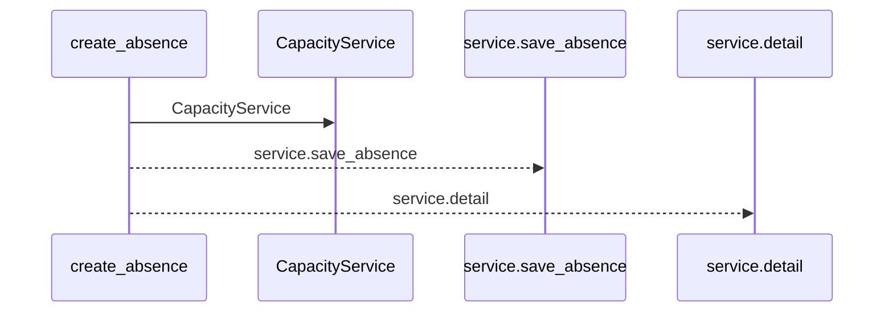
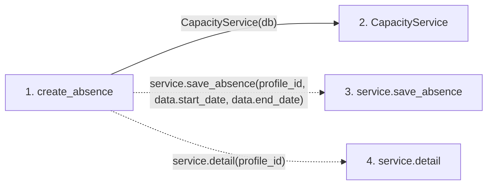

# create_absence

**Entry point:** `create_absence` (`http`)
**Source:** [routers_capacity](../modules/routers_capacity.md)
**Modules touched:** [capacity_service](../modules/capacity_service.md), [routers_capacity](../modules/routers_capacity.md)

## Call sequence

<!-- Auto-generated from static call edges. Dashed arrows are external or unresolved calls. Reviewed runtime conditions and side effects belong in Behavior. -->

## Data flow

<!-- Auto-generated static analysis. Treat values and boundaries as best-effort hints, not runtime proof. -->

### Step data

| Step | Inputs | Reads | Writes | Returns |
|---|---|---|---|---|
| `create_absence` | `profile_id: int`, `data: AbsenceInput`, `db: Database` | - | - | `...` |
| `CapacityService` | - | - | - | - |
| `service.save_absence` | - | - | - | - |
| `service.detail` | - | - | - | - |

### Call data

| From | To | Line | Call |
|---|---|---:|---|
| create_absence | CapacityService | 44 | `CapacityService(db)` |
| create_absence | service.save_absence | 45 | `service.save_absence(profile_id, data.start_date, data.end_date)` |
| create_absence | service.detail | 46 | `service.detail(profile_id)` |

### Boundary effects

*No boundary effects detected.*

### Static analysis gaps

| Kind | Step | Target | Line |
|---|---|---|---:|
| unresolved_call | `create_absence` | `service.save_absence` | 45 |
| unresolved_call | `create_absence` | `service.detail` | 46 |

## Behavior

Creates a person-owned absence and revises every affected plan in the same transaction. Existing legacy vacation adapters retain their identities while canonical ranges supply capacity across projects.
