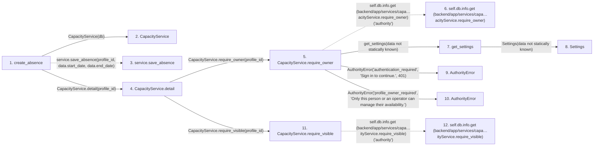

# create_absence

**Entry point:** `create_absence` (`http`)
**Source:** [routers_capacity](../modules/routers_capacity.md)
**Modules touched:** [authority](../modules/authority.md), [capacity_service](../modules/capacity_service.md), [commands](../modules/commands.md), [config](../modules/config.md), [routers_capacity](../modules/routers_capacity.md)

## Call sequence

> Static overview in presentation order, not runtime execution order. Arrows retain captured callers; representative internal continuations and boundary examples precede repeated helper detail.

<!-- Auto-generated from static call edges. Dashed arrows are external or unresolved calls. Reviewed runtime conditions and side effects belong in Behavior. -->

```mermaid
sequenceDiagram
    participant p0 as create_absence
    participant p1 as CapacityService.detail
    participant p2 as CapacityService
    participant p3 as CapacityService.require_owner
    participant p4 as CapacityService.require_visible
    participant p5 as get_settings
    participant p6 as internal_authority
    participant p7 as calendar_signature
    participant p8 as AuthorityError
    participant p9 as PlanningConflict
    participant p10 as Settings
    participant p11 as list
    participant p12 as service.save_absence
    participant p13 as self.db.get (backend/app/services/capa….py:CapacityService.detail)
    participant p14 as (…).unique().all
    participant p15 as (…).unique
    participant p16 as self.db.scalars
    participant p17 as select(…).join(…).join(…).where
    participant p18 as select(…).join(…).join
    participant p19 as select(…).join
    participant p20 as select (backend/app/services/capa….py:CapacityService.detail)
    participant p21 as len
    participant p22 as sorted (backend/app/services/capa….py:CapacityService.detail)
    participant p23 as (…).all
    participant p24 as select(…).where(…).order_by
    participant p25 as select(…).where (backend/app/services/capa….py:CapacityService.detail)
    participant p26 as ProfileAbsence.deleted.is_
    participant p27 as self.db.info.get (backend/app/services/capa…acityService.require_owner)
    participant p28 as self.db.info.get (backend/app/services/capa…ityService.require_visible)
    p0->>p1: CapacityService.detail
    p0->>p2: CapacityService
    p1->>p3: CapacityService.require_owner
    p1->>p4: CapacityService.require_visible
    p3->>p5: get_settings
    p1->>p6: internal_authority
    p1->>p7: calendar_signature
    p3->>p8: AuthorityError
    p4->>p9: PlanningConflict
    p5->>p10: Settings
    p1-->>p11: list(...)
    p0-->>p12: service.save_absence(profile_id, data.start_date, data.end_date)
    p1-->>p13: self.db.get (backend/app/services/capa….py:CapacityService.detail)(ProfileAvailability, profile_id)
    p1-->>p14: (…).unique().all
    p1-->>p15: (…).unique
    p1-->>p16: self.db.scalars(...)
    p1-->>p17: select(…).join(…).join(…).where(...)
    p1-->>p18: select(…).join(…).join(TeamMember, ...)
    p1-->>p19: select(…).join(Iteration)
    p1-->>p20: select (backend/app/services/capa….py:CapacityService.detail)(Calendar)
    p1-->>p21: len(...)
    p1-->>p22: sorted (backend/app/services/capa….py:CapacityService.detail)(...)
    p1-->>p23: (…).all
    p1-->>p16: self.db.scalars(...)
    p1-->>p24: select(…).where(…).order_by(ProfileAbsence.start_date, ProfileAbsence.id)
    p1-->>p25: select(…).where (backend/app/services/capa….py:CapacityService.detail)(..., ProfileAbsence.deleted.is_(...))
    p1-->>p20: select (backend/app/services/capa….py:CapacityService.detail)(ProfileAbsence)
    p1-->>p26: ProfileAbsence.deleted.is_(False)
    p3-->>p27: self.db.info.get (backend/app/services/capa…acityService.require_owner)('authority')
    p4-->>p28: self.db.info.get (backend/app/services/capa…ityService.require_visible)('authority')
```

> Call sequence diagram shows 30 of 49 interactions; 19 omitted to keep the visualization within the 30-interaction and generated-diagram limits, with uncertain identities omitted rather than inferred.

> Captured boundary calls: external 5 of 13 (8 omitted); unresolved 15 of 23 (8 omitted). These counts cover the captured static trace.

Omitted captured detail, grouped by actual caller occurrence and target module:

| Caller | Parent step | Target module | Kind | Omitted interactions |
| --- | --- | --- | --- | --- |
| `backend/app/services/capacity_service.py:CapacityService.require_owner` | 5 | [backend/app/authority.py](../modules/authority.md) | internal | 1 |
| `backend/app/services/capacity_service.py:CapacityService.require_visible` | 11 | - | unresolved | 7 |
| `backend/app/services/capacity_service.py:CapacityService.require_visible` | 11 | - | external | 2 |
| `backend/app/services/capacity_service.py:CapacityService.require_visible` | 11 | [backend/app/authority.py](../modules/authority.md) | internal | 2 |
| `backend/app/authority.py:internal_authority` | 22 | - | unresolved | 1 |
| `backend/app/services/capacity_service.py:calendar_signature` | 37 | - | external | 6 |
> Detailed flow queries retain their own coverage and limits; omitted paths may execute at runtime.

## Data flow

<!-- Auto-generated static analysis. Treat values and boundaries as best-effort hints, not runtime proof. -->

### Analysis coverage

**Effect analysis partially available.** Flow assembly and source effect analysis are separate; empty observations do not prove an empty handler body.

Source steps: 14; effect analysis evaluated: 8, partial: 0, unavailable: 6. Counts include steps omitted from the displayed trace.

Collector observations for 8 source steps with known totals: observed: 21, emitted: 21, omitted: 0. Unavailable totals are excluded.

- Callable record unavailable for one or more source steps; those steps have no represented callable body.
- Effect collector totals unavailable; observed counts cover captured records only.

| Step | Callable record | Effect analysis | Collector totals | Observed | Emitted | Omitted |
|---|---|---|---|---:|---:|---:|
| `create_absence` | `available` | `evaluated` | `available` | `4` | `4` | `0` |
| `CapacityService` | `unavailable` | `unavailable` | `unavailable` | — | — | — |
| `service.save_absence` | `not_applicable` | `not_applicable` | `not_applicable` | — | — | — |
| `CapacityService.detail` | `available` | `evaluated` | `available` | `4` | `4` | `0` |
| `CapacityService.require_owner` | `available` | `evaluated` | `available` | `1` | `1` | `0` |
| `self.db.info.get (backend/app/services/capa…acityService.require_owner)` | `not_applicable` | `not_applicable` | `not_applicable` | — | — | — |
| `get_settings` | `available` | `evaluated` | `available` | `1` | `1` | `0` |
| `Settings` | `unavailable` | `unavailable` | `unavailable` | — | — | — |
| `AuthorityError` | `unavailable` | `unavailable` | `unavailable` | — | — | — |
| `AuthorityError` | `unavailable` | `unavailable` | `unavailable` | — | — | — |
| `CapacityService.require_visible` | `available` | `evaluated` | `available` | `3` | `3` | `0` |
| `self.db.info.get (backend/app/services/capa…ityService.require_visible)` | `not_applicable` | `not_applicable` | `not_applicable` | — | — | — |

```mermaid
flowchart LR
    s1["1. create_absence"]
    s2["2. CapacityService"]
    s3["3. service.save_absence"]
    s4["4. CapacityService.detail"]
    s5["5. CapacityService.require_owner"]
    s6["6. self.db.info.get (backend/app/services/capa…acityService.require_owner)"]
    s7["7. get_settings"]
    s8["8. Settings"]
    s9["9. AuthorityError"]
    s10["10. AuthorityError"]
    s11["11. CapacityService.require_visible"]
    s12["12. self.db.info.get (backend/app/services/capa…ityService.require_visible)"]
    s1 -->|"CapacityService(db)"| s2
    s1 -. "service.save_absence(profile_id, data.start_date, data.end_date)" .-> s3
    s1 -->|"CapacityService.detail(profile_id)"| s4
    s4 -->|"CapacityService.require_owner(profile_id)"| s5
    s5 -. "self.db.info.get (backend/app/services/capa…acityService.require_owner)('authority')" .-> s6
    s5 -->|"get_settings(data not statically known)"| s7
    s7 -->|"Settings(data not statically known)"| s8
    s5 -->|"AuthorityError('authentication_required', 'Sign in to continue.', 401)"| s9
    s5 -->|"AuthorityError('profile_owner_required', 'Only this person or an operator can manage their availability.')"| s10
    s4 -->|"CapacityService.require_visible(profile_id)"| s11
    s11 -. "self.db.info.get (backend/app/services/capa…ityService.require_visible)('authority')" .-> s12
    click s1 "../modules/routers_capacity.md"
    click s2 "../modules/capacity_service.md"
    click s4 "../modules/capacity_service.md"
    click s5 "../modules/capacity_service.md"
    click s7 "../modules/config.md"
    click s8 "../modules/config.md"
    click s9 "../modules/authority.md"
    click s10 "../modules/authority.md"
    click s11 "../modules/capacity_service.md"
```

### Step data

| Step | Inputs | Reads | Writes | Returns |
|---|---|---|---|---|
| `create_absence` | `profile_id: int`, `data: AbsenceInput`, `db: Database` | - | - | `...` |
| `CapacityService` | - | - | - | - |
| `service.save_absence` | - | - | - | - |
| `CapacityService.detail` | `profile_id` | `self.db`, `ProfileAvailability` | - | `{...}` |
| `CapacityService.require_owner` | `profile_id` | - | - | - |
| `self.db.info.get (backend/app/services/capa…acityService.require_owner)` | - | - | - | - |
| `get_settings` | - | - | - | `Settings(...)` |
| `Settings` | - | - | - | - |
| `AuthorityError` | - | - | - | - |
| `AuthorityError` | - | - | - | - |
| `CapacityService.require_visible` | `profile_id` | `self.db`, `TeamMemberProfile` | - | - |
| `self.db.info.get (backend/app/services/capa…ityService.require_visible)` | - | - | - | - |

### Call data

| From | To | Line | Call |
|---|---|---:|---|
| create_absence | CapacityService | 44 | `CapacityService(db)` |
| create_absence | service.save_absence | 45 | `service.save_absence(profile_id, data.start_date, data.end_date)` |
| create_absence | CapacityService.detail | 46 | `service.detail(profile_id)` |
| CapacityService.detail | CapacityService.require_owner | 101 | `self.require_owner(profile_id)` |
| CapacityService.require_owner | self.db.info.get (backend/app/services/capa…acityService.require_owner) | 32 | `self.db.info.get('authority')` |
| CapacityService.require_owner | get_settings | 34 | `get_settings(data not statically known)` |
| get_settings | Settings | 481 | `Settings(data not statically known)` |
| CapacityService.require_owner | AuthorityError | 35 | `AuthorityError('authentication_required', 'Sign in to continue.', 401)` |
| CapacityService.require_owner | AuthorityError | 38 | `AuthorityError('profile_owner_required', 'Only this person or an operator can manage their availability.')` |
| CapacityService.detail | CapacityService.require_visible | 102 | `self.require_visible(profile_id)` |
| CapacityService.require_visible | self.db.info.get (backend/app/services/capa…ityService.require_visible) | 41 | `self.db.info.get('authority')` |

### Boundary effects

*No boundary-effect observations were captured in this static trace.*

### Static analysis gaps

| Kind | Step | Target | Line |
|---|---|---|---:|
| unresolved_call | `create_absence` | `service.save_absence` | 45 |
| unresolved_call | `CapacityService.require_owner` | `self.db.info.get` | 32 |
| unresolved_call | `CapacityService.require_visible` | `self.db.info.get` | 41 |
| step_limit | `create_absence` | `first 12 steps` | 0 |

## Behavior

Creates a person-owned absence and revises every affected plan in the same transaction. Existing legacy vacation adapters retain their identities while canonical ranges supply capacity across projects.
