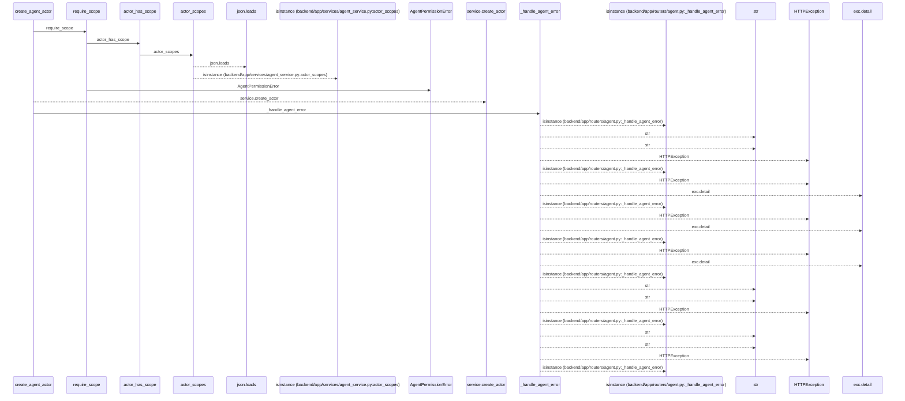
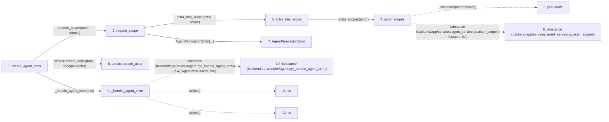

# create_agent_actor

**Entry point:** `create_agent_actor` (`http`)
**Source:** [routers_agent](../modules/routers_agent.md)
**Modules touched:** [agent_service](../modules/agent_service.md), [routers_agent](../modules/routers_agent.md), [schemas_agent](../modules/schemas_agent.md)

## Call sequence

<!-- Auto-generated from static call edges. Dashed arrows are external or unresolved calls. Reviewed runtime conditions and side effects belong in Behavior. -->

> Call sequence diagram shows 30 of 38 interactions; 8 omitted to keep the visualization within the 30-interaction and generated-diagram limits.

## Data flow

<!-- Auto-generated static analysis. Treat values and boundaries as best-effort hints, not runtime proof. -->

### Step data

| Step | Inputs | Reads | Writes | Returns |
|---|---|---|---|---|
| `create_agent_actor` | `data: AgentActorCreate`, `response: Response`, `actor: Annotated[AgentActor, Depends(get_agent_admin_actor)]`, `service: Annotated[AgentService, Depends(get_agent_service)]` | - | `response.headers[...]`, `response.headers[...]`, `response.headers[...]` | `AgentActorCreatedResponse(...)` |
| `require_scope` | `actor: AgentActor`, `scope: str` | - | - | - |
| `actor_has_scope` | `actor: AgentActor`, `scope: str` | - | - | `...` |
| `actor_scopes` | `actor: AgentActor` | `json` | - | `...` |
| `json.loads` | - | - | - | - |
| `isinstance (backend/app/services/agent_service.py:actor_scopes)` | - | - | - | - |
| `AgentPermissionError` | - | - | - | - |
| `service.create_actor` | - | - | - | - |
| `_handle_agent_error` | `exc: Exception`, `structured: bool` | `AgentPermissionError`, `status`, `AgentRoutingConflictError`, `status`, `AgentTeamSetupConflictError`, `status`, `TaskVersionConflictError`, `status` | - | - |
| `isinstance (backend/app/routers/agent.py:_handle_agent_error)` | - | - | - | - |
| `str` | - | - | - | - |
| `str` | - | - | - | - |

### Call data

| From | To | Line | Call |
|---|---|---:|---|
| create_agent_actor | require_scope | 546 | `require_scope(actor, 'admin')` |
| require_scope | actor_has_scope | 84 | `actor_has_scope(actor, scope)` |
| actor_has_scope | actor_scopes | 78 | `actor_scopes(actor)` |
| actor_scopes | json.loads | 70 | `json.loads(actor.scopes)` |
| actor_scopes | isinstance (backend/app/services/agent_service.py:actor_scopes) | 73 | `isinstance(scopes, list)` |
| require_scope | AgentPermissionError | 85 | `AgentPermissionError(...)` |
| create_agent_actor | service.create_actor | 547 | `service.create_actor(data, principal=actor)` |
| create_agent_actor | _handle_agent_error | 552 | `_handle_agent_error(exc)` |
| _handle_agent_error | isinstance (backend/app/routers/agent.py:_handle_agent_error) | 244 | `isinstance(exc, AgentPermissionError)` |
| _handle_agent_error | str | 246 | `str(exc)` |
| _handle_agent_error | str | 248 | `str(exc)` |

### Boundary effects

*No boundary effects detected.*

### Static analysis gaps

| Kind | Step | Target | Line |
|---|---|---|---:|
| external_call | `actor_scopes` | `json.loads` | 70 |
| external_call | `actor_scopes` | `isinstance` | 73 |
| unresolved_call | `create_agent_actor` | `service.create_actor` | 547 |
| external_call | `_handle_agent_error` | `isinstance` | 244 |
| step_limit | `create_agent_actor` | `first 12 steps` | 0 |

## Behavior

This flow starts at `create_agent_actor` and is classified as `http`. The generated call and data-flow sections are bounded static projections; runtime conditions and side effects require source-level confirmation.
