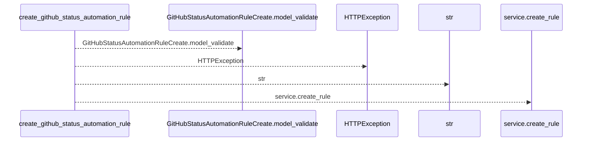
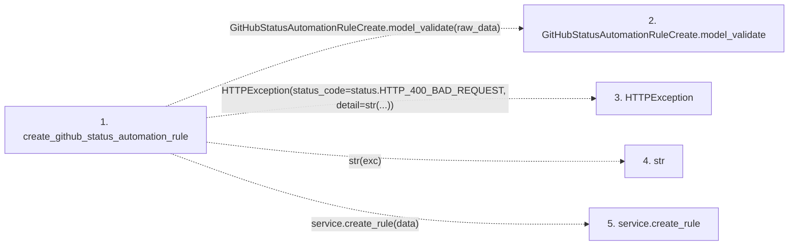

# create_github_status_automation_rule

**Entry point:** `create_github_status_automation_rule` (`http`)
**Source:** [routers_github](../modules/routers_github.md)
**Modules touched:** [routers_github](../modules/routers_github.md)

## Call sequence

<!-- Auto-generated from static call edges. Dashed arrows are external or unresolved calls. Reviewed runtime conditions and side effects belong in Behavior. -->

## Data flow

<!-- Auto-generated static analysis. Treat values and boundaries as best-effort hints, not runtime proof. -->

### Step data

| Step | Inputs | Reads | Writes | Returns |
|---|---|---|---|---|
| `create_github_status_automation_rule` | `raw_data: Annotated[dict, Body(...)]`, `service: Annotated[GitHubStatusAutomationService, Depends(get_github_status_automation_service)]` | `ValidationError`, `status` | - | `...` |
| `GitHubStatusAutomationRuleCreate.model_validate` | - | - | - | - |
| `HTTPException` | - | - | - | - |
| `str` | - | - | - | - |
| `service.create_rule` | - | - | - | - |

### Call data

| From | To | Line | Call |
|---|---|---:|---|
| create_github_status_automation_rule | GitHubStatusAutomationRuleCreate.model_validate | 75 | `GitHubStatusAutomationRuleCreate.model_validate(raw_data)` |
| create_github_status_automation_rule | HTTPException | 77 | `HTTPException(status_code=status.HTTP_400_BAD_REQUEST, detail=str(...))` |
| create_github_status_automation_rule | str | 79 | `str(exc)` |
| create_github_status_automation_rule | service.create_rule | 81 | `service.create_rule(data)` |

### Boundary effects

*No boundary effects detected.*

### Static analysis gaps

| Kind | Step | Target | Line |
|---|---|---|---:|
| unresolved_call | `create_github_status_automation_rule` | `GitHubStatusAutomationRuleCreate.model_validate` | 75 |
| external_call | `create_github_status_automation_rule` | `HTTPException` | 77 |
| unresolved_call | `create_github_status_automation_rule` | `service.create_rule` | 81 |

## Behavior

This flow starts at `create_github_status_automation_rule` and is classified as `http`. The generated call and data-flow sections are bounded static projections; runtime conditions and side effects require source-level confirmation.
