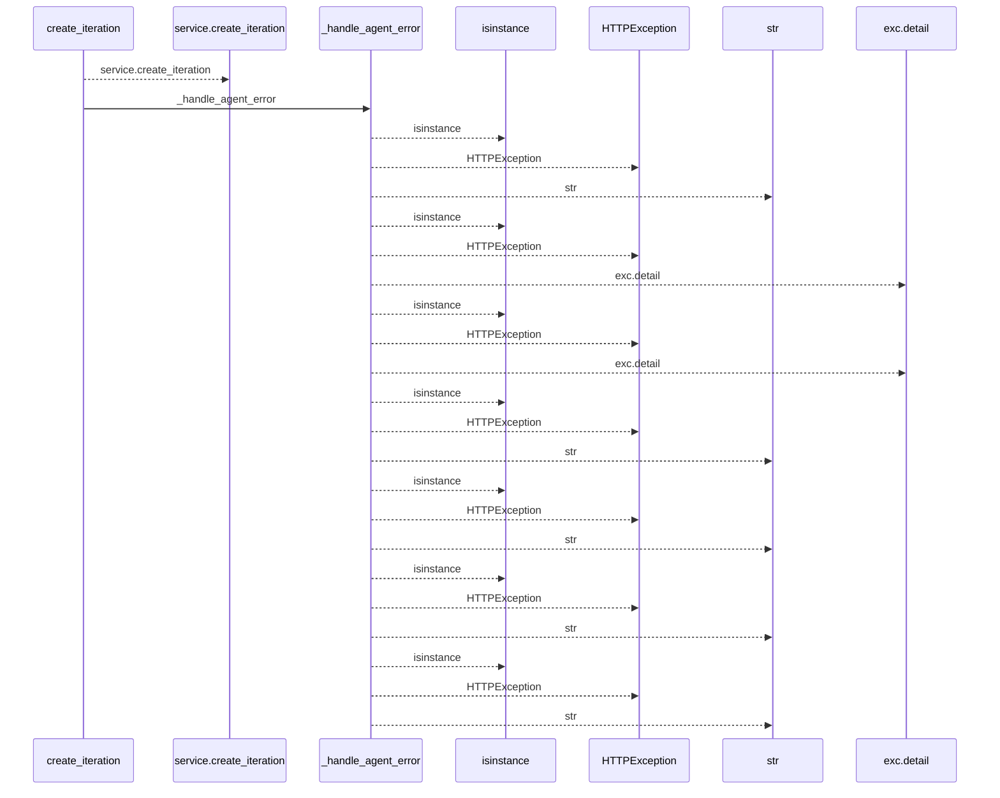
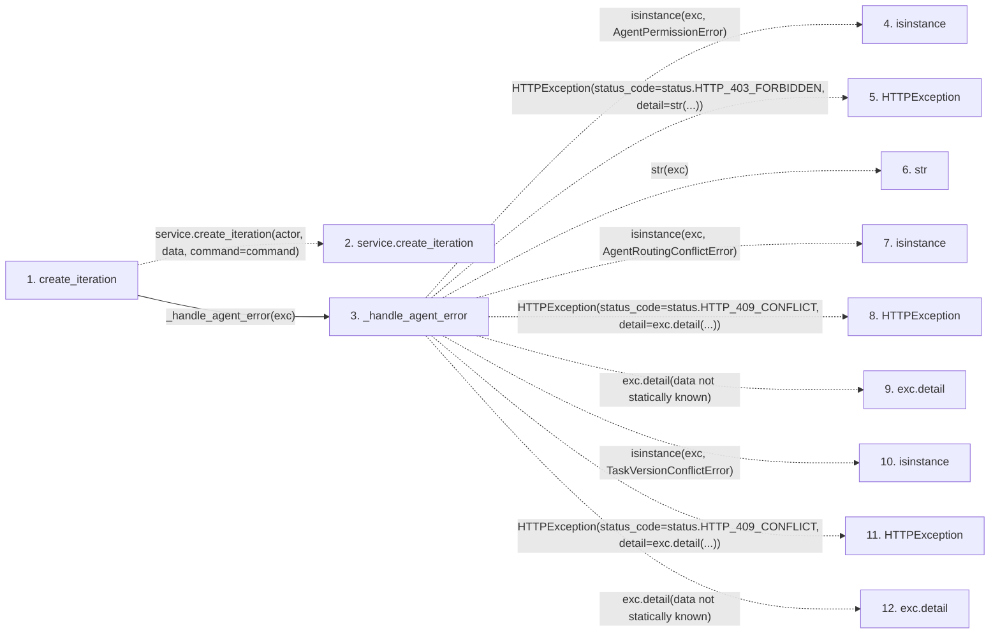

# create_iteration

**Entry point:** `create_iteration` (`http`)
**Source:** [routers_agent_planning](../modules/routers_agent_planning.md)
**Modules touched:** [routers_agent_planning](../modules/routers_agent_planning.md)

## Call sequence

<!-- Auto-generated from static call edges. Dashed arrows are external or unresolved calls. Reviewed runtime conditions and side effects belong in Behavior. -->

## Data flow

<!-- Auto-generated static analysis. Treat values and boundaries as best-effort hints, not runtime proof. -->

### Step data

| Step | Inputs | Reads | Writes | Returns |
|---|---|---|---|---|
| `create_iteration` | `data: IterationCreate`, `actor: Annotated[AgentActor, Depends(get_agent_actor)]`, `service: Annotated[AgentPlanningService, Depends(get_agent_planning_service)]`, `command: Annotated[AgentPlanningCommandContext, Depends(get_agent_planning_command_context)]` | - | - | `...` |
| `service.create_iteration` | - | - | - | - |
| `_handle_agent_error` | `exc: Exception` | `AgentPermissionError`, `status`, `AgentRoutingConflictError`, `status`, `TaskVersionConflictError`, `status`, `AgentConflictError`, `status` | - | - |
| `isinstance` | - | - | - | - |
| `HTTPException` | - | - | - | - |
| `str` | - | - | - | - |
| `isinstance` | - | - | - | - |
| `HTTPException` | - | - | - | - |
| `exc.detail` | - | - | - | - |
| `isinstance` | - | - | - | - |
| `HTTPException` | - | - | - | - |
| `exc.detail` | - | - | - | - |

### Call data

| From | To | Line | Call |
|---|---|---:|---|
| create_iteration | service.create_iteration | 360 | `service.create_iteration(actor, data, command=command)` |
| create_iteration | _handle_agent_error | 366 | `_handle_agent_error(exc)` |
| _handle_agent_error | isinstance | 102 | `isinstance(exc, AgentPermissionError)` |
| _handle_agent_error | HTTPException | 103 | `HTTPException(status_code=status.HTTP_403_FORBIDDEN, detail=str(...))` |
| _handle_agent_error | str | 103 | `str(exc)` |
| _handle_agent_error | isinstance | 104 | `isinstance(exc, AgentRoutingConflictError)` |
| _handle_agent_error | HTTPException | 105 | `HTTPException(status_code=status.HTTP_409_CONFLICT, detail=exc.detail(...))` |
| _handle_agent_error | exc.detail | 105 | `exc.detail(data not statically known)` |
| _handle_agent_error | isinstance | 106 | `isinstance(exc, TaskVersionConflictError)` |
| _handle_agent_error | HTTPException | 107 | `HTTPException(status_code=status.HTTP_409_CONFLICT, detail=exc.detail(...))` |
| _handle_agent_error | exc.detail | 107 | `exc.detail(data not statically known)` |

### Boundary effects

*No boundary effects detected.*

### Static analysis gaps

| Kind | Step | Target | Line |
|---|---|---|---:|
| unresolved_call | `create_iteration` | `service.create_iteration` | 360 |
| external_call | `_handle_agent_error` | `isinstance` | 102 |
| external_call | `_handle_agent_error` | `HTTPException` | 103 |
| external_call | `_handle_agent_error` | `isinstance` | 104 |
| external_call | `_handle_agent_error` | `HTTPException` | 105 |
| unresolved_call | `_handle_agent_error` | `exc.detail` | 105 |
| external_call | `_handle_agent_error` | `isinstance` | 106 |
| external_call | `_handle_agent_error` | `HTTPException` | 107 |
| unresolved_call | `_handle_agent_error` | `exc.detail` | 107 |
| step_limit | `create_iteration` | `first 12 steps` | 0 |

## Behavior

This flow starts at `create_iteration` and is classified as `http`. The generated call and data-flow sections are bounded static projections; runtime conditions and side effects require source-level confirmation.
