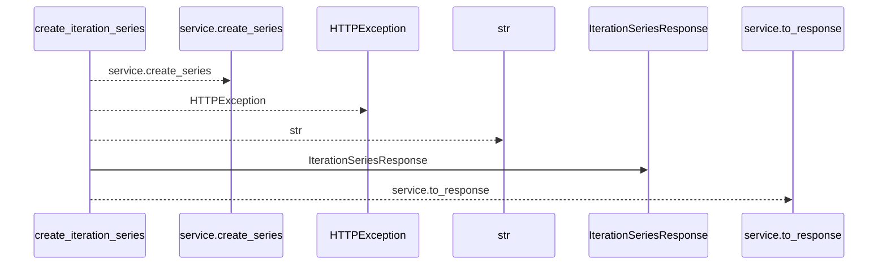
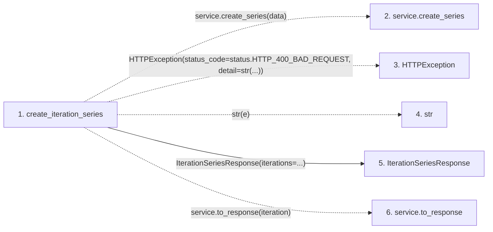

# create_iteration_series

**Entry point:** `create_iteration_series` (`http`)
**Source:** [iterations](../modules/iterations.md)
**Modules touched:** [iterations](../modules/iterations.md), [schemas_iteration](../modules/schemas_iteration.md)

## Call sequence

<!-- Auto-generated from static call edges. Dashed arrows are external or unresolved calls. Reviewed runtime conditions and side effects belong in Behavior. -->

## Data flow

<!-- Auto-generated static analysis. Treat values and boundaries as best-effort hints, not runtime proof. -->

### Step data

| Step | Inputs | Reads | Writes | Returns |
|---|---|---|---|---|
| `create_iteration_series` | `data: IterationSeriesCreate`, `service: Annotated[IterationService, Depends(get_iteration_service)]` | `status` | - | `IterationSeriesResponse(...)` |
| `service.create_series` | - | - | - | - |
| `HTTPException` | - | - | - | - |
| `str` | - | - | - | - |
| `IterationSeriesResponse` | - | - | - | - |
| `service.to_response` | - | - | - | - |

### Call data

| From | To | Line | Call |
|---|---|---:|---|
| create_iteration_series | service.create_series | 100 | `service.create_series(data)` |
| create_iteration_series | HTTPException | 102 | `HTTPException(status_code=status.HTTP_400_BAD_REQUEST, detail=str(...))` |
| create_iteration_series | str | 104 | `str(e)` |
| create_iteration_series | IterationSeriesResponse | 106 | `IterationSeriesResponse(iterations=...)` |
| create_iteration_series | service.to_response | 107 | `service.to_response(iteration)` |

### Boundary effects

*No boundary effects detected.*

### Static analysis gaps

| Kind | Step | Target | Line |
|---|---|---|---:|
| unresolved_call | `create_iteration_series` | `service.create_series` | 100 |
| external_call | `create_iteration_series` | `HTTPException` | 102 |
| unresolved_call | `create_iteration_series` | `service.to_response` | 107 |

## Behavior

This flow starts at `create_iteration_series` and is classified as `http`. The generated call and data-flow sections are bounded static projections; runtime conditions and side effects require source-level confirmation.
