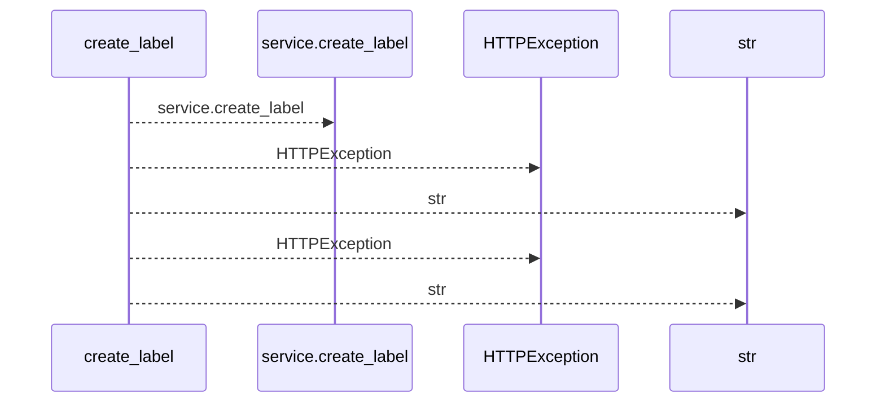
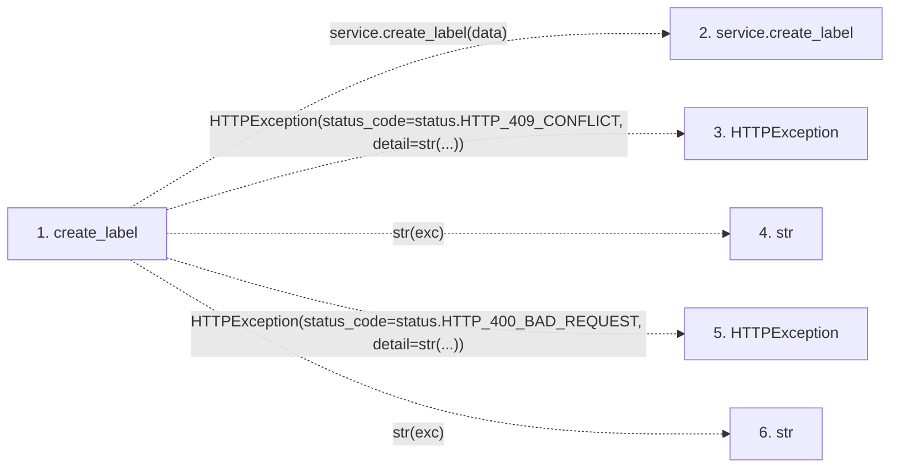

# create_label

**Entry point:** `create_label` (`http`)
**Source:** [labels](../modules/labels.md)
**Modules touched:** [labels](../modules/labels.md)

## Call sequence

<!-- Auto-generated from static call edges. Dashed arrows are external or unresolved calls. Reviewed runtime conditions and side effects belong in Behavior. -->

## Data flow

<!-- Auto-generated static analysis. Treat values and boundaries as best-effort hints, not runtime proof. -->

### Step data

| Step | Inputs | Reads | Writes | Returns |
|---|---|---|---|---|
| `create_label` | `data: LabelCreate`, `service: Annotated[LabelService, Depends(get_label_service)]` | `LabelConflictError`, `status`, `status` | - | `...` |
| `service.create_label` | - | - | - | - |
| `HTTPException` | - | - | - | - |
| `str` | - | - | - | - |
| `HTTPException` | - | - | - | - |
| `str` | - | - | - | - |

### Call data

| From | To | Line | Call |
|---|---|---:|---|
| create_label | service.create_label | 101 | `service.create_label(data)` |
| create_label | HTTPException | 103 | `HTTPException(status_code=status.HTTP_409_CONFLICT, detail=str(...))` |
| create_label | str | 103 | `str(exc)` |
| create_label | HTTPException | 105 | `HTTPException(status_code=status.HTTP_400_BAD_REQUEST, detail=str(...))` |
| create_label | str | 105 | `str(exc)` |

### Boundary effects

*No boundary effects detected.*

### Static analysis gaps

| Kind | Step | Target | Line |
|---|---|---|---:|
| unresolved_call | `create_label` | `service.create_label` | 101 |
| external_call | `create_label` | `HTTPException` | 103 |
| external_call | `create_label` | `HTTPException` | 105 |

## Behavior

This flow starts at `create_label` and is classified as `http`. The generated call and data-flow sections are bounded static projections; runtime conditions and side effects require source-level confirmation.
