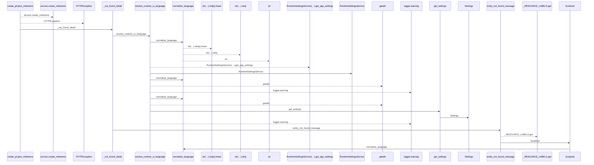
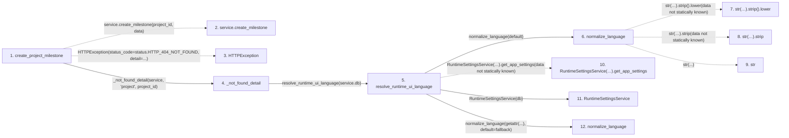

# create_project_milestone

**Entry point:** `create_project_milestone` (`http`)
**Source:** [projects](../modules/projects.md)
**Modules touched:** [config](../modules/config.md), [language_service](../modules/language_service.md), [projects](../modules/projects.md), [system_settings_service](../modules/system_settings_service.md)

## Call sequence

<!-- Auto-generated from static call edges. Dashed arrows are external or unresolved calls. Reviewed runtime conditions and side effects belong in Behavior. -->

## Data flow

<!-- Auto-generated static analysis. Treat values and boundaries as best-effort hints, not runtime proof. -->

### Step data

| Step | Inputs | Reads | Writes | Returns |
|---|---|---|---|---|
| `create_project_milestone` | `project_id: int`, `data: ProjectMilestoneCreateRequest`, `service: Annotated[ProjectService, Depends(get_project_service)]` | `status` | - | `milestone` |
| `service.create_milestone` | - | - | - | - |
| `HTTPException` | - | - | - | - |
| `_not_found_detail` | `service: Any`, `entity: str`, `entity_id: int` | - | - | `entity_not_found_message(...)` |
| `resolve_runtime_ui_language` | `db: Any`, `default: LanguageCode \| None` | - | - | `normalize_language(...)`, `normalize_language(...)`, `fallback` |
| `normalize_language` | `value: Any`, `default: LanguageCode` | - | - | `normalized`, `default` |
| `str(…).strip().lower` | - | - | - | - |
| `str(…).strip` | - | - | - | - |
| `str` | - | - | - | - |
| `RuntimeSettingsService(…).get_app_settings` | - | - | - | - |
| `RuntimeSettingsService` | - | - | - | - |
| `normalize_language` | `value: Any`, `default: LanguageCode` | - | - | `normalized`, `default` |

### Call data

| From | To | Line | Call |
|---|---|---:|---|
| create_project_milestone | service.create_milestone | 336 | `service.create_milestone(project_id, data)` |
| create_project_milestone | HTTPException | 338 | `HTTPException(status_code=status.HTTP_404_NOT_FOUND, detail=...)` |
| create_project_milestone | _not_found_detail | 340 | `_not_found_detail(service, 'project', project_id)` |
| _not_found_detail | resolve_runtime_ui_language | 73 | `resolve_runtime_ui_language(service.db)` |
| resolve_runtime_ui_language | normalize_language | 406 | `normalize_language(default)` |
| normalize_language | str(…).strip().lower | 35 | `str(value or '').strip().lower(data not statically known)` |
| normalize_language | str(…).strip | 35 | `str(value or '').strip(data not statically known)` |
| normalize_language | str | 35 | `str(...)` |
| resolve_runtime_ui_language | RuntimeSettingsService(…).get_app_settings | 411 | `RuntimeSettingsService(db).get_app_settings(data not statically known)` |
| resolve_runtime_ui_language | RuntimeSettingsService | 411 | `RuntimeSettingsService(db)` |
| resolve_runtime_ui_language | normalize_language | 412 | `normalize_language(getattr(...), default=fallback)` |

### Boundary effects

*No boundary effects detected.*

### Static analysis gaps

| Kind | Step | Target | Line |
|---|---|---|---:|
| unresolved_call | `create_project_milestone` | `service.create_milestone` | 336 |
| external_call | `create_project_milestone` | `HTTPException` | 338 |
| unresolved_call | `normalize_language` | `str(value or '').strip().lower` | 35 |
| unresolved_call | `normalize_language` | `str(value or '').strip` | 35 |
| unresolved_call | `resolve_runtime_ui_language` | `RuntimeSettingsService(db).get_app_settings` | 411 |
| step_limit | `create_project_milestone` | `first 12 steps` | 0 |

## Behavior

This flow starts at `create_project_milestone` and is classified as `http`. The generated call and data-flow sections are bounded static projections; runtime conditions and side effects require source-level confirmation.
