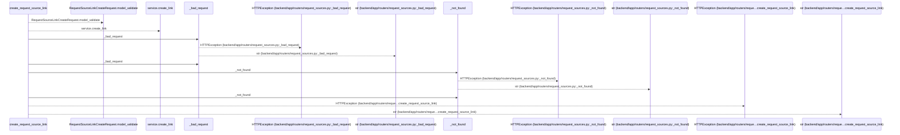
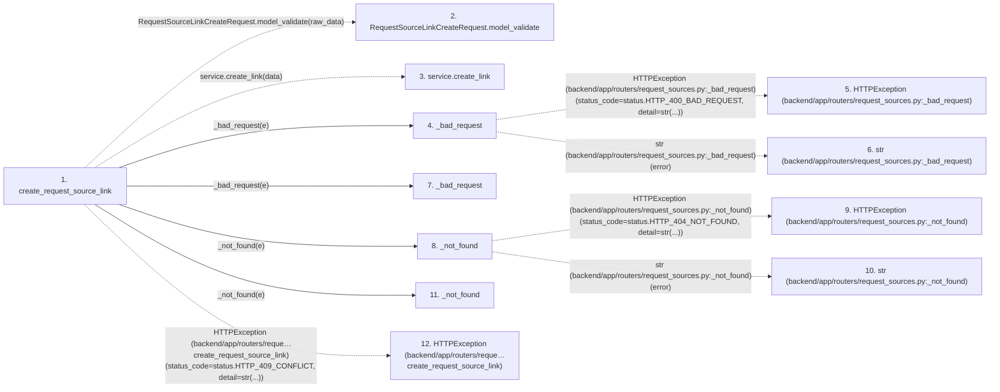

# create_request_source_link

**Entry point:** `create_request_source_link` (`http`)
**Source:** [request_sources](../modules/request_sources.md)
**Modules touched:** [request_sources](../modules/request_sources.md)

## Call sequence

<!-- Auto-generated from static call edges. Dashed arrows are external or unresolved calls. Reviewed runtime conditions and side effects belong in Behavior. -->

## Data flow

<!-- Auto-generated static analysis. Treat values and boundaries as best-effort hints, not runtime proof. -->

### Step data

| Step | Inputs | Reads | Writes | Returns |
|---|---|---|---|---|
| `create_request_source_link` | `raw_data: Annotated[dict, Body(...)]`, `service: Annotated[RequestSourceService, Depends(get_request_source_service)]` | `ValidationError`, `RequestSourceValidationError`, `RequestSourceTargetNotFoundError`, `RequestSourceNotFoundError`, `RequestSourceConflictError`, `status` | - | `...` |
| `RequestSourceLinkCreateRequest.model_validate` | - | - | - | - |
| `service.create_link` | - | - | - | - |
| `_bad_request` | `error: Exception` | `status` | - | `HTTPException(...)` |
| `HTTPException (backend/app/routers/request_sources.py:_bad_request)` | - | - | - | - |
| `str (backend/app/routers/request_sources.py:_bad_request)` | - | - | - | - |
| `_bad_request` | `error: Exception` | `status` | - | `HTTPException(...)` |
| `_not_found` | `error: Exception` | `status` | - | `HTTPException(...)` |
| `HTTPException (backend/app/routers/request_sources.py:_not_found)` | - | - | - | - |
| `str (backend/app/routers/request_sources.py:_not_found)` | - | - | - | - |
| `_not_found` | `error: Exception` | `status` | - | `HTTPException(...)` |
| `HTTPException (backend/app/routers/reque…create_request_source_link)` | - | - | - | - |

### Call data

| From | To | Line | Call |
|---|---|---:|---|
| create_request_source_link | RequestSourceLinkCreateRequest.model_validate | 84 | `RequestSourceLinkCreateRequest.model_validate(raw_data)` |
| create_request_source_link | service.create_link | 85 | `service.create_link(data)` |
| create_request_source_link | _bad_request | 87 | `_bad_request(e)` |
| _bad_request | HTTPException (backend/app/routers/request_sources.py:_bad_request) | 34 | `HTTPException(status_code=status.HTTP_400_BAD_REQUEST, detail=str(...))` |
| _bad_request | str (backend/app/routers/request_sources.py:_bad_request) | 34 | `str(error)` |
| create_request_source_link | _bad_request | 89 | `_bad_request(e)` |
| create_request_source_link | _not_found | 91 | `_not_found(e)` |
| _not_found | HTTPException (backend/app/routers/request_sources.py:_not_found) | 38 | `HTTPException(status_code=status.HTTP_404_NOT_FOUND, detail=str(...))` |
| _not_found | str (backend/app/routers/request_sources.py:_not_found) | 38 | `str(error)` |
| create_request_source_link | _not_found | 93 | `_not_found(e)` |
| create_request_source_link | HTTPException (backend/app/routers/reque…create_request_source_link) | 95 | `HTTPException(status_code=status.HTTP_409_CONFLICT, detail=str(...))` |

### Boundary effects

*No boundary effects detected.*

### Static analysis gaps

| Kind | Step | Target | Line |
|---|---|---|---:|
| unresolved_call | `create_request_source_link` | `RequestSourceLinkCreateRequest.model_validate` | 84 |
| unresolved_call | `create_request_source_link` | `service.create_link` | 85 |
| external_call | `_bad_request` | `HTTPException` | 34 |
| external_call | `_not_found` | `HTTPException` | 38 |
| external_call | `create_request_source_link` | `HTTPException` | 95 |
| step_limit | `create_request_source_link` | `first 12 steps` | 0 |

## Behavior

This flow starts at `create_request_source_link` and is classified as `http`. The generated call and data-flow sections are bounded static projections; runtime conditions and side effects require source-level confirmation.
