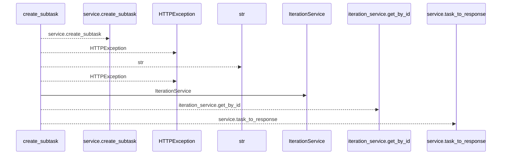
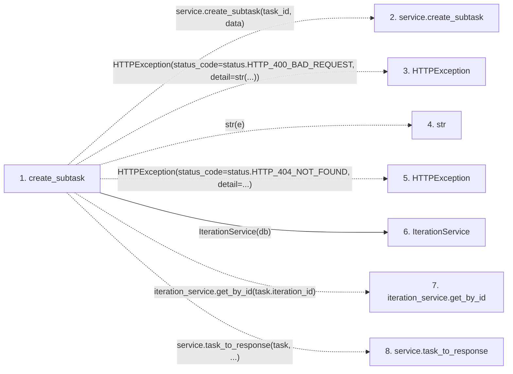

# create_subtask

**Entry point:** `create_subtask` (`http`)
**Source:** [tasks](../modules/tasks.md)
**Modules touched:** [iteration_service](../modules/iteration_service.md), [tasks](../modules/tasks.md)

## Call sequence

<!-- Auto-generated from static call edges. Dashed arrows are external or unresolved calls. Reviewed runtime conditions and side effects belong in Behavior. -->

## Data flow

<!-- Auto-generated static analysis. Treat values and boundaries as best-effort hints, not runtime proof. -->

### Step data

| Step | Inputs | Reads | Writes | Returns |
|---|---|---|---|---|
| `create_subtask` | `task_id: int`, `data: TaskCreate`, `service: Annotated[TaskService, Depends(get_task_service)]`, `db: Annotated[AsyncSession, Depends(get_db, scope='function')]` | `status`, `status` | - | `service.task_to_response(...)` |
| `service.create_subtask` | - | - | - | - |
| `HTTPException` | - | - | - | - |
| `str` | - | - | - | - |
| `HTTPException` | - | - | - | - |
| `IterationService` | - | - | - | - |
| `iteration_service.get_by_id` | - | - | - | - |
| `service.task_to_response` | - | - | - | - |

### Call data

| From | To | Line | Call |
|---|---|---:|---|
| create_subtask | service.create_subtask | 566 | `service.create_subtask(task_id, data)` |
| create_subtask | HTTPException | 568 | `HTTPException(status_code=status.HTTP_400_BAD_REQUEST, detail=str(...))` |
| create_subtask | str | 570 | `str(e)` |
| create_subtask | HTTPException | 573 | `HTTPException(status_code=status.HTTP_404_NOT_FOUND, detail=...)` |
| create_subtask | IterationService | 578 | `IterationService(db)` |
| create_subtask | iteration_service.get_by_id | 579 | `iteration_service.get_by_id(task.iteration_id)` |
| create_subtask | service.task_to_response | 581 | `service.task_to_response(task, ...)` |

### Boundary effects

*No boundary effects detected.*

### Static analysis gaps

| Kind | Step | Target | Line |
|---|---|---|---:|
| unresolved_call | `create_subtask` | `service.create_subtask` | 566 |
| external_call | `create_subtask` | `HTTPException` | 568 |
| external_call | `create_subtask` | `HTTPException` | 573 |
| unresolved_call | `create_subtask` | `iteration_service.get_by_id` | 579 |
| unresolved_call | `create_subtask` | `service.task_to_response` | 581 |

## Behavior

This flow starts at `create_subtask` and is classified as `http`. The generated call and data-flow sections are bounded static projections; runtime conditions and side effects require source-level confirmation.
