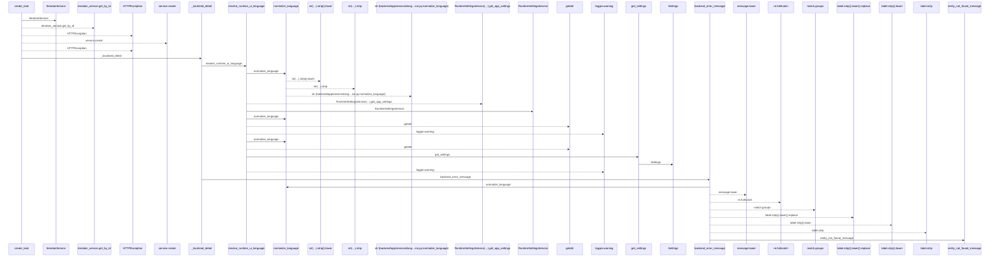
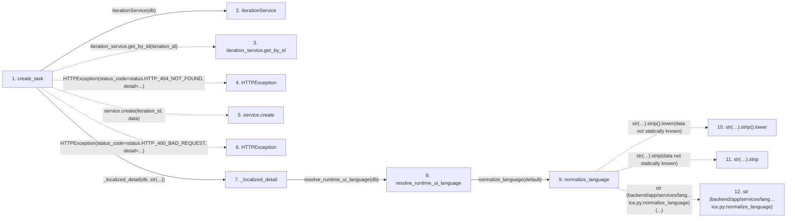

# create_task

**Entry point:** `create_task` (`http`)
**Source:** [tasks](../modules/tasks.md)
**Modules touched:** [config](../modules/config.md), [iteration_service](../modules/iteration_service.md), [language_service](../modules/language_service.md), [system_settings_service](../modules/system_settings_service.md), and 1 more

**Complete modules touched:**

- [config](../modules/config.md)
- [iteration_service](../modules/iteration_service.md)
- [language_service](../modules/language_service.md)
- [system_settings_service](../modules/system_settings_service.md)
- [tasks](../modules/tasks.md)

## Call sequence

<!-- Auto-generated from static call edges. Dashed arrows are external or unresolved calls. Reviewed runtime conditions and side effects belong in Behavior. -->

> Call sequence diagram shows 30 of 119 interactions; 89 omitted to keep the visualization within the 30-interaction and generated-diagram limits.

## Data flow

<!-- Auto-generated static analysis. Treat values and boundaries as best-effort hints, not runtime proof. -->

### Step data

| Step | Inputs | Reads | Writes | Returns |
|---|---|---|---|---|
| `create_task` | `iteration_id: int`, `data: TaskCreate`, `service: Annotated[TaskService, Depends(get_task_service)]`, `db: Annotated[AsyncSession, Depends(get_db, scope='function')]` | `status`, `status` | - | `service.task_to_response(...)` |
| `IterationService` | - | - | - | - |
| `iteration_service.get_by_id` | - | - | - | - |
| `HTTPException` | - | - | - | - |
| `service.create` | - | - | - | - |
| `HTTPException` | - | - | - | - |
| `_localized_detail` | `db: AsyncSession`, `message: str` | - | - | `backend_error_message(...)` |
| `resolve_runtime_ui_language` | `db: Any`, `default: LanguageCode \| None` | - | - | `normalize_language(...)`, `normalize_language(...)`, `fallback` |
| `normalize_language` | `value: Any`, `default: LanguageCode` | - | - | `normalized`, `default` |
| `str(…).strip().lower` | - | - | - | - |
| `str(…).strip` | - | - | - | - |
| `str (backend/app/services/lang…ice.py:normalize_language)` | - | - | - | - |

### Call data

| From | To | Line | Call |
|---|---|---:|---|
| create_task | IterationService | 145 | `IterationService(db)` |
| create_task | iteration_service.get_by_id | 146 | `iteration_service.get_by_id(iteration_id)` |
| create_task | HTTPException | 149 | `HTTPException(status_code=status.HTTP_404_NOT_FOUND, detail=...)` |
| create_task | service.create | 155 | `service.create(iteration_id, data)` |
| create_task | HTTPException | 157 | `HTTPException(status_code=status.HTTP_400_BAD_REQUEST, detail=...)` |
| create_task | _localized_detail | 159 | `_localized_detail(db, str(...))` |
| _localized_detail | resolve_runtime_ui_language | 63 | `resolve_runtime_ui_language(db)` |
| resolve_runtime_ui_language | normalize_language | 406 | `normalize_language(default)` |
| normalize_language | str(…).strip().lower | 35 | `str(value or '').strip().lower(data not statically known)` |
| normalize_language | str(…).strip | 35 | `str(value or '').strip(data not statically known)` |
| normalize_language | str (backend/app/services/lang…ice.py:normalize_language) | 35 | `str(...)` |

### Boundary effects

*No boundary effects detected.*

### Static analysis gaps

| Kind | Step | Target | Line |
|---|---|---|---:|
| unresolved_call | `create_task` | `iteration_service.get_by_id` | 146 |
| external_call | `create_task` | `HTTPException` | 149 |
| unresolved_call | `create_task` | `service.create` | 155 |
| external_call | `create_task` | `HTTPException` | 157 |
| unresolved_call | `normalize_language` | `str(value or '').strip().lower` | 35 |
| unresolved_call | `normalize_language` | `str(value or '').strip` | 35 |
| step_limit | `create_task` | `first 12 steps` | 0 |

## Behavior

This flow starts at `create_task` and is classified as `http`. The generated call and data-flow sections are bounded static projections; runtime conditions and side effects require source-level confirmation.
