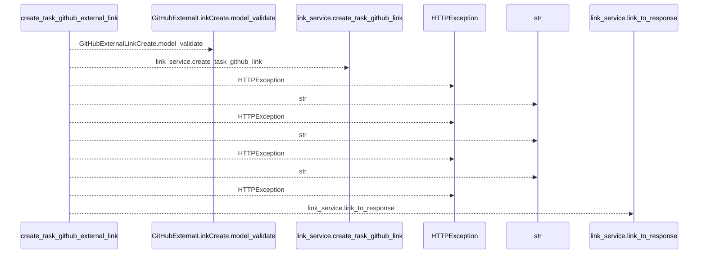
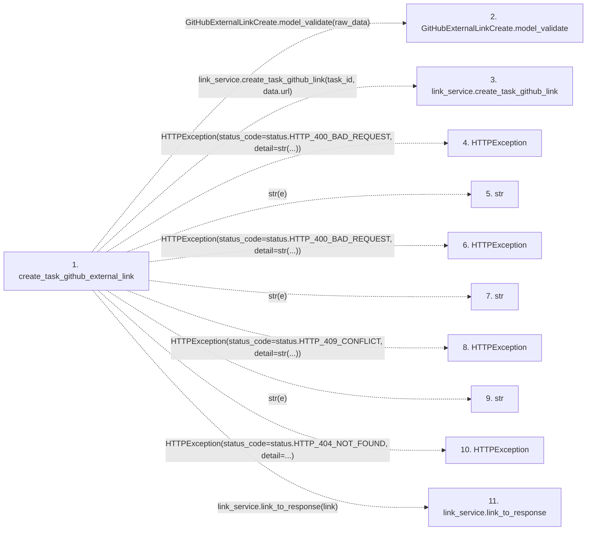

# create_task_github_external_link

**Entry point:** `create_task_github_external_link` (`http`)
**Source:** [tasks](../modules/tasks.md)
**Modules touched:** [tasks](../modules/tasks.md)

## Call sequence

<!-- Auto-generated from static call edges. Dashed arrows are external or unresolved calls. Reviewed runtime conditions and side effects belong in Behavior. -->

## Data flow

<!-- Auto-generated static analysis. Treat values and boundaries as best-effort hints, not runtime proof. -->

### Step data

| Step | Inputs | Reads | Writes | Returns |
|---|---|---|---|---|
| `create_task_github_external_link` | `task_id: int`, `raw_data: Annotated[dict, Body(...)]`, `link_service: Annotated[ExternalLinkService, Depends(get_external_link_service)]` | `ValidationError`, `status`, `ExternalLinkValidationError`, `status`, `ExternalLinkConflictError`, `status`, `status` | - | `link_service.link_to_response(...)` |
| `GitHubExternalLinkCreate.model_validate` | - | - | - | - |
| `link_service.create_task_github_link` | - | - | - | - |
| `HTTPException` | - | - | - | - |
| `str` | - | - | - | - |
| `HTTPException` | - | - | - | - |
| `str` | - | - | - | - |
| `HTTPException` | - | - | - | - |
| `str` | - | - | - | - |
| `HTTPException` | - | - | - | - |
| `link_service.link_to_response` | - | - | - | - |

### Call data

| From | To | Line | Call |
|---|---|---:|---|
| create_task_github_external_link | GitHubExternalLinkCreate.model_validate | 466 | `GitHubExternalLinkCreate.model_validate(raw_data)` |
| create_task_github_external_link | link_service.create_task_github_link | 467 | `link_service.create_task_github_link(task_id, data.url)` |
| create_task_github_external_link | HTTPException | 469 | `HTTPException(status_code=status.HTTP_400_BAD_REQUEST, detail=str(...))` |
| create_task_github_external_link | str | 471 | `str(e)` |
| create_task_github_external_link | HTTPException | 474 | `HTTPException(status_code=status.HTTP_400_BAD_REQUEST, detail=str(...))` |
| create_task_github_external_link | str | 476 | `str(e)` |
| create_task_github_external_link | HTTPException | 479 | `HTTPException(status_code=status.HTTP_409_CONFLICT, detail=str(...))` |
| create_task_github_external_link | str | 481 | `str(e)` |
| create_task_github_external_link | HTTPException | 485 | `HTTPException(status_code=status.HTTP_404_NOT_FOUND, detail=...)` |
| create_task_github_external_link | link_service.link_to_response | 489 | `link_service.link_to_response(link)` |

### Boundary effects

*No boundary effects detected.*

### Static analysis gaps

| Kind | Step | Target | Line |
|---|---|---|---:|
| unresolved_call | `create_task_github_external_link` | `GitHubExternalLinkCreate.model_validate` | 466 |
| unresolved_call | `create_task_github_external_link` | `link_service.create_task_github_link` | 467 |
| external_call | `create_task_github_external_link` | `HTTPException` | 469 |
| external_call | `create_task_github_external_link` | `HTTPException` | 474 |
| external_call | `create_task_github_external_link` | `HTTPException` | 479 |
| external_call | `create_task_github_external_link` | `HTTPException` | 485 |
| unresolved_call | `create_task_github_external_link` | `link_service.link_to_response` | 489 |

## Behavior

This flow starts at `create_task_github_external_link` and is classified as `http`. The generated call and data-flow sections are bounded static projections; runtime conditions and side effects require source-level confirmation.
