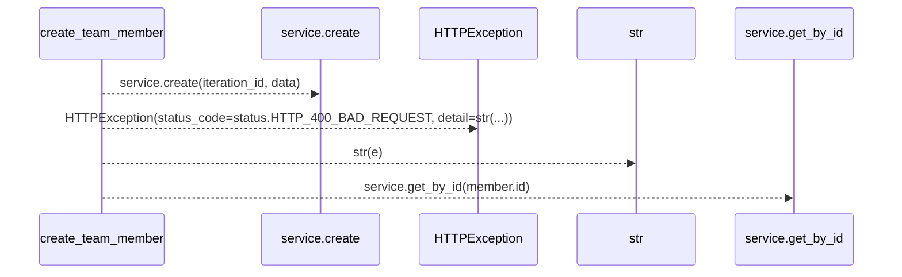
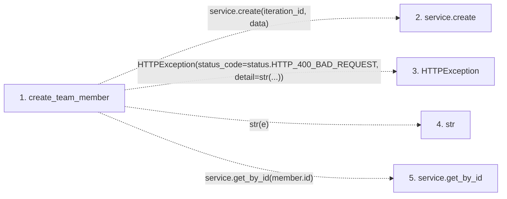

# create_team_member

**Entry point:** `create_team_member` (`http`)
**Source:** [routers_team](../modules/routers_team.md)
**Modules touched:** [routers_team](../modules/routers_team.md)

## Call sequence

> Static overview in presentation order, not runtime execution order. Arrows retain captured callers; representative internal continuations and boundary examples precede repeated helper detail.

<!-- Auto-generated from static call edges. Dashed arrows are external or unresolved calls. Reviewed runtime conditions and side effects belong in Behavior. -->

```mermaid
sequenceDiagram
    participant p0 as create_team_member
    participant p1 as service.create
    participant p2 as HTTPException
    participant p3 as str
    participant p4 as service.get_by_id
    p0-->>p1: service.create(iteration_id, data)
    p0-->>p2: HTTPException(status_code=status.HTTP_400_BAD_REQUEST, detail=str(...))
    p0-->>p3: str(e)
    p0-->>p4: service.get_by_id(member.id)
```

> Call sequence diagram shows 4 of 4 interactions; 0 omitted to keep the visualization within the 30-interaction and generated-diagram limits, with uncertain identities omitted rather than inferred.

> Captured boundary calls: external 2 of 2 (0 omitted); unresolved 2 of 2 (0 omitted). These counts cover the captured static trace.
> Detailed flow queries retain their own coverage and limits; omitted paths may execute at runtime.

## Data flow

<!-- Auto-generated static analysis. Treat values and boundaries as best-effort hints, not runtime proof. -->

### Analysis coverage

**Effect analysis evaluated.** Flow assembly and source effect analysis are separate; empty observations do not prove an empty handler body.

Source steps: 1; effect analysis evaluated: 1, partial: 0, unavailable: 0. Counts include steps omitted from the displayed trace.

Collector observations for 1 source steps with known totals: observed: 5, emitted: 5, omitted: 0. Unavailable totals are excluded.

```mermaid
flowchart LR
    s1["1. create_team_member"]
    s2["2. service.create"]
    s3["3. HTTPException"]
    s4["4. str"]
    s5["5. service.get_by_id"]
    s1 -. "service.create(iteration_id, data)" .-> s2
    s1 -. "HTTPException(status_code=status.HTTP_400_BAD_REQUEST, detail=str(...))" .-> s3
    s1 -. "str(e)" .-> s4
    s1 -. "service.get_by_id(member.id)" .-> s5
    click s1 "../modules/routers_team.md"
```

### Step data

| Step | Inputs | Reads | Writes | Returns |
|---|---|---|---|---|
| `create_team_member` | `iteration_id: int`, `data: TeamMemberCreate`, `service: Annotated[TeamService, Depends(get_team_service)]` | `status` | - | `...` |
| `service.create` | - | - | - | - |
| `HTTPException` | - | - | - | - |
| `str` | - | - | - | - |
| `service.get_by_id` | - | - | - | - |

### Call data

| From | To | Line | Call |
|---|---|---:|---|
| create_team_member | service.create | 195 | `service.create(iteration_id, data)` |
| create_team_member | HTTPException | 197 | `HTTPException(status_code=status.HTTP_400_BAD_REQUEST, detail=str(...))` |
| create_team_member | str | 199 | `str(e)` |
| create_team_member | service.get_by_id | 201 | `service.get_by_id(member.id)` |

### Boundary effects

*No boundary-effect observations were captured in this static trace.*

### Static analysis gaps

| Kind | Step | Target | Line |
|---|---|---|---:|
| unresolved_call | `create_team_member` | `service.create` | 195 |
| external_call | `create_team_member` | `HTTPException` | 197 |
| unresolved_call | `create_team_member` | `service.get_by_id` | 201 |

## Behavior

This flow starts at `create_team_member` and is classified as `http`. The generated call and data-flow sections are bounded static projections; runtime conditions and side effects require source-level confirmation.
