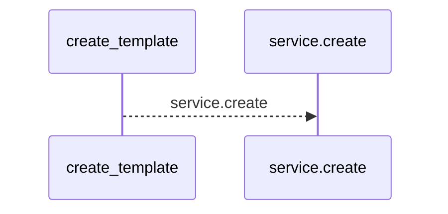
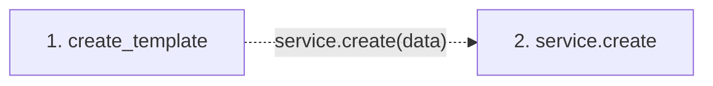

# create_template

**Entry point:** `create_template` (`http`)
**Source:** [templates](../modules/templates.md)
**Modules touched:** [templates](../modules/templates.md)

## Call sequence

<!-- Auto-generated from static call edges. Dashed arrows are external or unresolved calls. Reviewed runtime conditions and side effects belong in Behavior. -->

## Data flow

<!-- Auto-generated static analysis. Treat values and boundaries as best-effort hints, not runtime proof. -->

### Step data

| Step | Inputs | Reads | Writes | Returns |
|---|---|---|---|---|
| `create_template` | `data: WorkTemplateCreate`, `service: Annotated[TemplateService, Depends(get_template_service)]` | - | - | `...` |
| `service.create` | - | - | - | - |

### Call data

| From | To | Line | Call |
|---|---|---:|---|
| create_template | service.create | 50 | `service.create(data)` |

### Boundary effects

*No boundary effects detected.*

### Static analysis gaps

| Kind | Step | Target | Line |
|---|---|---|---:|
| unresolved_call | `create_template` | `service.create` | 50 |

## Behavior

This flow starts at `create_template` and is classified as `http`. The generated call and data-flow sections are bounded static projections; runtime conditions and side effects require source-level confirmation.
