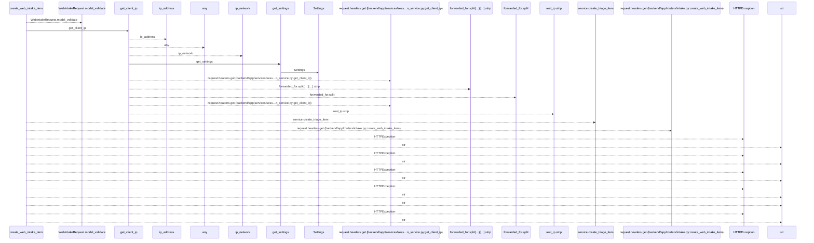
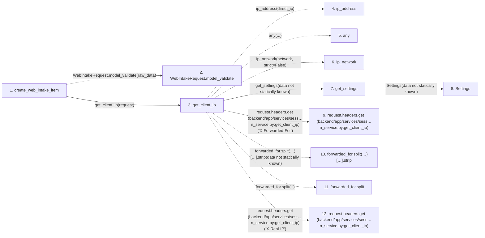

# create_web_intake_item

**Entry point:** `create_web_intake_item` (`http`)
**Source:** [routers_intake](../modules/routers_intake.md)
**Modules touched:** [config](../modules/config.md), [routers_intake](../modules/routers_intake.md), [session_service](../modules/session_service.md)

## Call sequence

<!-- Auto-generated from static call edges. Dashed arrows are external or unresolved calls. Reviewed runtime conditions and side effects belong in Behavior. -->

## Data flow

<!-- Auto-generated static analysis. Treat values and boundaries as best-effort hints, not runtime proof. -->

### Step data

| Step | Inputs | Reads | Writes | Returns |
|---|---|---|---|---|
| `create_web_intake_item` | `request: Request`, `raw_data: Annotated[Any, Body(...)]`, `service: Annotated[WebIntakeService, Depends(get_web_intake_service)]`, `authorization: Annotated[Optional[str], Header(alias='Authorization')]` | `ValidationError`, `status`, `WebIntakeConfigurationError`, `status`, `WebIntakeUnauthorizedError`, `status`, `WebIntakeRateLimitError`, `status` | - | `...` |
| `WebIntakeRequest.model_validate` | - | - | - | - |
| `get_client_ip` | `request: Request` | - | - | `...`, `real_ip.strip(...)`, `direct_ip` |
| `ip_address` | - | - | - | - |
| `any` | - | - | - | - |
| `ip_network` | - | - | - | - |
| `get_settings` | - | - | - | `Settings(...)` |
| `Settings` | - | - | - | - |
| `request.headers.get (backend/app/services/sess…n_service.py:get_client_ip)` | - | - | - | - |
| `forwarded_for.split(…)[…].strip` | - | - | - | - |
| `forwarded_for.split` | - | - | - | - |
| `request.headers.get (backend/app/services/sess…n_service.py:get_client_ip)` | - | - | - | - |

### Call data

| From | To | Line | Call |
|---|---|---:|---|
| create_web_intake_item | WebIntakeRequest.model_validate | 48 | `WebIntakeRequest.model_validate(raw_data)` |
| create_web_intake_item | get_client_ip | 49 | `get_client_ip(request)` |
| get_client_ip | ip_address | 50 | `ip_address(direct_ip)` |
| get_client_ip | any | 51 | `any(...)` |
| get_client_ip | ip_network | 52 | `ip_network(network, strict=False)` |
| get_client_ip | get_settings | 53 | `get_settings(data not statically known)` |
| get_settings | Settings | 469 | `Settings(data not statically known)` |
| get_client_ip | request.headers.get (backend/app/services/sess…n_service.py:get_client_ip) | 58 | `request.headers.get('X-Forwarded-For')` |
| get_client_ip | forwarded_for.split(…)[…].strip | 60 | `forwarded_for.split(',')[0].strip(data not statically known)` |
| get_client_ip | forwarded_for.split | 60 | `forwarded_for.split(',')` |
| get_client_ip | request.headers.get (backend/app/services/sess…n_service.py:get_client_ip) | 61 | `request.headers.get('X-Real-IP')` |

### Boundary effects

*No boundary effects detected.*

### Static analysis gaps

| Kind | Step | Target | Line |
|---|---|---|---:|
| unresolved_call | `create_web_intake_item` | `WebIntakeRequest.model_validate` | 48 |
| external_call | `get_client_ip` | `ip_address` | 50 |
| external_call | `get_client_ip` | `any` | 51 |
| external_call | `get_client_ip` | `ip_network` | 52 |
| unresolved_call | `get_client_ip` | `request.headers.get` | 58 |
| unresolved_call | `get_client_ip` | `forwarded_for.split(',')[0].strip` | 60 |
| unresolved_call | `get_client_ip` | `forwarded_for.split` | 60 |
| unresolved_call | `get_client_ip` | `request.headers.get` | 61 |
| step_limit | `create_web_intake_item` | `first 12 steps` | 0 |

## Behavior

This flow starts at `create_web_intake_item` and is classified as `http`. The generated call and data-flow sections are bounded static projections; runtime conditions and side effects require source-level confirmation.
