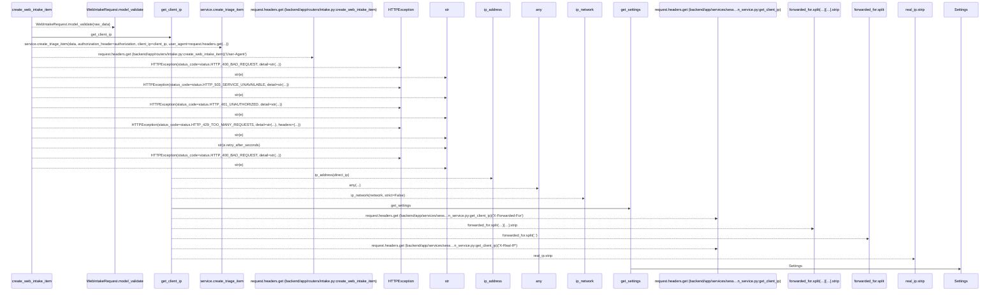
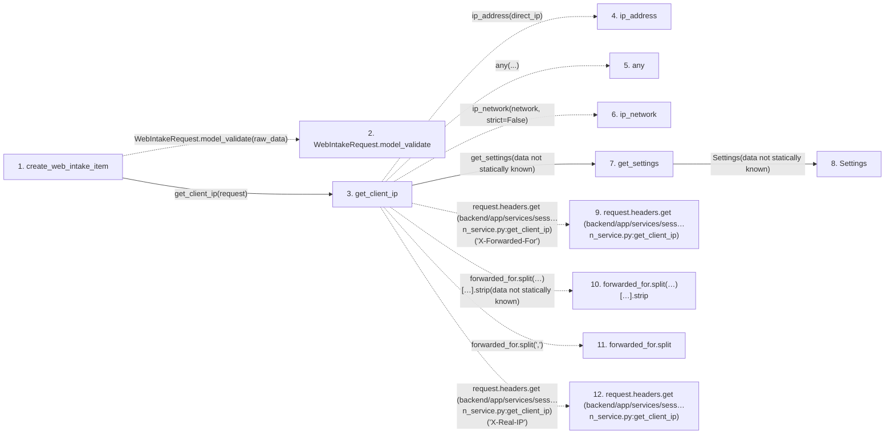

# create_web_intake_item

**Entry point:** `create_web_intake_item` (`http`)
**Source:** [routers_intake](../modules/routers_intake.md)
**Modules touched:** [config](../modules/config.md), [routers_intake](../modules/routers_intake.md), [session_service](../modules/session_service.md)

## Call sequence

> Static overview in presentation order, not runtime execution order. Arrows retain captured callers; representative internal continuations and boundary examples precede repeated helper detail.

<!-- Auto-generated from static call edges. Dashed arrows are external or unresolved calls. Reviewed runtime conditions and side effects belong in Behavior. -->

```mermaid
sequenceDiagram
    participant p0 as create_web_intake_item
    participant p1 as WebIntakeRequest.model_validate
    participant p2 as get_client_ip
    participant p3 as service.create_triage_item
    participant p4 as request.headers.get (backend/app/routers/intake.py:create_web_intake_item)
    participant p5 as HTTPException
    participant p6 as str
    participant p7 as ip_address
    participant p8 as any
    participant p9 as ip_network
    participant p10 as get_settings
    participant p11 as request.headers.get (backend/app/services/sess…n_service.py:get_client_ip)
    participant p12 as forwarded_for.split(…)[…].strip
    participant p13 as forwarded_for.split
    participant p14 as real_ip.strip
    participant p15 as Settings
    p0-->>p1: WebIntakeRequest.model_validate(raw_data)
    p0->>p2: get_client_ip
    p0-->>p3: service.create_triage_item(data, authorization_header=authorization, client_ip=client_ip, user_agent=request.headers.get(...))
    p0-->>p4: request.headers.get (backend/app/routers/intake.py:create_web_intake_item)('User-Agent')
    p0-->>p5: HTTPException(status_code=status.HTTP_400_BAD_REQUEST, detail=str(...))
    p0-->>p6: str(e)
    p0-->>p5: HTTPException(status_code=status.HTTP_503_SERVICE_UNAVAILABLE, detail=str(...))
    p0-->>p6: str(e)
    p0-->>p5: HTTPException(status_code=status.HTTP_401_UNAUTHORIZED, detail=str(...))
    p0-->>p6: str(e)
    p0-->>p5: HTTPException(status_code=status.HTTP_429_TOO_MANY_REQUESTS, detail=str(...), headers={...})
    p0-->>p6: str(e)
    p0-->>p6: str(e.retry_after_seconds)
    p0-->>p5: HTTPException(status_code=status.HTTP_400_BAD_REQUEST, detail=str(...))
    p0-->>p6: str(e)
    p2-->>p7: ip_address(direct_ip)
    p2-->>p8: any(...)
    p2-->>p9: ip_network(network, strict=False)
    p2->>p10: get_settings
    p2-->>p11: request.headers.get (backend/app/services/sess…n_service.py:get_client_ip)('X-Forwarded-For')
    p2-->>p12: forwarded_for.split(…)[…].strip
    p2-->>p13: forwarded_for.split(',')
    p2-->>p11: request.headers.get (backend/app/services/sess…n_service.py:get_client_ip)('X-Real-IP')
    p2-->>p14: real_ip.strip
    p10->>p15: Settings
```

> Call sequence diagram shows 25 of 25 interactions; 0 omitted to keep the visualization within the 30-interaction and generated-diagram limits, with uncertain identities omitted rather than inferred.

> Captured boundary calls: external 14 of 14 (0 omitted); unresolved 8 of 8 (0 omitted). These counts cover the captured static trace.
> Detailed flow queries retain their own coverage and limits; omitted paths may execute at runtime.

## Data flow

<!-- Auto-generated static analysis. Treat values and boundaries as best-effort hints, not runtime proof. -->

### Analysis coverage

**Effect analysis partially available.** Flow assembly and source effect analysis are separate; empty observations do not prove an empty handler body.

Source steps: 4; effect analysis evaluated: 2, partial: 1, unavailable: 1. Counts include steps omitted from the displayed trace.

Collector observations for 3 source steps with known totals: observed: 19, emitted: 18, omitted: 1. Unavailable totals are excluded.

- Callable record unavailable for one or more source steps; those steps have no represented callable body.
- Effect collector omitted observations before flow assembly; displayed effects are partial.
- Effect collector totals unavailable; observed counts cover captured records only.

| Step | Callable record | Effect analysis | Collector totals | Observed | Emitted | Omitted |
|---|---|---|---|---:|---:|---:|
| `create_web_intake_item` | `available` | `partial` | `available` | `14` | `13` | `1` |
| `WebIntakeRequest.model_validate` | `not_applicable` | `not_applicable` | `not_applicable` | — | — | — |
| `get_client_ip` | `available` | `evaluated` | `available` | `4` | `4` | `0` |
| `ip_address` | `not_applicable` | `not_applicable` | `not_applicable` | — | — | — |
| `any` | `not_applicable` | `not_applicable` | `not_applicable` | — | — | — |
| `ip_network` | `not_applicable` | `not_applicable` | `not_applicable` | — | — | — |
| `get_settings` | `available` | `evaluated` | `available` | `1` | `1` | `0` |
| `Settings` | `unavailable` | `unavailable` | `unavailable` | — | — | — |
| `request.headers.get (backend/app/services/sess…n_service.py:get_client_ip)` | `not_applicable` | `not_applicable` | `not_applicable` | — | — | — |
| `forwarded_for.split(…)[…].strip` | `not_applicable` | `not_applicable` | `not_applicable` | — | — | — |
| `forwarded_for.split` | `not_applicable` | `not_applicable` | `not_applicable` | — | — | — |
| `request.headers.get (backend/app/services/sess…n_service.py:get_client_ip)` | `not_applicable` | `not_applicable` | `not_applicable` | — | — | — |

```mermaid
flowchart LR
    s1["1. create_web_intake_item"]
    s2["2. WebIntakeRequest.model_validate"]
    s3["3. get_client_ip"]
    s4["4. ip_address"]
    s5["5. any"]
    s6["6. ip_network"]
    s7["7. get_settings"]
    s8["8. Settings"]
    s9["9. request.headers.get (backend/app/services/sess…n_service.py:get_client_ip)"]
    s10["10. forwarded_for.split(…)[…].strip"]
    s11["11. forwarded_for.split"]
    s12["12. request.headers.get (backend/app/services/sess…n_service.py:get_client_ip)"]
    s1 -. "WebIntakeRequest.model_validate(raw_data)" .-> s2
    s1 -->|"get_client_ip(request)"| s3
    s3 -. "ip_address(direct_ip)" .-> s4
    s3 -. "any(...)" .-> s5
    s3 -. "ip_network(network, strict=False)" .-> s6
    s3 -->|"get_settings(data not statically known)"| s7
    s7 -->|"Settings(data not statically known)"| s8
    s3 -. "request.headers.get (backend/app/services/sess…n_service.py:get_client_ip)('X-Forwarded-For')" .-> s9
    s3 -. "forwarded_for.split(…)[…].strip(data not statically known)" .-> s10
    s3 -. "forwarded_for.split(',')" .-> s11
    s3 -. "request.headers.get (backend/app/services/sess…n_service.py:get_client_ip)('X-Real-IP')" .-> s12
    click s1 "../modules/routers_intake.md"
    click s3 "../modules/session_service.md"
    click s7 "../modules/config.md"
    click s8 "../modules/config.md"
```

### Step data

| Step | Inputs | Reads | Writes | Returns |
|---|---|---|---|---|
| `create_web_intake_item` | `request: Request`, `raw_data: Annotated[Any, Body(...)]`, `service: Annotated[WebIntakeService, Depends(get_web_intake_service)]`, `authorization: Annotated[Optional[str], Header(alias='Authorization')]` | `ValidationError`, `status`, `WebIntakeConfigurationError`, `status`, `WebIntakeUnauthorizedError`, `status`, `WebIntakeRateLimitError`, `status` | - | `...` |
| `WebIntakeRequest.model_validate` | - | - | - | - |
| `get_client_ip` | `request: Request` | - | - | `...`, `real_ip.strip(...)`, `direct_ip` |
| `ip_address` | - | - | - | - |
| `any` | - | - | - | - |
| `ip_network` | - | - | - | - |
| `get_settings` | - | - | - | `Settings(...)` |
| `Settings` | - | - | - | - |
| `request.headers.get (backend/app/services/sess…n_service.py:get_client_ip)` | - | - | - | - |
| `forwarded_for.split(…)[…].strip` | - | - | - | - |
| `forwarded_for.split` | - | - | - | - |
| `request.headers.get (backend/app/services/sess…n_service.py:get_client_ip)` | - | - | - | - |

### Call data

| From | To | Line | Call |
|---|---|---:|---|
| create_web_intake_item | WebIntakeRequest.model_validate | 48 | `WebIntakeRequest.model_validate(raw_data)` |
| create_web_intake_item | get_client_ip | 49 | `get_client_ip(request)` |
| get_client_ip | ip_address | 52 | `ip_address(direct_ip)` |
| get_client_ip | any | 53 | `any(...)` |
| get_client_ip | ip_network | 54 | `ip_network(network, strict=False)` |
| get_client_ip | get_settings | 55 | `get_settings(data not statically known)` |
| get_settings | Settings | 481 | `Settings(data not statically known)` |
| get_client_ip | request.headers.get (backend/app/services/sess…n_service.py:get_client_ip) | 60 | `request.headers.get('X-Forwarded-For')` |
| get_client_ip | forwarded_for.split(…)[…].strip | 62 | `forwarded_for.split(',')[0].strip(data not statically known)` |
| get_client_ip | forwarded_for.split | 62 | `forwarded_for.split(',')` |
| get_client_ip | request.headers.get (backend/app/services/sess…n_service.py:get_client_ip) | 63 | `request.headers.get('X-Real-IP')` |

### Boundary effects

*No boundary-effect observations were captured in this static trace.*

### Static analysis gaps

| Kind | Step | Target | Line |
|---|---|---|---:|
| unresolved_call | `create_web_intake_item` | `WebIntakeRequest.model_validate` | 48 |
| external_call | `get_client_ip` | `ip_address` | 52 |
| external_call | `get_client_ip` | `any` | 53 |
| external_call | `get_client_ip` | `ip_network` | 54 |
| unresolved_call | `get_client_ip` | `request.headers.get` | 60 |
| unresolved_call | `get_client_ip` | `forwarded_for.split(',')[0].strip` | 62 |
| unresolved_call | `get_client_ip` | `forwarded_for.split` | 62 |
| unresolved_call | `get_client_ip` | `request.headers.get` | 63 |
| step_limit | `create_web_intake_item` | `first 12 steps` | 0 |

## Behavior

This flow starts at `create_web_intake_item` and is classified as `http`. The generated call and data-flow sections are bounded static projections; runtime conditions and side effects require source-level confirmation.
