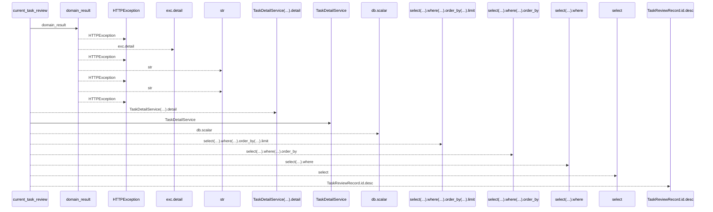
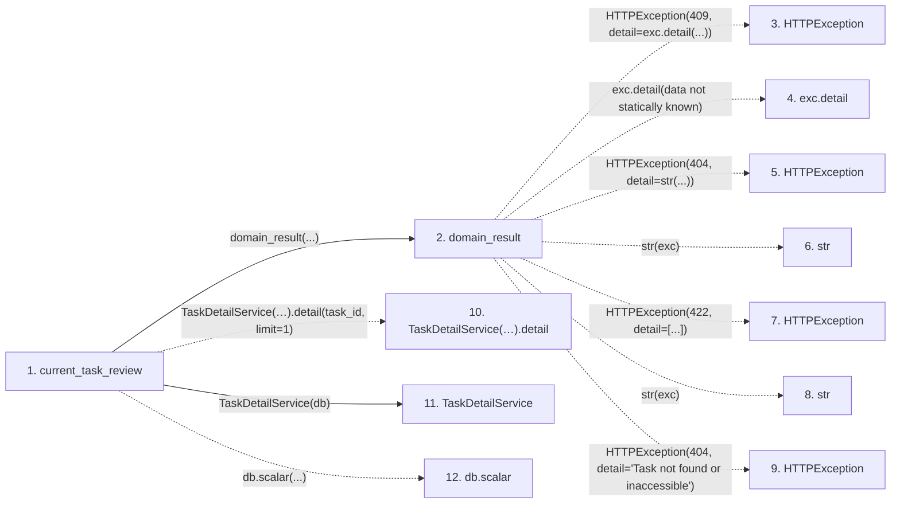

# current_task_review

**Entry point:** `current_task_review` (`http`)
**Source:** [routers_task_domain](../modules/routers_task_domain.md)
**Modules touched:** [routers_task_domain](../modules/routers_task_domain.md), [task_detail_service](../modules/task_detail_service.md)

## Call sequence

<!-- Auto-generated from static call edges. Dashed arrows are external or unresolved calls. Reviewed runtime conditions and side effects belong in Behavior. -->

## Data flow

<!-- Auto-generated static analysis. Treat values and boundaries as best-effort hints, not runtime proof. -->

### Step data

| Step | Inputs | Reads | Writes | Returns |
|---|---|---|---|---|
| `current_task_review` | `task_id: int`, `db: DB` | - | - | `{...}` |
| `domain_result` | `awaitable` | `TaskVersionConflictError` | - | `result` |
| `HTTPException` | - | - | - | - |
| `exc.detail` | - | - | - | - |
| `HTTPException` | - | - | - | - |
| `str` | - | - | - | - |
| `HTTPException` | - | - | - | - |
| `str` | - | - | - | - |
| `HTTPException` | - | - | - | - |
| `TaskDetailService(…).detail` | - | - | - | - |
| `TaskDetailService` | - | - | - | - |
| `db.scalar` | - | - | - | - |

### Call data

| From | To | Line | Call |
|---|---|---:|---|
| current_task_review | domain_result | 211 | `domain_result(...)` |
| domain_result | HTTPException | 42 | `HTTPException(409, detail=exc.detail(...))` |
| domain_result | exc.detail | 42 | `exc.detail(data not statically known)` |
| domain_result | HTTPException | 44 | `HTTPException(404, detail=str(...))` |
| domain_result | str | 44 | `str(exc)` |
| domain_result | HTTPException | 46 | `HTTPException(422, detail=[...])` |
| domain_result | str | 46 | `str(exc)` |
| domain_result | HTTPException | 48 | `HTTPException(404, detail='Task not found or inaccessible')` |
| current_task_review | TaskDetailService(…).detail | 211 | `TaskDetailService(db).detail(task_id, limit=1)` |
| current_task_review | TaskDetailService | 211 | `TaskDetailService(db)` |
| current_task_review | db.scalar | 213 | `db.scalar(...)` |

### Boundary effects

*No boundary effects detected.*

### Static analysis gaps

| Kind | Step | Target | Line |
|---|---|---|---:|
| external_call | `domain_result` | `HTTPException` | 42 |
| unresolved_call | `domain_result` | `exc.detail` | 42 |
| external_call | `domain_result` | `HTTPException` | 44 |
| external_call | `domain_result` | `HTTPException` | 46 |
| external_call | `domain_result` | `HTTPException` | 48 |
| unresolved_call | `current_task_review` | `TaskDetailService(db).detail` | 211 |
| unresolved_call | `current_task_review` | `db.scalar` | 213 |
| step_limit | `current_task_review` | `first 12 steps` | 0 |

## Behavior

Checks current task visibility through the bounded detail service, then selects the latest review matching the current task, brief and artifact revisions. The response includes the task version with the verdict or null. This lookup does not depend on the first history page and does not mutate task state.
