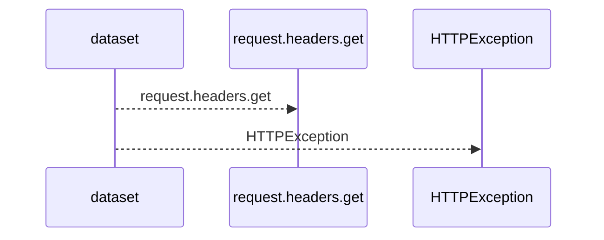
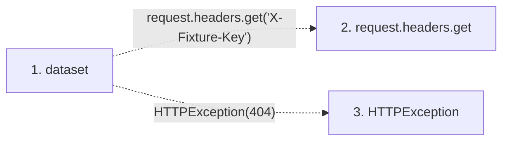

# dataset

**Entry point:** `dataset` (`http`)
**Source:** [serve_disposable_api](../modules/serve_disposable_api.md)
**Modules touched:** [serve_disposable_api](../modules/serve_disposable_api.md)

## Call sequence

<!-- Auto-generated from static call edges. Dashed arrows are external or unresolved calls. Reviewed runtime conditions and side effects belong in Behavior. -->

## Data flow

<!-- Auto-generated static analysis. Treat values and boundaries as best-effort hints, not runtime proof. -->

### Step data

| Step | Inputs | Reads | Writes | Returns |
|---|---|---|---|---|
| `dataset` | `request: Request`, `task_id: int` | - | - | `dataset_counts` |
| `request.headers.get` | - | - | - | - |
| `HTTPException` | - | - | - | - |

### Call data

| From | To | Line | Call |
|---|---|---:|---|
| dataset | request.headers.get | 90 | `request.headers.get('X-Fixture-Key')` |
| dataset | HTTPException | 91 | `HTTPException(404)` |

### Boundary effects

*No boundary effects detected.*

### Static analysis gaps

| Kind | Step | Target | Line |
|---|---|---|---:|
| unresolved_call | `dataset` | `request.headers.get` | 90 |
| unresolved_call | `dataset` | `HTTPException` | 91 |

## Behavior

This flow starts at `dataset` and is classified as `http`. The generated call and data-flow sections are bounded static projections; runtime conditions and side effects require source-level confirmation.
