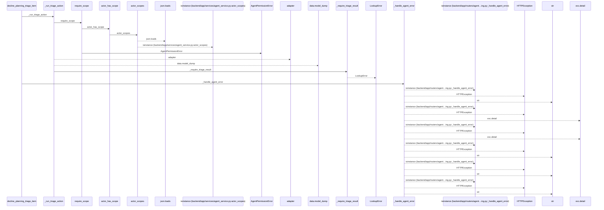
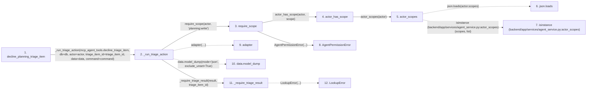

# decline_planning_triage_item

**Entry point:** `decline_planning_triage_item` (`http`)
**Source:** [routers_agent_planning](../modules/routers_agent_planning.md)
**Modules touched:** [agent_service](../modules/agent_service.md), [routers_agent_planning](../modules/routers_agent_planning.md)

## Call sequence

<!-- Auto-generated from static call edges. Dashed arrows are external or unresolved calls. Reviewed runtime conditions and side effects belong in Behavior. -->

> Call sequence diagram shows 30 of 33 interactions; 3 omitted to keep the visualization within the 30-interaction and generated-diagram limits.

## Data flow

<!-- Auto-generated static analysis. Treat values and boundaries as best-effort hints, not runtime proof. -->

### Step data

| Step | Inputs | Reads | Writes | Returns |
|---|---|---|---|---|
| `decline_planning_triage_item` | `triage_item_id: int`, `data: TriageActionRequest`, `actor: Annotated[AgentActor, Depends(get_agent_actor)]`, `db: Annotated[AsyncSession, Depends(get_db)]`, `command: Annotated[AgentPlanningCommandContext, Depends(get_agent_planning_command_context)]` | `mcp_agent_tools` | - | `...` |
| `_run_triage_action` | `adapter`, `db: AsyncSession`, `actor: AgentActor`, `triage_item_id: int`, `data`, `command: AgentPlanningCommandContext` | - | - | `_require_triage_result(...)` |
| `require_scope` | `actor: AgentActor`, `scope: str` | - | - | - |
| `actor_has_scope` | `actor: AgentActor`, `scope: str` | - | - | `...` |
| `actor_scopes` | `actor: AgentActor` | `json` | - | `...` |
| `json.loads` | - | - | - | - |
| `isinstance (backend/app/services/agent_service.py:actor_scopes)` | - | - | - | - |
| `AgentPermissionError` | - | - | - | - |
| `adapter` | - | - | - | - |
| `data.model_dump` | - | - | - | - |
| `_require_triage_result` | `result`, `triage_item_id: int` | - | - | `result` |
| `LookupError` | - | - | - | - |

### Call data

| From | To | Line | Call |
|---|---|---:|---|
| decline_planning_triage_item | _run_triage_action | 724 | `_run_triage_action(mcp_agent_tools.decline_triage_item, db=db, actor=actor, triage_item_id=triage_item_id, data=data, command=command)` |
| _run_triage_action | require_scope | 673 | `require_scope(actor, 'planning:write')` |
| require_scope | actor_has_scope | 84 | `actor_has_scope(actor, scope)` |
| actor_has_scope | actor_scopes | 78 | `actor_scopes(actor)` |
| actor_scopes | json.loads | 70 | `json.loads(actor.scopes)` |
| actor_scopes | isinstance (backend/app/services/agent_service.py:actor_scopes) | 73 | `isinstance(scopes, list)` |
| require_scope | AgentPermissionError | 85 | `AgentPermissionError(...)` |
| _run_triage_action | adapter | 674 | `adapter(db, actor, triage_item_id, data.model_dump(...), idempotency_key=command.idempotency_key, rationale=command.rationale, correlation_id=command.correlation_id)` |
| _run_triage_action | data.model_dump | 678 | `data.model_dump(mode='json', exclude_unset=True)` |
| _run_triage_action | _require_triage_result | 683 | `_require_triage_result(result, triage_item_id)` |
| _require_triage_result | LookupError | 578 | `LookupError(...)` |

### Boundary effects

*No boundary effects detected.*

### Static analysis gaps

| Kind | Step | Target | Line |
|---|---|---|---:|
| external_call | `actor_scopes` | `json.loads` | 70 |
| external_call | `actor_scopes` | `isinstance` | 73 |
| unresolved_call | `_run_triage_action` | `adapter` | 674 |
| unresolved_call | `_run_triage_action` | `data.model_dump` | 678 |
| external_call | `_require_triage_result` | `LookupError` | 578 |
| step_limit | `decline_planning_triage_item` | `first 12 steps` | 0 |

## Behavior

This flow starts at `decline_planning_triage_item` and is classified as `http`. The generated call and data-flow sections are bounded static projections; runtime conditions and side effects require source-level confirmation.
