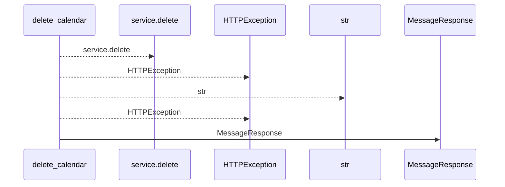
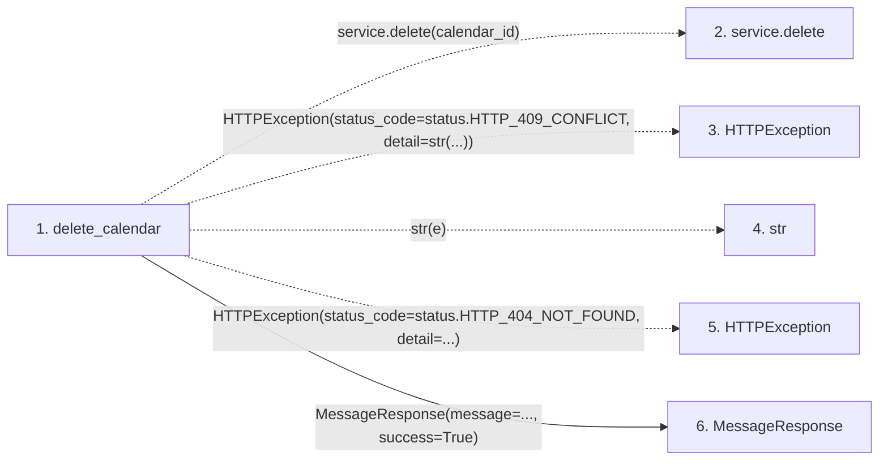

# delete_calendar

**Entry point:** `delete_calendar` (`http`)
**Source:** [calendars](../modules/calendars.md)
**Modules touched:** [calendars](../modules/calendars.md), [schemas_common](../modules/schemas_common.md)

## Call sequence

<!-- Auto-generated from static call edges. Dashed arrows are external or unresolved calls. Reviewed runtime conditions and side effects belong in Behavior. -->

## Data flow

<!-- Auto-generated static analysis. Treat values and boundaries as best-effort hints, not runtime proof. -->

### Step data

| Step | Inputs | Reads | Writes | Returns |
|---|---|---|---|---|
| `delete_calendar` | `calendar_id: int`, `service: Annotated[CalendarService, Depends(get_calendar_service)]` | `status`, `status` | - | `MessageResponse(...)` |
| `service.delete` | - | - | - | - |
| `HTTPException` | - | - | - | - |
| `str` | - | - | - | - |
| `HTTPException` | - | - | - | - |
| `MessageResponse` | - | - | - | - |

### Call data

| From | To | Line | Call |
|---|---|---:|---|
| delete_calendar | service.delete | 84 | `service.delete(calendar_id)` |
| delete_calendar | HTTPException | 86 | `HTTPException(status_code=status.HTTP_409_CONFLICT, detail=str(...))` |
| delete_calendar | str | 88 | `str(e)` |
| delete_calendar | HTTPException | 91 | `HTTPException(status_code=status.HTTP_404_NOT_FOUND, detail=...)` |
| delete_calendar | MessageResponse | 95 | `MessageResponse(message=..., success=True)` |

### Boundary effects

*No boundary effects detected.*

### Static analysis gaps

| Kind | Step | Target | Line |
|---|---|---|---:|
| unresolved_call | `delete_calendar` | `service.delete` | 84 |
| external_call | `delete_calendar` | `HTTPException` | 86 |
| external_call | `delete_calendar` | `HTTPException` | 91 |

## Behavior

This flow starts at `delete_calendar` and is classified as `http`. The generated call and data-flow sections are bounded static projections; runtime conditions and side effects require source-level confirmation.
