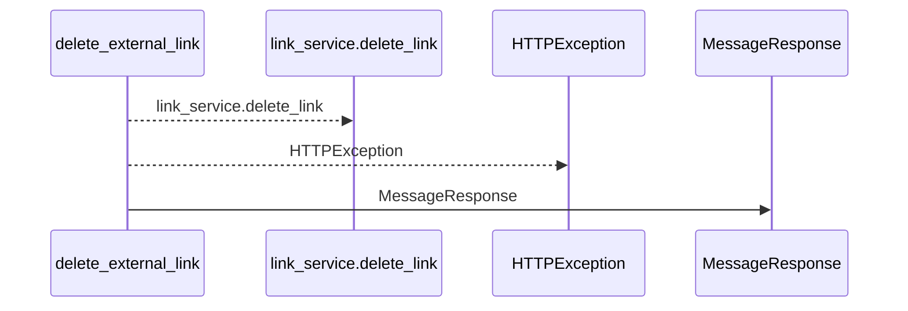
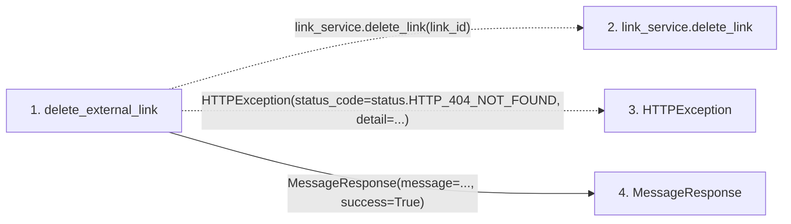

# delete_external_link

**Entry point:** `delete_external_link` (`http`)
**Source:** [tasks](../modules/tasks.md)
**Modules touched:** [schemas_common](../modules/schemas_common.md), [tasks](../modules/tasks.md)

## Call sequence

<!-- Auto-generated from static call edges. Dashed arrows are external or unresolved calls. Reviewed runtime conditions and side effects belong in Behavior. -->

## Data flow

<!-- Auto-generated static analysis. Treat values and boundaries as best-effort hints, not runtime proof. -->

### Step data

| Step | Inputs | Reads | Writes | Returns |
|---|---|---|---|---|
| `delete_external_link` | `link_id: int`, `link_service: Annotated[ExternalLinkService, Depends(get_external_link_service)]` | `status` | - | `MessageResponse(...)` |
| `link_service.delete_link` | - | - | - | - |
| `HTTPException` | - | - | - | - |
| `MessageResponse` | - | - | - | - |

### Call data

| From | To | Line | Call |
|---|---|---:|---|
| delete_external_link | link_service.delete_link | 544 | `link_service.delete_link(link_id)` |
| delete_external_link | HTTPException | 546 | `HTTPException(status_code=status.HTTP_404_NOT_FOUND, detail=...)` |
| delete_external_link | MessageResponse | 550 | `MessageResponse(message=..., success=True)` |

### Boundary effects

*No boundary effects detected.*

### Static analysis gaps

| Kind | Step | Target | Line |
|---|---|---|---:|
| unresolved_call | `delete_external_link` | `link_service.delete_link` | 544 |
| external_call | `delete_external_link` | `HTTPException` | 546 |

## Behavior

This flow starts at `delete_external_link` and is classified as `http`. The generated call and data-flow sections are bounded static projections; runtime conditions and side effects require source-level confirmation.
