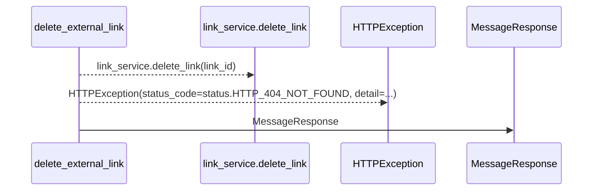
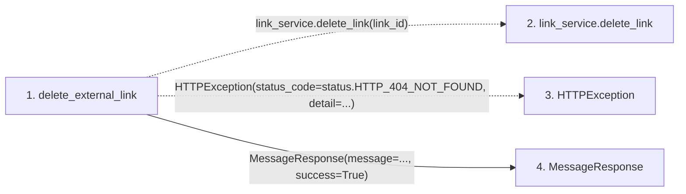

# delete_external_link

**Entry point:** `delete_external_link` (`http`)
**Source:** [tasks](../modules/tasks.md)
**Modules touched:** [schemas_common](../modules/schemas_common.md), [tasks](../modules/tasks.md)

## Call sequence

> Static overview in presentation order, not runtime execution order. Arrows retain captured callers; representative internal continuations and boundary examples precede repeated helper detail.

<!-- Auto-generated from static call edges. Dashed arrows are external or unresolved calls. Reviewed runtime conditions and side effects belong in Behavior. -->

```mermaid
sequenceDiagram
    participant p0 as delete_external_link
    participant p1 as link_service.delete_link
    participant p2 as HTTPException
    participant p3 as MessageResponse
    p0-->>p1: link_service.delete_link(link_id)
    p0-->>p2: HTTPException(status_code=status.HTTP_404_NOT_FOUND, detail=...)
    p0->>p3: MessageResponse
```

> Call sequence diagram shows 3 of 3 interactions; 0 omitted to keep the visualization within the 30-interaction and generated-diagram limits, with uncertain identities omitted rather than inferred.

> Captured boundary calls: external 1 of 1 (0 omitted); unresolved 1 of 1 (0 omitted). These counts cover the captured static trace.
> Detailed flow queries retain their own coverage and limits; omitted paths may execute at runtime.

## Data flow

<!-- Auto-generated static analysis. Treat values and boundaries as best-effort hints, not runtime proof. -->

### Analysis coverage

**Effect analysis partially available.** Flow assembly and source effect analysis are separate; empty observations do not prove an empty handler body.

Source steps: 2; effect analysis evaluated: 1, partial: 0, unavailable: 1. Counts include steps omitted from the displayed trace.

Collector observations for 1 source steps with known totals: observed: 4, emitted: 4, omitted: 0. Unavailable totals are excluded.

- Callable record unavailable for one or more source steps; those steps have no represented callable body.
- Effect collector totals unavailable; observed counts cover captured records only.

| Step | Callable record | Effect analysis | Collector totals | Observed | Emitted | Omitted |
|---|---|---|---|---:|---:|---:|
| `delete_external_link` | `available` | `evaluated` | `available` | `4` | `4` | `0` |
| `link_service.delete_link` | `not_applicable` | `not_applicable` | `not_applicable` | — | — | — |
| `HTTPException` | `not_applicable` | `not_applicable` | `not_applicable` | — | — | — |
| `MessageResponse` | `unavailable` | `unavailable` | `unavailable` | — | — | — |

```mermaid
flowchart LR
    s1["1. delete_external_link"]
    s2["2. link_service.delete_link"]
    s3["3. HTTPException"]
    s4["4. MessageResponse"]
    s1 -. "link_service.delete_link(link_id)" .-> s2
    s1 -. "HTTPException(status_code=status.HTTP_404_NOT_FOUND, detail=...)" .-> s3
    s1 -->|"MessageResponse(message=..., success=True)"| s4
    click s1 "../modules/tasks.md"
    click s4 "../modules/schemas_common.md"
```

### Step data

| Step | Inputs | Reads | Writes | Returns |
|---|---|---|---|---|
| `delete_external_link` | `link_id: int`, `link_service: Annotated[ExternalLinkService, Depends(get_external_link_service)]` | `status` | - | `MessageResponse(...)` |
| `link_service.delete_link` | - | - | - | - |
| `HTTPException` | - | - | - | - |
| `MessageResponse` | - | - | - | - |

### Call data

| From | To | Line | Call |
|---|---|---:|---|
| delete_external_link | link_service.delete_link | 551 | `link_service.delete_link(link_id)` |
| delete_external_link | HTTPException | 553 | `HTTPException(status_code=status.HTTP_404_NOT_FOUND, detail=...)` |
| delete_external_link | MessageResponse | 557 | `MessageResponse(message=..., success=True)` |

### Boundary effects

*No boundary-effect observations were captured in this static trace.*

### Static analysis gaps

| Kind | Step | Target | Line |
|---|---|---|---:|
| unresolved_call | `delete_external_link` | `link_service.delete_link` | 551 |
| external_call | `delete_external_link` | `HTTPException` | 553 |

## Behavior

This flow starts at `delete_external_link` and is classified as `http`. The generated call and data-flow sections are bounded static projections; runtime conditions and side effects require source-level confirmation.
