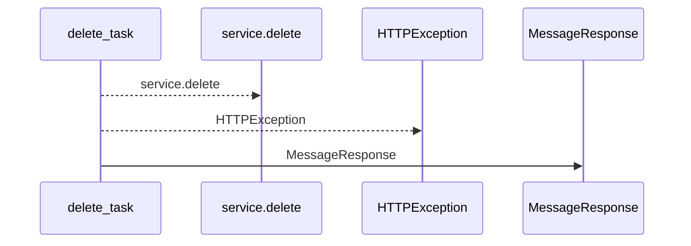
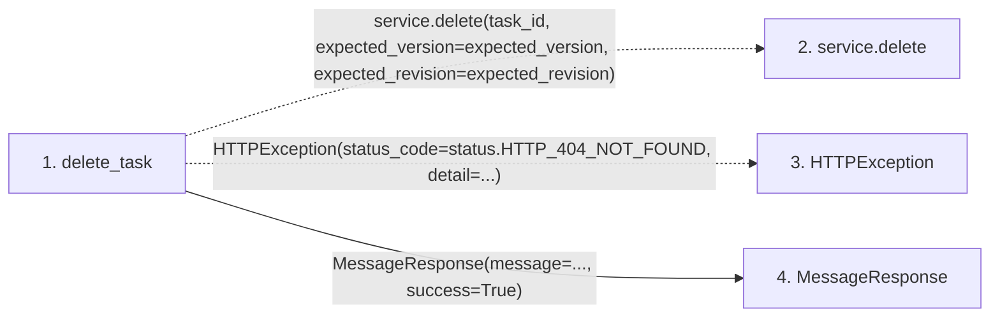

# delete_task

**Entry point:** `delete_task` (`http`)
**Source:** [tasks](../modules/tasks.md)
**Modules touched:** [schemas_common](../modules/schemas_common.md), [tasks](../modules/tasks.md)

## Call sequence

<!-- Auto-generated from static call edges. Dashed arrows are external or unresolved calls. Reviewed runtime conditions and side effects belong in Behavior. -->

## Data flow

<!-- Auto-generated static analysis. Treat values and boundaries as best-effort hints, not runtime proof. -->

### Step data

| Step | Inputs | Reads | Writes | Returns |
|---|---|---|---|---|
| `delete_task` | `task_id: int`, `service: Annotated[TaskService, Depends(get_task_service)]`, `expected_version: int \| None`, `expected_revision: int \| None` | `status` | - | `MessageResponse(...)` |
| `service.delete` | - | - | - | - |
| `HTTPException` | - | - | - | - |
| `MessageResponse` | - | - | - | - |

### Call data

| From | To | Line | Call |
|---|---|---:|---|
| delete_task | service.delete | 402 | `service.delete(task_id, expected_version=expected_version, expected_revision=expected_revision)` |
| delete_task | HTTPException | 404 | `HTTPException(status_code=status.HTTP_404_NOT_FOUND, detail=...)` |
| delete_task | MessageResponse | 408 | `MessageResponse(message=..., success=True)` |

### Boundary effects

*No boundary effects detected.*

### Static analysis gaps

| Kind | Step | Target | Line |
|---|---|---|---:|
| unresolved_call | `delete_task` | `service.delete` | 402 |
| external_call | `delete_task` | `HTTPException` | 404 |

## Behavior

This flow starts at `delete_task` and is classified as `http`. The generated call and data-flow sections are bounded static projections; runtime conditions and side effects require source-level confirmation.
