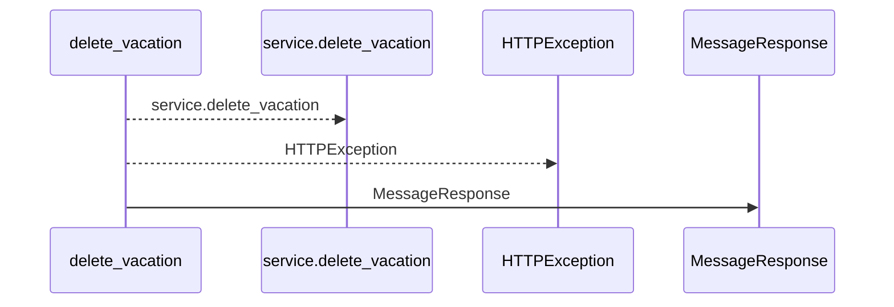
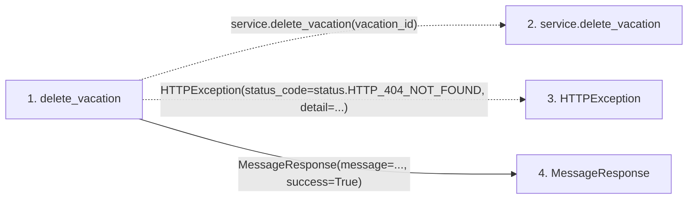

# delete_vacation

**Entry point:** `delete_vacation` (`http`)
**Source:** [routers_team](../modules/routers_team.md)
**Modules touched:** [routers_team](../modules/routers_team.md), [schemas_common](../modules/schemas_common.md)

## Call sequence

<!-- Auto-generated from static call edges. Dashed arrows are external or unresolved calls. Reviewed runtime conditions and side effects belong in Behavior. -->

## Data flow

<!-- Auto-generated static analysis. Treat values and boundaries as best-effort hints, not runtime proof. -->

### Step data

| Step | Inputs | Reads | Writes | Returns |
|---|---|---|---|---|
| `delete_vacation` | `vacation_id: int`, `service: Annotated[TeamService, Depends(get_team_service)]` | `status` | - | `MessageResponse(...)` |
| `service.delete_vacation` | - | - | - | - |
| `HTTPException` | - | - | - | - |
| `MessageResponse` | - | - | - | - |

### Call data

| From | To | Line | Call |
|---|---|---:|---|
| delete_vacation | service.delete_vacation | 330 | `service.delete_vacation(vacation_id)` |
| delete_vacation | HTTPException | 332 | `HTTPException(status_code=status.HTTP_404_NOT_FOUND, detail=...)` |
| delete_vacation | MessageResponse | 336 | `MessageResponse(message=..., success=True)` |

### Boundary effects

*No boundary effects detected.*

### Static analysis gaps

| Kind | Step | Target | Line |
|---|---|---|---:|
| unresolved_call | `delete_vacation` | `service.delete_vacation` | 330 |
| external_call | `delete_vacation` | `HTTPException` | 332 |

## Behavior

This flow starts at `delete_vacation` and is classified as `http`. The generated call and data-flow sections are bounded static projections; runtime conditions and side effects require source-level confirmation.
